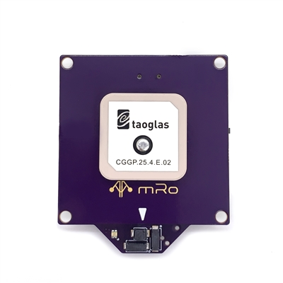

.. _common-mrobotics-location-one-gps:

=================================
mRobotics Location One UAVCAN GPS
=================================

The mRo Location One is a multi-constellation GNSS powered by the new uBlox M9N module. This smart device is based on the ArduPilot AP_Periph CAN peripheral firmware.

Features
========

- Ublox M9N high precision GPS
- RM3100 High Precision Magnetic Compass
- DPS310 Low noise Barometer
- RGB Status LED
- Push to "Arm" safety button

Designed for all UAVCAN compatible platforms.

Location One is not just a u-Blox chip populated on a purple reference GNSS board design. Patch antennas don't work by themselves, they require a proper ground plane to achieve maximum performance and assure good reception at any angle. Without that, as with any RF system, the GNSS module will not achieve peak performance (or work at all). The Location One ground plane has been optimized for maximum performance.

Configuration
=============

- :ref:`CAN_P1_DRIVER<CAN_P1_DRIVER>` = 1
- :ref:`CAN_D1_PROTOCOL<CAN_D1_PROTOCOL>` =1 (UAVCAN, should be set as default already)
- :ref:`GPS_TYPE<GPS_TYPE>` = 9 (UAVCAN) if primary GPS or,
- :ref:`GPS_TYPE<GPS_TYPE>` = 9 (UAVCAN) if using as secondary GPS
- :ref:`NTF_LED_TYPES<NTF_LED_TYPES>` set bit 5 (+32 to value) to enable LED as notification LED
- :ref:`BRD_SAFETYENABLE<BRD_SAFETYENABLE>` = 1 enables this, and any other, safety switch in the system. 

Compass
-------

If your flight controller has more than 3 compasses connected, you should disable or change the priority on the least important one to allow this compass to be used. Even then, you may wish to prioritize this compass higher than others, or as the highest priority compass, due to its improved performance. See Compass Advanced Configuration page.

If you have any issues getting these devices recognized and used, follow the instructions on enabling the CANBUS in the :ref:`common-canbus-setup-advanced` page, followed by :ref:`common-uavcan-setup-advanced` steps.

Where to Buy
============

`mRobotics <https://store.mrobotics.io/product-p/mro10070b.htm>`_