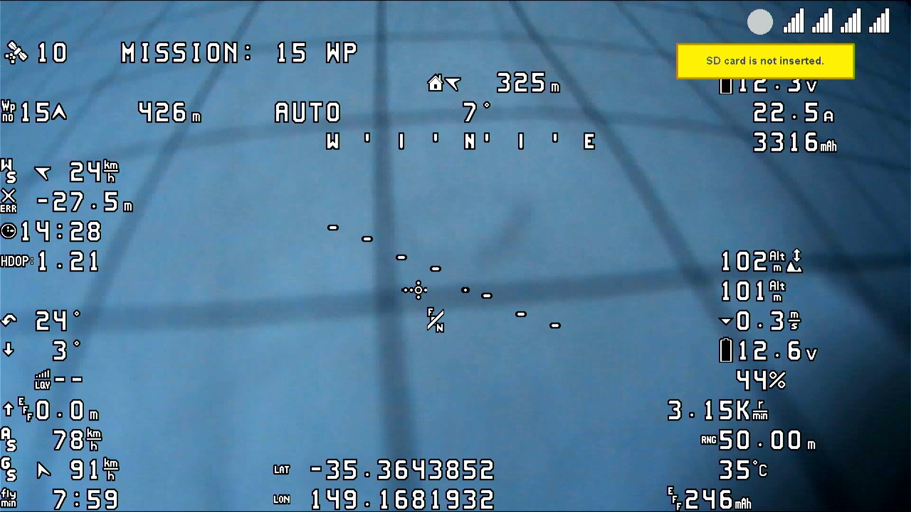
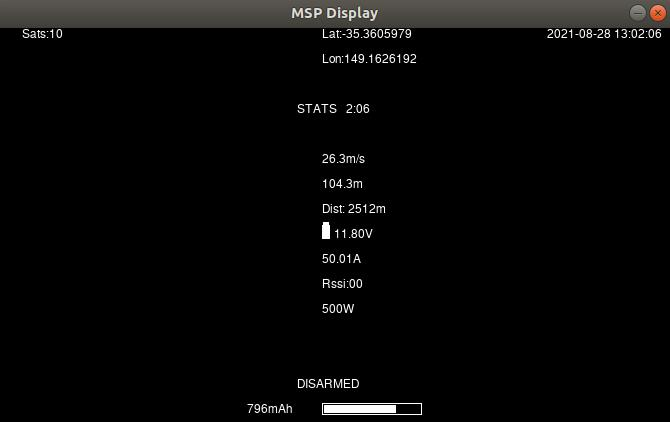
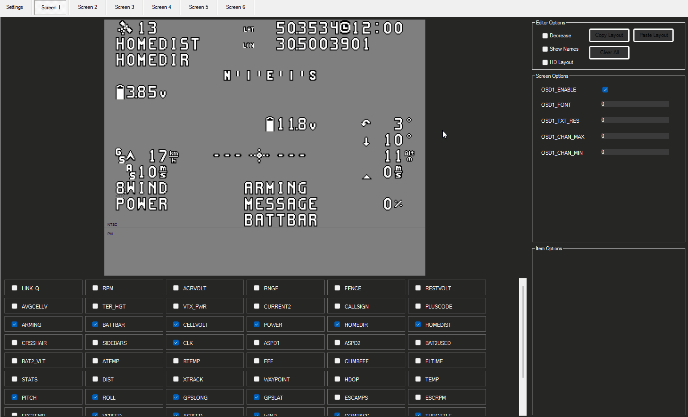

.. _common-msp-osd-overview-4.2:

=======
MSP OSD
=======
ArduPilot supports several types of On Screen Displays (OSD) using MSP (MultiWii Serial Protocol) based protocols:

 - MSP Telemetry based OSDs such as DJI FPV Goggles V1/V2, DJI Goggles RE, FatShark ByteFrost, FatShark SharkByte (before fw 09042021), `MWOSD <http://www.mwosd.com/>`__ , etc.
 - DisplayPort based OSDs such as HDZero (previously known as FatShark SharkByte (fw 09042021 and later)), Walksnail, DJI goggles using the `wtf-os <https://github.com/fpv-wtf/wtfos>`__ firmware and `msdp-osd module <https://github.com/fpv-wtf/msp-osd>`__, and MWOSD's DisplayPort mode/firmware

Telemetry only based OSDs will render OSD panel items on screen with their own engine based on the standard MSP telemetry sensor messages sent using Serial port protocol "32", so ArduPilot has no control of how the items look.

DJI 2/V1/V2 goggles also have an extended protocol which is sent using Serial port protocol "33" that allows position information for each OSD panel when using their extended Custom OSD feature. This also allows the display of any ArduPilot OSD panel.

DisplayPort, on the other hand, is an MSP protocol extension that allows ArduPilot to specify text characters/icons and their positions to be drawn on external OSD displays like it does on internal integrated analog OSDs using Serial port protocol "42". DisplayPort is also known (incorrectly) as CANVAS MODE. Basically it’s a remote text only frame buffer that uses local fonts (local to the rendering engine i.e. the OSD hardware) to render strings sent via MSP.

Telemetry based OSD
===================
Telemetry based OSDs will render OSD panel items on screen with their own engine, so ArduPilot has no control of how the items look. Another limitation of telemetry based OSDs is that there's no way for ArduPilot to add new panel items at will, it's the vendor's responsibility to add new features by rolling out new firmware releases.

If an on-board integrated analog OSD is present and the user wishes to have both OSDs , it can be activated as well. For example, on vehicles using the DJI goggles/air system for medium range, but still running a long range analog VTX using the internal OSD, for when the vehicle exceeds the range of the HD DJI Goggles. This configuration could use one OSD screen optimized for DJI Goggles, and another for the integrated OSD and the user can switch between them depending on which video system is being viewed.

Configuration
-------------
Example assumes connection of air unit to SERIAL2 of the flight controller.

 - :ref:`OSD_TYPE<OSD_TYPE>` = 3 if no integrated OSD is being used, or = 1 if an integrated OSD is present and the user wishes to have both OSDs.
 - :ref:`SERIAL2_PROTOCOL<SERIAL2_PROTOCOL>` = 32 (MSP)
 - :ref:`SERIAL2_BAUD<SERIAL2_BAUD>` = 115
 - :ref:`MSP_OPTIONS<MSP_OPTIONS>` bit 0 = 0 (Do not EnableTelemetryMode) if the Air Unit is to be connected by both RX and TX input to the AutoPilot Serial port TX/RX. Set bit 0 = 1 (EnableTelemetryMode) if a standalone OSD unit connected only via a single wire from its RX input to the Serial ports' TX. This is known as "push" mode.

OSD Panels Available with MSP telemetry OSDs
--------------------------------------------
These are the MSP only OSD elements supported on telemetry based OSDs (assuming the OSD has the capability itself to display these telemetry values):

+---------------+------------------------------------------------------------------------------------------------------------------------------------------------------------------------------------------------------------------------------------------------------------------------------------------------------+
| OSD Parameter | Notes                                                                                                                                                                                                                                                                                                |
+===============+======================================================================================================================================================================================================================================================================================================+
| OSDn_ALTITUDE | Home relative altitude                                                                                                                                                                                                                                                                               |
+---------------+------------------------------------------------------------------------------------------------------------------------------------------------------------------------------------------------------------------------------------------------------------------------------------------------------+
| OSDn_ARMING   | Arming status, hidden when armed otherwise showing DISARMED                                                                                                                                                                                                                                          |
+---------------+------------------------------------------------------------------------------------------------------------------------------------------------------------------------------------------------------------------------------------------------------------------------------------------------------+
| OSDn_ASPEED   | Please refer to OSDn_GSPEED for more info on enabling airspeed display                                                                                                                                                                                                                               |
+---------------+------------------------------------------------------------------------------------------------------------------------------------------------------------------------------------------------------------------------------------------------------------------------------------------------------+
| OSDn_BAT_VOLT | First battery voltage                                                                                                                                                                                                                                                                                |
+---------------+------------------------------------------------------------------------------------------------------------------------------------------------------------------------------------------------------------------------------------------------------------------------------------------------------+
| OSDn_BATBAR   | First battery remaining percentage rendered as a bar based on declared capacity and consumed mAh                                                                                                                                                                                                     |
+---------------+------------------------------------------------------------------------------------------------------------------------------------------------------------------------------------------------------------------------------------------------------------------------------------------------------+
| OSDn_BATUSED  | First battery consumed mAh                                                                                                                                                                                                                                                                           |
+---------------+------------------------------------------------------------------------------------------------------------------------------------------------------------------------------------------------------------------------------------------------------------------------------------------------------+
| OSDn_CELLVOLT | First battery average cell voltage, if automatic cell detection fails please override with MSP_OSD_NCELLS                                                                                                                                                                                            |
+---------------+------------------------------------------------------------------------------------------------------------------------------------------------------------------------------------------------------------------------------------------------------------------------------------------------------+
| OSDn_CLK      | Realtime clock (requires GPX fix)                                                                                                                                                                                                                                                                    |
+---------------+------------------------------------------------------------------------------------------------------------------------------------------------------------------------------------------------------------------------------------------------------------------------------------------------------+
| OSDn_CRSSHAIR | Artificial horizon is not supported so crosshair is often kept hidden                                                                                                                                                                                                                                |
+---------------+------------------------------------------------------------------------------------------------------------------------------------------------------------------------------------------------------------------------------------------------------------------------------------------------------+
| OSDn_CURRENT  | First battery current                                                                                                                                                                                                                                                                                |
+---------------+------------------------------------------------------------------------------------------------------------------------------------------------------------------------------------------------------------------------------------------------------------------------------------------------------+
| OSDn_ESCTEMP  | On DJI V1/V2 Goggles this will report the highest ESC temperature                                                                                                                                                                                                                                    |
+---------------+------------------------------------------------------------------------------------------------------------------------------------------------------------------------------------------------------------------------------------------------------------------------------------------------------+
| OSDn_FLTMODE  | DJI hardware does not support ArduPilot's flight modes! This item will generally be blank and only show !FS! while in failsafe!                                                                                                                                                                      |
+---------------+------------------------------------------------------------------------------------------------------------------------------------------------------------------------------------------------------------------------------------------------------------------------------------------------------+
| OSDn_GPSLAT   | GPS Latitude in decimal format                                                                                                                                                                                                                                                                       |
+---------------+------------------------------------------------------------------------------------------------------------------------------------------------------------------------------------------------------------------------------------------------------------------------------------------------------+
| OSDn_GPSLONG  | GPS Longitude in decimal format                                                                                                                                                                                                                                                                      |
+---------------+------------------------------------------------------------------------------------------------------------------------------------------------------------------------------------------------------------------------------------------------------------------------------------------------------+
| OSDn_GSPEED   | This item shows ground speed unless ``OSDn_ASPEED_EN`` = 1 in which case it will show true airspeed if an airspeed sensor is present or estimated airspeed otherwise. The position on screen is set by ``OSDn_GSPEED_X`` and ``OSDn_GSPEED_Y`` regardless of the value of ``OSDn_ASPEED_EN``         |
+---------------+------------------------------------------------------------------------------------------------------------------------------------------------------------------------------------------------------------------------------------------------------------------------------------------------------+
| OSDn_HEADING  | Not supported by DJI V1/V2 Goggles                                                                                                                                                                                                                                                                   |
+---------------+------------------------------------------------------------------------------------------------------------------------------------------------------------------------------------------------------------------------------------------------------------------------------------------------------+
| OSDn_HOMEDIR  | Rotating arrow pointing to home                                                                                                                                                                                                                                                                      |
+---------------+------------------------------------------------------------------------------------------------------------------------------------------------------------------------------------------------------------------------------------------------------------------------------------------------------+
| OSDn_HOMEDIST | Distance from home                                                                                                                                                                                                                                                                                   |
+---------------+------------------------------------------------------------------------------------------------------------------------------------------------------------------------------------------------------------------------------------------------------------------------------------------------------+
| OSDn_HORIZON  | Not supported by DJI V1/V2 Goggles                                                                                                                                                                                                                                                                   |
+---------------+------------------------------------------------------------------------------------------------------------------------------------------------------------------------------------------------------------------------------------------------------------------------------------------------------+
| OSDn_MESSAGE  | This will display status text messages as rolling text. Status text messages will be hidden after a couple seconds and the panel will show the current flightmode. If ``OSDn_WIND_EN`` is set to 1, this item also displays wind info next to the current flight mode as a rotating arrow and speed. |
+---------------+------------------------------------------------------------------------------------------------------------------------------------------------------------------------------------------------------------------------------------------------------------------------------------------------------+
| OSDn_PITCH    | Pitch angle                                                                                                                                                                                                                                                                                          |
+---------------+------------------------------------------------------------------------------------------------------------------------------------------------------------------------------------------------------------------------------------------------------------------------------------------------------+
| OSDn_POWER    | Instant power calculated as voltage * current                                                                                                                                                                                                                                                        |
+---------------+------------------------------------------------------------------------------------------------------------------------------------------------------------------------------------------------------------------------------------------------------------------------------------------------------+
| OSDn_ROLL     | Roll angle                                                                                                                                                                                                                                                                                           |
+---------------+------------------------------------------------------------------------------------------------------------------------------------------------------------------------------------------------------------------------------------------------------------------------------------------------------+
| OSDn_RSSI     | Rssi as configured in :ref:`RSSI_TYPE`                                                                                                                                                                                                                                                               |
+---------------+------------------------------------------------------------------------------------------------------------------------------------------------------------------------------------------------------------------------------------------------------------------------------------------------------+
| OSDn_SATS     | On DJI V1/V2 Goggles when there's no telemetry based MSP OSDfix it will report 14 sats, this is a known DJI bug                                                                                                                                                                                      |
+---------------+------------------------------------------------------------------------------------------------------------------------------------------------------------------------------------------------------------------------------------------------------------------------------------------------------+
| OSDn_SIDEBARS | Not supported by DJI V1/V2 Goggles                                                                                                                                                                                                                                                                   |
+---------------+------------------------------------------------------------------------------------------------------------------------------------------------------------------------------------------------------------------------------------------------------------------------------------------------------+
| OSDn_VSPEED   | Vertical speed                                                                                                                                                                                                                                                                                       |
+---------------+------------------------------------------------------------------------------------------------------------------------------------------------------------------------------------------------------------------------------------------------------------------------------------------------------+
| OSDn_WIND     | Please refer to OSDn_MESSAGE for wind speed and direction rendering                                                                                                                                                                                                                                  |
+---------------+------------------------------------------------------------------------------------------------------------------------------------------------------------------------------------------------------------------------------------------------------------------------------------------------------+

DJI goggles in their default OSD display mode support MSP telemetry display with the following notes:

 - ArduPilot currently supports all of the OSD panel items provided by the V1 and V2 DJI FPV Goggles, as given in the table above .
 - Changing display units other than metric and imperial are not currently supported.
 - Multiple screens and remote switching of those screens is supported.
 - Displaying statistics on a dedicated screen is supported, see below for details.
 - Warning levels for RSSI, Voltage, etc. currently not supported

DJI V1 FPV Goggles

 .. image:: ../../../images/msp_dji_fpv_goggles.jpeg
    :target: ../_images/msp_dji_fpv_goggles.jpeg

DJI Goggles RE

 .. image:: ../../../images/msp_dji_goggles_re.jpeg
    :target: ../_images/msp_dji_goggles_re.jpeg

DJI 2/V1/V2 Goggles without the WTFOS modifications
===================================================
In addition to native MSP telemetry only based OSD display, a "Custom OSD" facility was added in later models that allows any or all the OSD information panels provided by ArduPilot, and warnings, units, etc. to be displayed and positioned.

Configuration
-------------
To enable this, set the following parameters (example using SERIAL port 2 as the port to attach to the DJI Air unit using both TX and RX lines):

 - :ref:`OSD_TYPE<OSD_TYPE>` = 3 if no integrated OSD is being used in order to activate the OSD code. If an integrated OSD is present and the user wishes to have both OSDs , then :ref:`OSD_TYPE<OSD_TYPE>` = 1 will activate the on-board OSD as well as providing screens for the MSP OSD function. For example, on vehicles using the DJI goggles/air system for medium range, but still running a long range VTX using the internal OSD for when the vehicle exceeds the range of the HD DJI Goggles. This configuration could use one OSD screen optimized for DJI Goggles, and another for the integrated OSD and the user can switch between them depending on which video system is being viewed.
 - :ref:`SERIAL2_PROTOCOL<SERIAL2_PROTOCOL>` = 33 (DJI FPV)
 - :ref:`SERIAL2_BAUD<SERIAL2_BAUD>` = 115
 - :ref:`MSP_OPTIONS<MSP_OPTIONS>` bit 0 = 0 (Do not EnableTelemetryMode)
 - :ref:`MSP_OPTIONS<MSP_OPTIONS>` bit 2 = 1 (EnableBTFLFonts) forces ArduPilot to impersonate Betaflight and use a Betaflight compatible font index for the font table integrated in the remote OSD system. This is required since the goggles do not have an ArduPilot compatible fonts table.
 - :ref:`OSD_OPTIONS<OSD_OPTIONS>` bit 5 = 1 (TranslateArrows) use corrected direction arrows when using the Betaflight fonts.

.. note:: Serial port buad rate default is changed to 115.2Kbaud automatically when setting the above protocol type. However, if the user has previously or subsequently changes the baud, this default will not be used. 115.2Kbaud is required by most video goggle systems.

.. note:: DJI Custom OSD must be enabled: in SETTINGS->DISPLAY->CUSTOM OSD menu of goggles.

DisplayPort OSD
===============
DisplayPort, is an MSP protocol extension that allows an autopilot to remotely draw text on compatible external OSDs. DisplayPort, is an MSP protocol extension that allows to remotely draw text characters/icons on compatible external OSDs and allows High Definition (HD) as well as Standard Definition (SD) displays.

HDZero, Walksnail, and DJI with WTF-OSD modifications are capapable of DisplayPort operation.

Features
--------
DisplayPort OSDs can render all the panel items supported by the ArduPilot's onboard OSD.
Features such as multiple screen switching, multiple units and statistics are supported as well. Please refer to the :ref:`onboard OSD documentation <common-osd-overview>`  for more info.  DisplayPort based OSDs include:

- HDZero
- Walksnail
- DJI goggles using the `wtf-os <https://github.com/fpv-wtf/wtfos>`__ firmware and `msdp-osd module <https://github.com/fpv-wtf/msp-osd>`__, and 
- MWOSD's DisplayPort mode/firmware

Stick commands for accessing HDZero's VTX Menu and Camera Menu, or 0mW mode also work.

HDZero using ArduPilot custom fonts

Configuration
-------------
To enable MSP DisplayPort OSDs set the following parameters (using SERIAL port n as the port to attach to the Air unit using both TX and RX lines):

 - :ref:`OSD_TYPE<OSD_TYPE>` = 5 (MSP_DISPLAYPORT)
 - :ref:`SERIALn_PROTOCOL<SERIAL1_PROTOCOL>` = 42 (DisplayPort)
 - :ref:`SERIALn_BAUD<SERIAL1_BAUD>` = 115
 - :ref:`MSP_OPTIONS<MSP_OPTIONS>` set bit 0 = 0 (do NOT EnableTelemetryMode)
 - See :ref:`Display Resolution <display_resolution>` section below for resolution settings.

 .. note:: Serial port baud rate default is changed to 115.2Kbaud automatically when setting the above protocol type. However, if the user has previously changed or subsequently changes the baud, this default will not be used. 115.2Kbaud is required by most video goggle systems.

DJI Goggles with WTF-OSD firmware
---------------------------------
Depending on existing firmware revision, you can modify the firmware of the DJI goggles with a third party "rooting" and OS replacement that allows using MSP DisplayPort protocol and gives the same capabilities as that of the ArduPilot internal OSD in terms of panel items, screens, and placement.
Find out more about using the `wtf-os <https://github.com/fpv-wtf/wtfos>`__ firmware and `msdp-osd module <https://github.com/fpv-wtf/msp-osd>`__.

In addition, you can have either standard definition (SD) fonts, or high definition (HD) fonts, as well as colors for the fonts. The steps required to use this are:

- Use the `wtf-osd web based configurator <https://testing.fpv.wtf>`__ configuration buttons on your goggles and air units to:

#. ``Root`` the goggles and air unit
#. Install ``WTFOS``
#. Use the "Package Manager" to install the ``msp-osd`` module
#. Install the font package as instructed by the msp-osd readme in the root directory of the goggles SD card
#. Configure:

 - :ref:`OSD_TYPE<OSD_TYPE>` = 5 (MSP_DISPLAYPORT)
 - :ref:`SERIALn_PROTOCOL<SERIAL1_PROTOCOL>` = 42 (DisplayPort)
 - :ref:`SERIALn_BAUD<SERIAL1_BAUD>` = 115
 - :ref:`MSP_OPTIONS<MSP_OPTIONS>` set bit 0 = 0 (do NOT EnableTelemetryMode)
 - See :ref:`Display Resolution <display_resolution>` section below for resolution settings.

Sets of fonts converted from ArduPilot's standard font sets are provided on the ``msp-osd`` module site, but additional DJI-style SD/HD sets with color icons are available `here <https://github.com/ArduPilot/ardupilot/tree/master/libraries/AP_OSD/fonts/HDFonts>`__

.. note:: the font set above will need to be renamed and placed in the appropriate subdirectory on the goggle's SD card if using a version after ``mspd-osd`` ver 0.6.7. Follow the readme for whatever version you are using of ``msp-osd``.

OSD Panel Item Configuration
============================
Each OSD panel item uses a set of three variables to be set:

- ``OSDn_<ITEM>_EN`` - activates the respective panel item on screen "n" when set to 1.
- ``OSDn_<ITEM>_X`` and ``OSDn_<ITEM>_Y`` set the horizontal and vertical position of the item, starting with ``X = 0`` and ``Y = 0`` in the upper left corner of your screen.

.. note:: the positioning parameters are not used for MSP telemetry only OSDs that create the display only using the telemetry values.

.. note::    ArduPilot calculates a sensor-less airspeed estimate that is used if no sensor is present or fails. ARSPD_TYPE must be set to zero in order to display this value as the airspeed item, if no sensor is present.

.. _display_resolution:

Display Resolution
------------------
When using DisplayPort, you can select to display either the SD or HD fonts using ``OSDx_TXT_RES`` for each OSD screen enabled. 0 = SD (30x16), 1 = HD (50x18), 3 = HD (60x22).

For HDZero you should set ``OSDx_TXT_RES`` to 0 or 1 for each enabled OSD screen. If you set it to 2, the text displayed will be garbled.

The SD font's positions are set on a 30x16 X/Y position grid as normal, the HD uses a (1) 50x18 or (2) 60x22 grid. The 50x18 grid has margins at the top/bottom/left/right of the screen before the grid begins.

Screens and screen switching
----------------------------
For multiple screen layouts, each screen's "OSD" parameter label is trailed by a number, starting with "1". For example,  ``OSDn_<ITEM>_x`` is a parameter "x" associated with screen 1's "ITEM" panel.

.. note:: multiple screen layout switching is not avaialable on MSP telemetry only OSDs unless the OSD itself provides the capability themselves.

- Set ``OSDn_<ITEM>_EN`` =1 to enable screen "n" display of this item. This allows one to set individual items active on one screen but have them switched off on another screen. Up to 4 screens are optionally available, and can be individually enabled.
- Set parameters ``OSDn_CHAN_MIN`` and ``OSDn_CHAN_MAX`` to adjust RC channel pwm limits to use for switching to a respective screen. Be sure to have the ranges non-overlapping.

There are different switch-method options to meet individual RC systems switch layout requirements. These can be set by parameter: :ref:`OSD_SW_METHOD<OSD_SW_METHOD>`.
The options are:

- 0 = switches to next screen if the set RC channel's (:ref:`OSD_CHAN<OSD_CHAN>`) value is changed
- 1 = directly selects a screen based on the set pwm limits for each respective screen. RC channel value must change for new pwm value to be recognized.
- 2 = toggles screens on a low to high transition of set RC channel. keeps toggling to next screen every second while channel value is kept high

A limitation of telemetry based OSDs is that there's no way for ArduPilot to add new panel items at will, it's the vendor's responsibility to add new features by rolling out new firmware releases. 

Displaying statistics on a dedicated screen
-------------------------------------------
Displaying statistics on a dedicated screen requires enabling at least one extra screen by setting the respective ``OSDn_ENABLE`` to 1.
By default, ArduPilot has only one screen active so in a typical setup one would set (:ref:`OSD2_ENABLE<OSD2_ENABLE>`) = 1 and then enabling the OSD stats panel on screen 2 by setting (:ref:`OSD2_STATS_EN<OSD2_STATS_EN>`) = 1.

When the OSD switches to this screen it will check the value of the :ref:`OSD2_STATS_EN<OSD2_STATS_EN>` parameter and if enabled it will override the default behavior of the following OSD items:

 - OSDn_MESSAGE will display STATS followed by flight time
 - OSDn_ALTITUDE will display max altitude
 - OSDn_BAT_VOLT will display min voltage
 - OSDn_CURRENT will display max current
 - OSDn_GSPEED will display max ground speed (or airspeed if ``OSDn_ASPEED_EN`` is set to 1)
 - OSDn_HOMEDIST will alternates max distance from home and total traveled distance every 2 seconds
 - OSDn_RSSI will display min rssi

Testing OSD with SITL
=====================
MSP OSD functionality can be tested and panel items adjusted without autopilot or video hardware using the :ref:`Software In The Loop (SITL) simulator <dev:sitl-simulator-software-in-the-loop>` setup. Follow those SITL-Instructions to setup a simulation environment. Run the simulator on current source code using ``--osdmsp`` option to build the OSD code into the simulator. For example, for a plane simulation:

::

    sim_vehicle.py -v ArduPlane --console --osdmsp

A graphical DJI style MSP OSD simulation in a separate window will be opened with the other simulation windows using a typical set of OSD panel parameters, located at libraries/AP_MSP/Tools/osdtest.parm . Then the OSD elements can be customized by their parameters using the  MSP OSD emulation program to visualize the OSD.

.. note:: You could also use these parameters to initially setup the MSP OSD panels and positions for use with goggles, but still need to correctly configure the Serial port and other parameters for the particular OSD system.

.. note:: The emulation supports multiple screens and stats, but not yet Display Port

.. note:: The emulation does not support units other than metric

.. image:: ../../../images/msp_osd_python.png
   :target: ../_images/msp_osd_python.png

By changing the OSD panel items' parameters, a live update of their placement can be seen in this emulator.

Using Mission Planner to Configure the Layout
=============================================
Mission Planner(MP) has a tab in its CONFIG menu to configure the on-board OSD many autopilots integrate, as well as setup layouts for Displayport OSDs. This same configuration tab can be used to configure the OSD panels. 

.. note:: Mission Planners' OSD setup screen now supports HD OSD configuration. To enable it check "HD Layout" in Editor Options at the top right of the OSD screen you want to change.

You can change the MSP OSD display configuration by connecting Mission Planner to SITL while the MSP OSD emulation window is active. By doing this, you can adjust and tweak your OSD configuration using SITL without having to worry about overheating your VTX. Once you are done you can take the OSD parameters you have settled on and move them to your vehicle.

Mission Planner can be connected running on the same computer, or networked computer, to MAVProxy, using this command in MAVProxy:

::

    output add <ip address of box running Mission Planner>:14550

.. note:: if MP is running on the same PC, the ip address would be 127.0.0.1 (local host address)

For more information about using Mission Planner with SITL Please refer to the `onboard OSD with SITL documentation <common-osd-overview.html#testing-osd-with-sitl>`_

Video
=====

.. youtube:: gT4R3E_7Z_0
