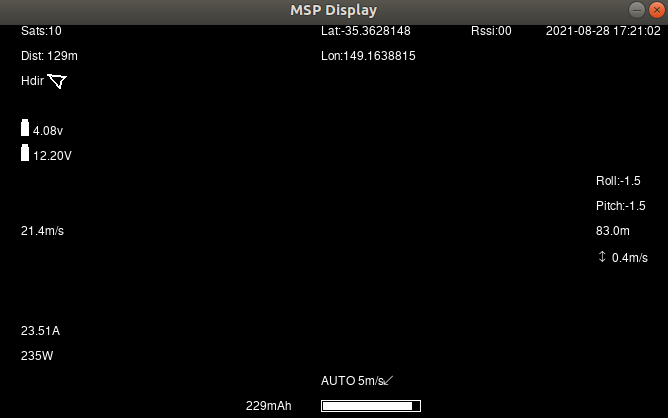

.. _common-msp-osd-overview:

=======
MSP OSD
=======

 .. image:: ../../../images/msp_dji_fpv_goggles.jpeg
    :target: ../_images/msp_dji_fpv_goggles.jpeg

 .. image:: ../../../images/msp_dji_goggles_re.jpeg
    :target: ../_images/msp_dji_goggles_re.jpeg
 
ArduPilot supports the special MSP OSD protocol which allows displaying flight data on the DJI goggles, much like with external MAVLink OSDs or the internal integrated OSD in many flight controllers.

Features
========
 
 - ArduPilot currently supports many, but not all, of the OSD panel items as noted in the section below.
 - Changing display units other than metric and imperial are not currently supported.
 - Multiple screens and remote switching of those screens is not supported.
 - Warning levels for RSSI, Voltage, etc. currently not supported

Configuration
=============

To enable MSP OSD, set the following parameters (using SERIAL port 2 as the port to attach to the DJI Air unit using both TX and RX lines):

 - :ref:`OSD_TYPE<OSD_TYPE>` = 3
 - :ref:`SERIAL2_PROTOCOL<SERIAL2_PROTOCOL>` = 33
 - :ref:`MSP_OPTIONS<MSP_OPTIONS>` = 0 (polling mode)

.. note:: DJI OSD must be enabled: in SETTINGS->DISPLAY->CUSTOM OSD menu of goggles

Panel Items Currently Supported
===============================

- Messages
- Altitude
- Bat_volt
- Bat mah
- Average cell voltage
- RSSI
- Current
- Batused % as horizontal gauge
- Sats
- Fight mode
- Ground speed
- Airspeed (only as override of ground speed)
- Vertical Speed
- Wind Direction and Distance
- Home Direction
- Home Distance
- Roll_angle
- Pitch_angle
- ESC Temperature
- Clock
- Gps_latitude
- Gps_longitude
- Distance Traveled
- Arming status

OSD Panel Item Configuration
============================

Each OSD panel item uses a set of three variables to be set: 

- ``OSDn_ITEM_ENABLE`` - activates the respective item when set to 1.
- ``OSDn_ITEM_X`` and ``OSDn_ITEM_Y`` set the horizontal and vertical position of the item, starting with ``X = 0`` and ``Y = 0`` in the upper left corner of your screen. 

.. note::    ArduPilot calculates a sensor-less airspeed estimate that is used if no sensor is present or fails. ARSPD_TYPE must be set to zero in order to display this value as the airspeed item, if no sensor is present.
    

Testing OSD with SITL
=====================

OSD functionality can be tested and panel items adjusted without autopilot or video hardware using the :ref:`Software In The Loop (SITL) simulator <dev:sitl-simulator-software-in-the-loop>` setup. Follow those SITL-Instructions to setup a simulation environment. Run the simulator on current source code using ``--osdmsp`` option to build the OSD code into the simulator. For example, for a plane simulation:

::

    sim_vehicle.py -v ArduPlane --console --osdmsp

A graphical DJI style MSP OSD simulation in a separate window will be opened with the other simulation windows using a typical set of OSD panel parameters, located at libraries/AP_MSP/Tools/osdtest.parm . Then the OSD elements can be customized by their parameters using the  MSP OSD emulation program to visualize the OSD. 

.. note:: You could also use these parameters to initially setup the MSP OSD configuration for use with goggles, but you may have to change the ``SERIALx_PROTOCOL`` parameter to match the actual serial port that you will be using.

.. note:: The emulation does not support multiple screens or units other than metric

By changing the OSD panel items' parameters, a live update on their placement can be seen in this emulator.

Using Mission Planner to Configure the Layout
=============================================

Mission Planner(MP) has a tab in its CONFIG menu to configure the on-board OSD many autopilots integrate. This same configuration tab can be used to configure the OSD panels. In fact, you can do that while the SITL program and MSP OSD emulation window are active by connecting Mission Planner running on the same computer, or networked computer, to MAVProxy, using this command in MAVProxy:

::

    output add <ip address of box running Mission Planner>:14550

.. note:: if MP is running on the same PC, the ip address would be 127.0.0.1 (local host address)

Video
=====

.. youtube:: gT4R3E_7Z_0

