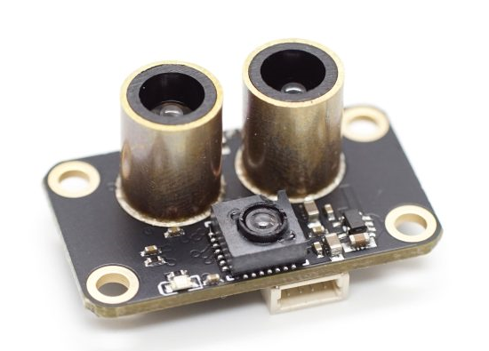
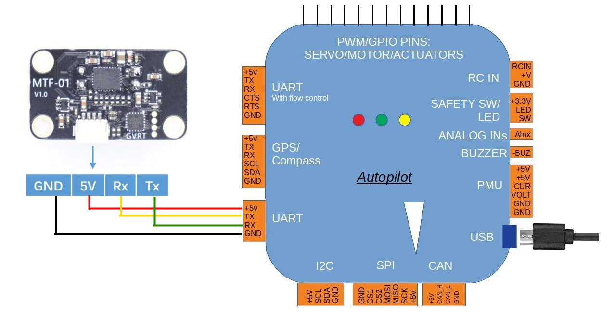

.. _common-mtf-01:

==================================
MicoAir MTF-01 Optical Flow Sensor
==================================

[copywiki destination="copter,plane,rover"]

The is a lightweight 2 in 1 optical flow sensor including a short range lidar which uses the serial MAVLink protocol to communicate with the autopilot.  This can be used to improve horizontal position control especially in GPS denied  or indoor environments.

Where to Buy
============

The sensor is available from `Aliexpress <https://www.aliexpress.us/item/3256805359467554.html>`__ and other resellers

Sensor Setup
============

Use MicoAir's MicoAssistant software using an FTDI adapter (USB to serial) to set its output protocol to "mav-apm".

..  youtube:: D-ooFHEtQoo
    :width: 100%

.. note:: With firmware versions 4.5.0 or above, MTF-01 may not be recognized by Ardupilot unless you  use MicoAssistant to modify its “mav_id” to 200(any value other than 1) and configure whichever serial port's ``SERIALx_OPTIONS`` its connected to  on the autopilot from "0" to "1024"(“Don’t forward mavlink to/from” option).

Connection to Autopilot
=======================

- The flow sensor should be mounted on the underside of the copter with the camera lens pointing downwards. 
- Connect the sensor to the autopilots' serial port 
 
Parameters
==========
For the following we will assume it will be connected to Serial1 port of the autopilot. Any serial port can be used, however.

- Set :ref:`SERIAL1_BAUD<SERIAL1_BAUD>` = 115
- Set :ref:`SERIAL1_PROTOCOL<SERIAL1_PROTOCOL>` = 1 (MAVLink1)
- Set :ref:`FLOW_TYPE<FLOW_TYPE>` = 5 (MAVLink)
- Set :ref:`RNGFND1_TYPE<RNGFND1_TYPE>` = 10 (MAVLink)
- Reboot autopilot to see rangefinder parameters
- Set :ref:`RNGFND1_MAX <RNGFND1_MAX>` = 800 to set range finder's maximum range to 8m
- Set :ref:`RNGFND1_MIN<RNGFND1_MIN>` = 1
- Set :ref:`RNGFND1_ORIENT<RNGFND1_ORIENT>` = 25 (Downward) 

Once the sensor is active you should be able to observe the optical flow and range sensor data on the Mission Planner’s “Status” page. The “opt_qua” and “rangefinder1” should have some value.

Optical Flow Use and Calibration
================================

Be sure to follow the setup and calibration instructions and parameters for :ref:`Optical Flow setup <common-optical-flow-sensor-setup>` and how to switch between outdoor(GPS) and indoor (Optical Flow) positioning.

