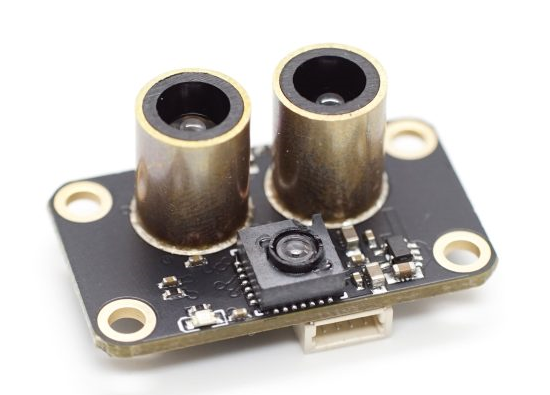
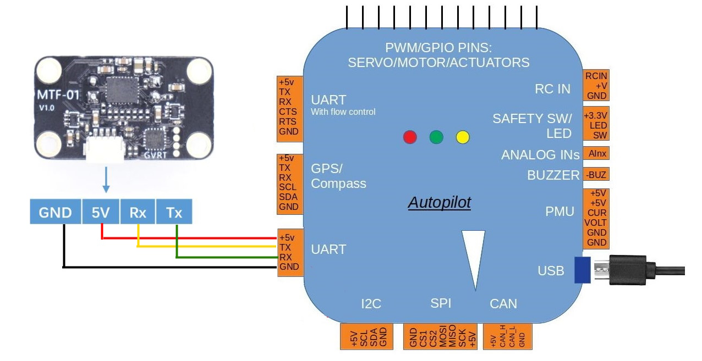
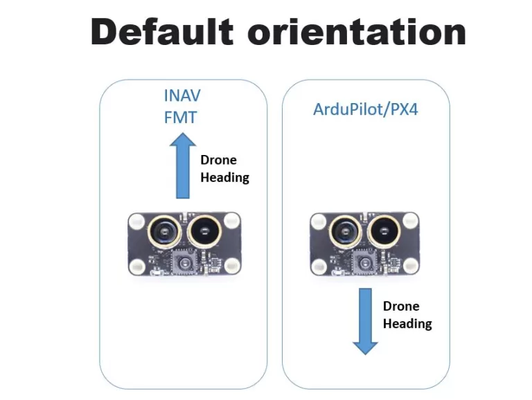

.. _common-mtf-01:

==================================
MicoAir MTF-01 Optical Flow Sensor
==================================

[copywiki destination="copter,plane,rover"]

The is a lightweight 2 in 1 optical flow sensor including a short range lidar which uses the serial MAVLink protocol to communicate with the autopilot.  This can be used to improve horizontal position control especially in GPS denied  or indoor environments.

Where to Buy
============

The sensor is available from `Aliexpress <https://www.aliexpress.us/item/3256805359467554.html>`__ and other resellers

Sensor Setup
============

Use MicoAir's MicoAssistant software using an FTDI adapter (USB to serial) to set its output protocol to "mav-apm".

..  youtube:: D-ooFHEtQoo
    :width: 100%

.. note:: With firmware versions 4.5.0 or above, MTF-01 may not be recognized by ArduPilot unless you use MicoAssistant to modify its “mav_id” to 200 (any value other than 1) and disable MAVLink forwarding on the autopilot serial port it is connected to, as shown in the :ref:`Parameters <common-mtf-01-parameters>` section below.

Connection to Autopilot
=======================

- The flow sensor should be mounted on the underside of the copter with the camera lens pointing downwards. 
- Connect the sensor to the autopilots' serial port 

Mounting Orientation
====================

MicoAir specifies a different default sensor orientation for ArduPilot/PX4 than for INAV/FMT: the orientation ArduPilot assumes with :ref:`FLOW_ORIENT_YAW <copter:FLOW_ORIENT_YAW>` = 0 is rotated 180 degrees from the INAV/FMT one.

If the sensor is mounted in the INAV/FMT orientation instead, which is how many third party mounting diagrams show it, set :ref:`FLOW_ORIENT_YAW <copter:FLOW_ORIENT_YAW>` = 18000 to rotate the sensor's axes by 180 degrees to match.

.. warning:: An incorrect :ref:`FLOW_ORIENT_YAW <copter:FLOW_ORIENT_YAW>` inverts the flow feedback, which produces a positive feedback loop and can lead to a flyaway. Always confirm the orientation using the flow versus attitude check described in :ref:`Optical Flow setup <common-optical-flow-sensor-setup>` before attempting a flight relying on optical flow.

.. _common-mtf-01-parameters:

Parameters
==========
For the following we will assume it will be connected to Serial1 port of the autopilot. Any serial port can be used, however.

.. tabs::
   .. tab:: ArduPilot 4.7 and later

      - Set :ref:`SERIAL1_BAUD<SERIAL1_BAUD>` = 115
      - Set :ref:`SERIAL1_PROTOCOL<SERIAL1_PROTOCOL>` = 1 (MAVLink1)
      - Reboot autopilot to see the MAVLink channel parameters for this port
      - Set ``MAVx_OPTIONS`` = 2 (Don't forward mavlink to/from) for the MAVLink channel used by this serial port. ``MAVx`` counts the serial ports that use MAVLink, not the ``SERIALx`` number: if only SERIAL0 (USB) and SERIAL1 use MAVLink, SERIAL1 is :ref:`MAV2_OPTIONS<MAV2_OPTIONS>`. See :ref:`MAVLink Advanced Configuration <mavlink_configuration>`.
      - Set :ref:`FLOW_TYPE<FLOW_TYPE>` = 5 (MAVLink)
      - Set :ref:`RNGFND1_TYPE<RNGFND1_TYPE>` = 10 (MAVLink)
      - Reboot autopilot to see rangefinder parameters
      - Set :ref:`RNGFND1_MAX <RNGFND1_MAX>` = 8 to set range finder's maximum range to 8m
      - Set :ref:`RNGFND1_MIN <RNGFND1_MIN>` = 0.01
      - Set :ref:`RNGFND1_ORIENT<RNGFND1_ORIENT>` = 25 (Downward)

   .. tab:: ArduPilot prior to 4.7

      - Set :ref:`SERIAL1_BAUD<SERIAL1_BAUD>` = 115
      - Set :ref:`SERIAL1_PROTOCOL<SERIAL1_PROTOCOL>` = 1 (MAVLink1)
      - Set ``SERIAL1_OPTIONS`` = 1024 (bit 10, Don't forward mavlink to/from)
      - Set :ref:`FLOW_TYPE<FLOW_TYPE>` = 5 (MAVLink)
      - Set :ref:`RNGFND1_TYPE<RNGFND1_TYPE>` = 10 (MAVLink)
      - Reboot autopilot to see rangefinder parameters
      - Set :ref:`RNGFND1_MAX <RNGFND1_MAX>` = 8 to set range finder's maximum range to 8m
      - Set :ref:`RNGFND1_MIN <RNGFND1_MIN>` = 0.01
      - Set :ref:`RNGFND1_ORIENT<RNGFND1_ORIENT>` = 25 (Downward)

Once the sensor is active you should be able to observe the optical flow and range sensor data on the Mission Planner’s “Status” page. The “opt_qua” and “rangefinder1” should have some value.

Optical Flow Use and Calibration
================================

Be sure to follow the setup and calibration instructions and parameters for :ref:`Optical Flow setup <common-optical-flow-sensor-setup>` and how to switch between outdoor(GPS) and indoor (Optical Flow) positioning.
