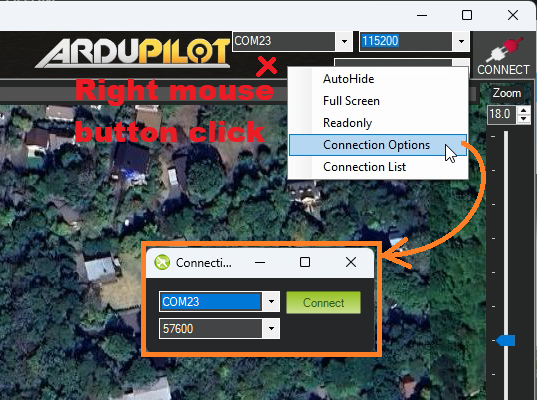
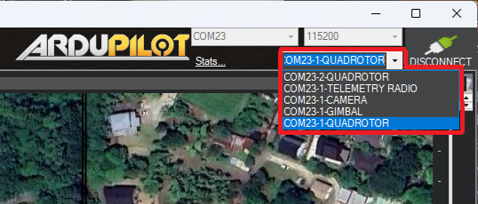

.. _common-multi-vehicle-flying:

====================
Multi-Vehicle Flying
====================

This page shows how to monitor and control multiple vehicles using a single ground station.  More information can be found on the :ref:`Follow mode <copter:follow-mode>` and :ref:`Mission Planner Swarming <planner:swarming>` pages.

.. note::

   This example has been greatly surpassed by `Michael Clement's 50 plane demonstration <https://diydrones.com/profiles/blogs/from-zero-to-fifty-planes-in-twenty-seven-minutes>`__\ 

..  youtube:: M4LxtYa94nk
    :width: 100%

Equipment you will need
=======================

- Multiple `Planes <https://ardupilot.org/plane/index.html>`_, :ref:`Copters <copter:home>` or :ref:`Rovers <rover:home>`
- Pairs of :ref:`telemetry radios <common-telemetry-landingpage>` (e.g. 2x number of vehicles) to allow each vehicle to be connected to the ground station PC and (optionally) a USB HUB increase the number of available USB ports on the PC

   OR

- Telemetry radios capable of mesh networking (e.g :ref:`DroneBridge ESP32 <common-esp32-telemetry>`, :ref:`RFD900 <common-rfd900>`) in which case just 1 radio for each vehicle + 1 for the ground station PC is required
- GCS capable of displaying and controlling multiple vehicles (e.g :ref:`Mission Planner <planner:home>`, QGroundControl)
- RC transmitter for each vehicle

Pre-Flight Setup
================

- Connect to each vehicle's autopilot and set its :ref:`MAV_SYSID <MAV_SYSID>` to a unique number (e.g. "1" for first vehicle, "2" for second vehicle, etc)
- If using SiK radios, :ref:`set the NetID <common-sik-telemetry-radio_configuring_using_the_mission_planner>` of each pair of radios to a unique number (e.g. set the first pair's ``NetID`` to "23", the second's to "24", etc)
- For each pair of radios, connect one to a vehicle's autopilot and the other to the ground station PC
- On the GCS, connect to each radio.  If using Mission Planner, right-mouse-button-click to the left of the Connect button, select "Connection Options" and select the COM port of each telemetry radio and press "Connect" (:ref:`more details can be found here <common-connect-mission-planner-autopilot>`)

- Confirm all vehicles appear on the GCS map
- Optionally :ref:`reduce the telemetry data rate <common-telemetry-port-setup>` for each vehicle to reduce network traffic

Controlling the vehicles
========================

How each vehicle is controlled depends upon the GCS used but if using Mission Planner, use the connection drop-down to select the vehicle to display and control.

If using Copter

- Switch each vehicle into GUIDED mode
- Command each vehicle to take-off by right-mouse-button-clicking on the map, select "Takeoff" and input 2m
- Each vehicle can be moved by first selecting its connection, then right-mouse-button click on the map and select "Fly to Here"
- Change each vehicle's mode to Land or RTL to end the test
- To retake control of a vehicle manually, use the vehicle's transmitter to change to a manual mode such as AltHold or Loiter
