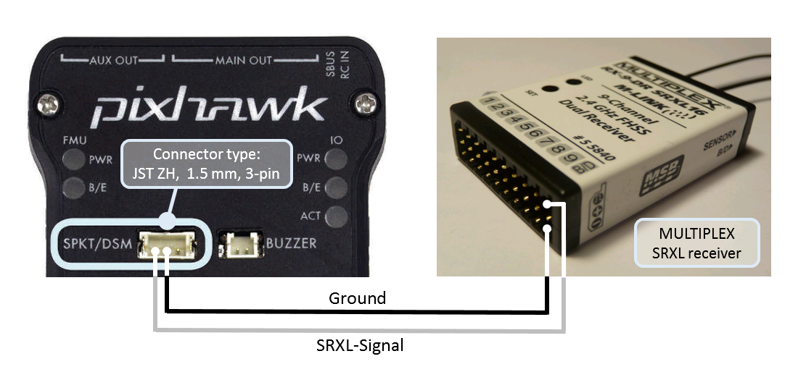

.. _common-multiplex-rc:

===================
Multiplex RC System
===================

.. _common-pixhawk-and-px4-compatible-rc-transmitter-and-receiver-systems-multiplex-srxl:

For a **MULTIPLEX SRXL** receiver, connect the **SPKT/DSM** port of the Pixhawk to the **B/D** port of the MULTIPLEX SRXL receiver, without using the +3,3V voltage supplied at the **SPKT/DSM** port of the Pixhawk and power the MULTIPLEX SRXL receiver separately. Note that you may also connect to the RCin pin or any appropriately configured serial port, See :ref:`common-flight-controller-wiring` 

Details how to enable the SRXL signal on MULTIPLEX receivers can be found in:

.. toctree::
    :maxdepth: 1

    common-srxl-receivers
