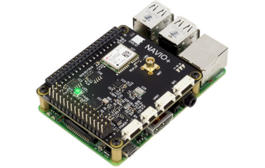

.. _common-navio-overview:

=========================
Archived: NAVIO+ Overview
=========================

.. warning::

   **ARCHIVED ARTICLE**

   Board is very old, and has been superseded by other Navio (and other) products.
   

Specifications
==============

-  **Processor** (`Raspberry PI 2 <https://www.raspberrypi.org/products/raspberry-pi-2-model-b/>`__)

   -  900Mhz quad-core ARM Cortext-A7 CPU
   -  1GB RAM

-  **Sensors**

   -  MPU9250 as main accel, gyro and compass
   -  MS5611 barometer
   -  U-Blox M8N GPS

-  **Power**

   -  Triple redundant power supply

-  **Interfaces**

   -  UART, SPI, I2C
   -  PWM Sum input
   -  Futaba S.BUS input
   -  13 PWM servo outputs

-  **Dimensions**

   -  Weight 12g (shield) + 54g (RPi2)
   -  Size: 55x65mm (shield only)

More details can be found from the `emlid.com website <https://emlid.com/>`__.

Developer build information can be found on the :ref:`ArduPilot dev wiki <dev:building-for-navio-on-rpi2>`.

..  youtube:: 63vjrphteRs
    :width: 100%
