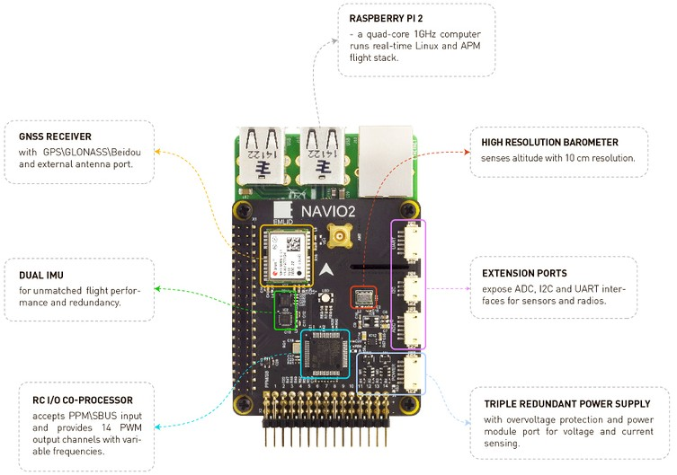

.. _common-navio2-overview:

===============
NAVIO2 Overview
===============

This page presents `Navio2 <http://www.emlid.com/shop/navio2/>`__ - Raspberry Pi autopilot, which runs well proven ArduPilot flight stack and supports all its features.

Specifications
==============

-  **Processor** (`Raspberry PI 3 <https://www.raspberrypi.org/products/raspberry-pi-3-model-b/>`__)

   -  1.2GHz 64-bit quad-core ARMv8 CPU
   -  1GB RAM

-  **Sensors**

   -  MPU9250 9DOF IMU
   -  LSM9DS1 9DOF IMU
   -  MS5611 Barometer
   -  U-blox M8N Glonass/GPS/Beidou
   -  RC I/O co-processor

-  **Power**

   -  Triple redundant power supply

-  **Interfaces**

   -  UART, I2C, ADC for extensions
   -  PWM/S.Bus input
   -  14 PWM servo outputs
    
-  **Dimensions**

   -  Weight 23g (shield) + 54g (RPi2)
   -  Size: 55x65mm (shield only)

What's new compared to Navio+
=============================

**Dual IMU.** Navio2 has two IMU chips to improve flight experience and for redundancy.

**Improved MS5611 performance.** Transactions from other chips on the bus, which MS5611 is connected to, can produce noise during the conversion. That's why MS5611 was left the only sensor on the I2C bus to overcome this.

**PCA9685 PWM generator replaced with a microcontroller.** On previous Navio version PWM generation was handled by PCA9685 chip. Main limitation of this chip is the inability to control frequencies for separate channels. This leads to problems with motors and servos that work on different frequencies. To eliminate that problem a microcontroller is used. It allows to set frequencies for output channels by groups.

**PPM/SBUS decoding done by microcontroller instead of DMA.**  Navio+ used DMA to sample PPM signal which was quite heavy on system resources. On Navio2 a microcontroller handles PPM/SBUS sampling leaving processor cores of Raspberry Pi 2 for your tasks. 

**AUX SPI.** Navio2 is the first HAT to utilize AUX SPI controller on Raspberry Pi. Using two SPI controllers allows to distribute sensors more efficiently.
 
**ADC port.** Using additional ADC channels on Navio+ was not user friendly due to ADC channels being only available on pads at the bottom of the board. On Navio2 these channels are easily accessible on a DF13 port.

**Better Linux integration.** PWM, ADC, SBUS and PPM are integrated in Linux sysfs allowing for easy access from any programming language. Even deeper integration is coming in the future.

For more details and purchase
=============================

- `Emlid website <http://www.emlid.com/>`__ 
- `Navio2 documentation <http://docs.emlid.com/navio2/>`__
- `Purchase page <http://www.emlid.com/shop/navio2/>`__

