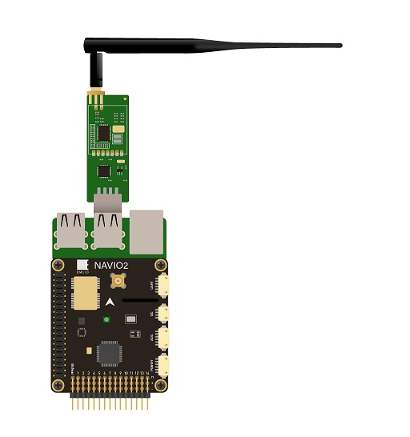

.. _common-navio2-wiring-and-quick-start:

======================================
NAVIO2 Assembly and Wiring Quick Start
======================================

This article provides information about attaching :ref:`NAVIO2 <common-navio2-overview>` to a Raspberry Pi,  powering and connecting its most important peripherals.

.. _common-navio2-wiring-and-quick-start_attaching_navio2:

Attaching NAVIO2 to a Raspberry Pi
==================================

ArduPilot on Navio2 is working on:

- Raspberry Pi 3 Model B
- Raspberry Pi 2 Model B

To mount NAVIO2: 

- Install spacers to the top side of Raspberry Pi and fix them with screws from the bottom.
- Connect extension header to the 40-pin gpio port.
- Attach NAVIO2 to the extension header.
- Fix NAVIO2 using screws.

.. note::

	Raspberry Pi2 requires an external USB Wi-Fi dongle. An extensive list of supported dongles is available `here <http://elinux.org/RPi_USB_Wi-Fi_Adapters>`__.

.. _common-navio2-wiring-and-quick-start_powering_navio2:

Powering NAVIO2
===============

Navio2 has three power sources, all of them can be used simultaneously as they are protected by ideal diodes.

For testing and development purposes:
Connect 5V 1A power adapter to the Raspberry Pi's microUSB port. Raspberry Pi will provide power to the NAVIO2.

In a drone:
NAVIO2 should be powered by a power module connected to the "POWER" port on NAVIO2. NAVIO2 will provide power to the Raspberry Pi. 

Redundancy:
In case of power module failure NAVIO2 will switch to power from the servo rail.

.. warning::

	All power sources should provide voltage in 4.8-5.3V range, otherwise you can damage your NAVIO2 and Raspberry Pi.

.. _common-navio2-wiring-quick-start_rc_inputs_navio2:

Connect remote control inputs
=============================

NAVIO2 supports PPM and SBUS signals as an RC input. To connect receivers that do not support PPM output you can use PPM encoder. PPM receiver is powered by NAVIO2 and does not require power on the servo rail.

.. warning::

	Do not connect servos to the RC receiver! Servos can consume a lot of power which RC receiver port may not be able to provide and that may lead to Raspberry Pi and NAVIO2 shutting down and even getting damaged.

Some of the receivers with PPM output:

For ACCST (most FrSky transmitters):

- FrSky D4R-II 4ch 2.4Ghz ACCST Receiver
- FrSKY V8R7-SP ACCST 7 Channel RX with composite PPM
- FrSKY D8R-XP

For FASST (Futaba & some FrSky trasmitters):

- FrSky TFR4 4ch 2.4Ghz Surface/Air Receiver FASST Compatible

.. _common-navio2-wiring-quick-start_gnss_navio2:

GNSS Antenna
============

GNSS antenna is plugged into the MCX port on top of NAVIO2.

.. _common-navio2-wiring-quick-start_motors_navio2:

Connect Motors
==============

ESCs are connected to RC outputs labeled from 1 to 14 on a 2.54mm header.

For typical ESCs setup schemes visit `NAVIO2 documentation <https://docs.emlid.com/navio2/Navio-APM/typical-setup-schemes/>`__ which includes copter, plane, rover setups. 

.. note::

	Only one ESC power wire (central) should be connected to Navio2 servo rail, otherwise BECs built in ESCs will heat each other.

Connect other peripherals
=========================

Depending on your hardware there may be any number of other peripherals attached, including sensors, cameras, grippers etc. 

Telemetry
---------
Radio modems can be connected either over UART or over USB.

- UART radio

For UART port use /dev/ttyAMA0 serial. 

- USB radio

Use /dev/ttyUSB0 virtual serial port for USB. 

Servos
------

Servos are connected to RC outputs labeled from 1 to 14 on a 2.54mm header.

.. note::

	Power module does not provide power to servos. To provide power to servos connect BEC to the servo rail. BEC would also serve as back-up power supply to Navio2.

Related information
===================

Detailed information for NAVIO2 configuration and setup can be found in `documentation <https://docs.emlid.com/navio2/>`__.

.. toctree::
    :maxdepth: 1

    Anti-vibration mount for NAVIO2 can be found in this article <common-vibration-damping> 
