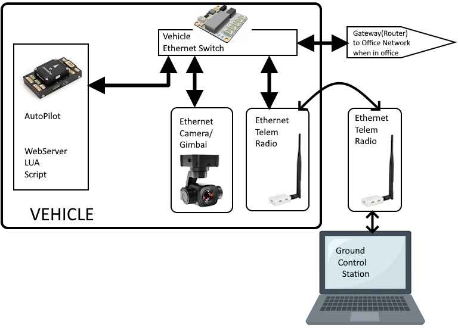
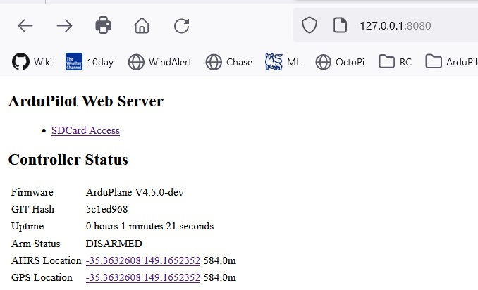

.. _common-network:

===========================
ArduPilot Network Interface
===========================

As of firmware 4.5 and later, ArduPilot provides a network interface framework to allow local and wide-area network connections. Several later generation autopilots, like Pixhawk6X and CubePilot CubeRed, provide Ethernet MAC interfaces, which allows ArduPilot to connect to vehicle peripherals, data servers, and even the wide area network via IP using transport layer UDP or TCP protocols.

In addition, custom builds for H7 based processors that do not have an Ethernet MAC integrated can be created with the `ArduPilot Custom Firmware Server <https://firmware.ardupilot.org/>`__ that includes PPP(Point-To-Point Protocol) allowing network connections over a serial port of the autopilot using PPP.

.. note:: for those :ref:`building firmware locally <building-the-code>`, PPP can be included with the --enable-ppp configuration option.

Currently, hooks into the normal serial manager within ArduPilot now allow serial protocols not only to be connected to the autopilot via the normal UART connections, but also via network connections. These can be used either with Etnernet or PPP interfaces.

In addition, LUA Scripting bindings allow the autopilot to run network server type applications via LUA scripts. A web server LUA example is available as an applet that allows faster log downloads, as well as vehicle/system status data to be presented.

For peripherals with a network interface ArduPilot has AP_Periph firmware that allows the easy development of network peripheral devices using the peripheral's Serial or DroneCAN interfaces to the peripheral device and an easily set up means to pass those devices' data to the autopilot over the network.

ArduPilot Network Framework Overview
====================================

ArduPilot provides a NET manager facility that provides the IP protocol engine, as well as UDP and TCP transport layer engines. Four configurable IP ports are available, and each one can be a UDP or TCP, Client or Server. Data flow to/from these ports can be used by the autopilot as if the data streams were those of a:

- A serial device supported by ArduPilot (ie. Rangefinder, Gimbal, serial ESC, etc.)
- A MAVLink connection to another vehicle or GCS

In addition, LUA Scripting running on an autopilot can access these data ports.

Configuration
=============

- :ref:`NET_ENABLE<NET_ENABLE>` must be set to "1" and autopilot rebooted in order to see the network parameters:

Ethernet MAC Configuration
--------------------------

If the autopilot has an Ethernet MAC the following parameters apply:

- :ref:`NET_MACADDR0<NET_MACADDR0>`
- :ref:`NET_MACADDR1<NET_MACADDR1>`
- :ref:`NET_MACADDR2<NET_MACADDR2>`
- :ref:`NET_MACADDR3<NET_MACADDR3>`
- :ref:`NET_MACADDR4<NET_MACADDR4>`
- :ref:`NET_MACADDR5<NET_MACADDR5>`

This is the global 6 byte MAC address. The default is automatically generated from the autopilot's CPU unique id, but can be changed if desired.

- :ref:`NET_IPADDR0<NET_IPADDR0>`
- :ref:`NET_IPADDR1<NET_IPADDR1>`
- :ref:`NET_IPADDR2<NET_IPADDR2>`
- :ref:`NET_IPADDR3<NET_IPADDR3>`

This is the autopilot's 4 byte IP address. It defaults to ``192.168.13.14``. It can be dynamically assigned if the network has a DHCP server by enabling ArduPilot's DHCP client using the :ref:`NET_DHCP<NET_DHCP>` parameter, or manually set as desired.

- :ref:`NET_NETMASK<NET_NETMASK>` is the number of leading bits set in the subnet mask. For example, if its set to 24, then the subnet mask is  255.255.255.0, which is the default.
- :ref:`NET_GWADDR0<NET_GWADDR0>`
- :ref:`NET_GWADDR1<NET_GWADDR1>`
- :ref:`NET_GWADDR2<NET_GWADDR2>`
- :ref:`NET_GWADDR3<NET_GWADDR3>`

This is the gateway's IP address out of the local sub-net defined by the :ref:`NET_NETMASK<NET_NETMASK>` mask. Any destination IPs that are outside the masked subnet range will be sent to the gateway's MAC address with the final destinations IP address.

PPP Configuration
-----------------

This feature allows an H7 cpu-based autopilot to connect to networks via a Serial port using PPP. 

.. note:: this cannot be used with autopilots having a built-in Ethernet MAC. Only one network connection per autopilot is allowed currently. Also, only one serial port on the autopilot can be configured for PPP.

To enable this feature, it first must be present in the autopilot firmware. This can be done using the `Custom Firmware Build Server <https://firmware.ardupilot.org/>`__ or by building the code locally using the "--enable-ppp" waf configuration option (See :ref:`building-the-code`)

To configure a serial port for PPP (Serial2 is used in this example):

- set :ref:`SERIAL2_PROTOCOL<SERIAL2_PROTOCOL>` = 48 (PPP) requires a reboot to take effect.
- set :ref:`SERIAL2_BAUD<SERIAL2_BAUD>` = 12500000 (12.5MBaud)

.. note:: to get best throughput, the Serial port should have flow control (RTS/CTS) and it be enabled and used. If using a port without flow control, you may be able to set the baud rate as high as 921000, however.

ArduPilot Port Configuration
----------------------------

These parameters apply for either Ethernet or PPP data link connections to the network.
Parameters for each of the four logical ports per network physical interface (example shown only for Port 1):

- :ref:`NET_P1_TYPE<NET_P1_TYPE>`: Type can be disabled (0), UDP Client (1), UDP Server (2), TCP Client (3), or TCP Server(4). For the two client types a valid destination IP address must be set. For the two server types either 0.0.0.0 or the autopilot's local IP address can be used. The UDP client type will use broadcast if the IP is set to 255.255.255.255 and will use UDP multicast if the IP is in the multicast address range. A reboot is required to see the following parameters once the TYPE is set.
- :ref:`NET_P1_IP0<NET_P1_IP0>`, :ref:`NET_P1_IP1<NET_P1_IP1>`, :ref:`NET_P1_IP2<NET_P1_IP2>`, :ref:`NET_P1_IP3<NET_P1_IP3>`:IP address for outgoing packets from Clients. Can be 0.0.0.0 or the autopilot's IP address for Servers. A reboot is required after changing.
- :ref:`NET_P1_PORT<NET_P1_PORT>`: This is the TCP or UDP port number. Reboot required after changing.
- :ref:`NET_P1_PROTOCOL<NET_P1_PROTOCOL>`: This registers this port with the ArduPilot Serial Manager as having a device attached which uses the specified protocol. This allows ArduPilot to use the data as if it had come from a UART attached device or connection. A reboot is required after changing.

The figure below shows a typical single device setup for an Ethernet gimbal.

The figure below shows a typical vehicle system with multiple peripherals and an optional ground-based connection to a factory network for data retrieval and vehicle setup.

Server or Client?
-----------------

The choice of client or server is determined by the capabilities of the device being connected. If it is a TCP server, then ArduPilot's port should be a TCP Client. If its a UDP Client, then ArduPilot would be a UDP Server.

In general if a device is a controllable object to the autopilot, it would be a server, always listening for commands (ESC, Gimbal,etc.). If a continuous data stream (like an airspeed sensor), it would probably be a client, able to send data without inquiry.

Scripting
=========

Network access to LUA scripts is provided with several `socket style bindings <https://github.com/ArduPilot/ardupilot/blob/d90224280e416d0475eaadd06648bbf0daab7f7d/libraries/AP_Scripting/docs/docs/docs.lua>`__  (search for "socket") that allows the script to connect and manage UDP or TCP data flow to the network from the script.

An example script implementing a simple web server application on the autopilot which allows access to the SD card (for rapid log downloading), and access to autopilot state(arming and GPS/AHRS location in this example) is available `here <https://github.com/ArduPilot/ardupilot/blob/master/libraries/AP_Scripting/applets/net_webserver.lua>`__ and its `readme file here <https://github.com/ArduPilot/ardupilot/blob/master/libraries/AP_Scripting/applets/net_webserver.md>`__

Running the Webserver Script Under SITL
---------------------------------------

- run SITL
- enable scripting (:ref:`SCR_ENABLE<SCR_ENABLE>` = 1), reboot SITL
- set :ref:`SCR_VM_I_COUNT<SCR_VM_I_COUNT>` = 1000000, reboot SITL
- connect local webrowser to "http://127.0.0.1:8080" (not types as shown to avoid https)

Resulting web page

Connecting to Webserver via Network Attached Autopilot
------------------------------------------------------
In order to connect an autopilot running the webserver to the local network to allow other PCs to access the server:

- connect autopilot to the local network (directly or via Ethernet switch)
- make sure ``NET_IPADDR`` is an address within the local network range or use the network DHCP server to set it if using the Ethernet interface. For PPP configurations the connected PPP access peripheral should be already setup for network operation as required, and its PPP daemon should have an arp proxy runniing.
- connect local webrowser to "http://<NET_IPADDR>:8080" (note: type exactly as shown... "https://" will not work)

Cable Adapters, Cabling, and Wiring
===================================

Most Ethernet devices are interconnected with CAT5(or higher) cables with RJ-45 connectors. These connectors are obviously too bulky for use on an autopilot or vehicle Ethernet switches. Instead 4 or 5 pin JST-GH or Picoblade connectors are used. Therefore, cable adapters such as the `BotBox adapter <https://botblox.io/switchblox-cable-adapter-for-ardupilot/>`__ , or other RJ45 breakout boards, need to be used if connecting from them to classic RJ45 interfaces.

Using full CAT5 cables to interconnect vehicle components for longer runs may be required, but runs 1-2 meters or less can be done with two twisted pairs of 22-24 AWG wire. Runs from autopilot to switch and to peripherals may all be implemented with short twisted pair runs and JST-GH/Picoblade connectors.

