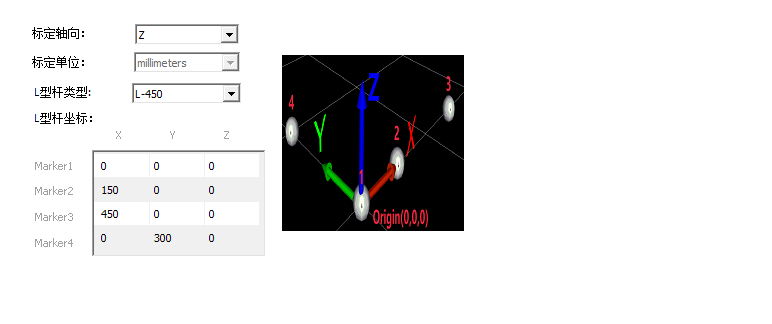
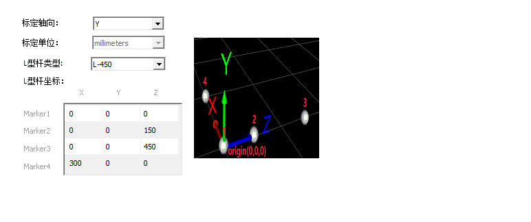

.. _common-nokov:

================================
Nokov indoor pose system
================================

[copywiki destination="copter"]

This article will introduce how to transmit pose information to copter through Nokov motion capture system.

Required hardware
=================

You will need a low-latency network link from your GCS computer to the copter, and from the GCS to your Nokov motion capture system. 

Nokov System Setup
==================

- Nokov includes two coordinate calibration systems, namely Z-axis up and Y-axis up.
- When Z-axis up,the forward direction is aligned with the Y-axis.
- When Y-axis up,the forward direction is aligned with the X-axis.

.. figure:: ../../../images/nokov_copter.jpg
    :target: ../_images/nokov_copter.jpg
    
    Place markers on the copter
    

    
    calibration systems of Z-axis up
    

    
    calibration systems of Y-axis up
    
Configuration the copter
========================

- AHRS_EKF_TYPE=3
- EK3_ENABLE=1
- EK2_ENABLE=0
- COMPASS_USE=0
- COMPASS_USE2=0
- COMPASS_USE3=0
- VISO_TYPE=1
- EK3_SRC1_POSXY=6
- EK3_SRC1_POSZ=6
- EK3_SRC1_YAW=6
- EK3_SRC1_VELXY=0
- EK3_SRC1_VELZ=0

Starting Nokov module
=====================

- Start connect to copter with MAVProxy. Inside MAVProxy load nokov module with:

.. code:: bash

    module load nokov
    
- Set host to the motion capture system:

.. code:: bash

    nokov set host HOST_IP_ADDRESS
    
- Set axis calibration systems("z"or"y"):

.. code:: bash

    nokov set axis "z"
    
- Set tracker_name to track from the motion capture system:

.. code:: bash

    nokov set tracker_name TRACK_NAME
    
MAVProxy Prepare
================

From Nokov get the nokvo-sdk and put it in "MAVProxy/modules/mavproxy_nokov",modify the setup.py file:zip_safe=True.

Test The Flight
===============

Connect the ground station to the copter, then make sure the Nokov SDK is enabled and there is data streaming, set host,axis and tracker_name correctly.Once you've done that, you can test flight.
