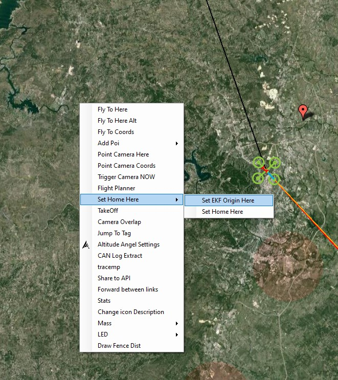

.. _common-non-gps-navigation-landing-page:

[copywiki destination="copter,rover,blimp"]

==================
Non-GPS Navigation
==================

..  youtube:: FjuC1mN8nU4
    :width: 100%

These are the available options that allow a vehicle to estimate its position without a GPS.  Once enabled this allows all autonomous and semi-autonomous modes just as they do would a GPS is available.

.. note:: unless added via a custom build (see :ref:`common-custom-firmware`), Beacon functionality is not included in standard firmware for autopilots having less than 2MB of flash.

.. toctree::
    :maxdepth: 1

    Intel RealSense T265 <common-vio-tracking-camera>
    Luxonis OAK-D <common-vio-oak-d>
    MarvelMind Beacons <common-marvelmind>
    ModalAI VOXL <common-modalai-voxl>
    ModalAI VOXL2 <common-modalai-voxl2>
    Nooploop Beacons <common-nooploop>
[site wiki="copter"]
    Nokov Indoor Optical Tracking <https://discuss.ardupilot.org/t/nokov-indoor-optical-tracking-system>
[/site]
[site wiki="copter,plane"]
    Optical Flow <common-optical-flow-sensors-landingpage>
[/site]
[site wiki="copter"]
    OptiTrack motion capture system <common-optitrack>
[/site]
    Pozyx Beacons <common-pozyx>
    ROS with Google Cartographer (Developers only) <https://ardupilot.org/dev/docs/ros-cartographer-slam.html>
    Vicon Positioning System <common-vicon-for-nongps-navigation>
[site wiki="rover"]
    Wheel Encoders <wheel-encoder>
[/site]
    GPS/Non-GPS Transitions <common-non-gps-to-gps>

.. note:: Most of the above systems (except Beacons) require that the ORIGIN be set manually, except if a GPS is present. In order to do this the user must either use the GCS to set Origin, as shown below using Mission Planner, or use a lua script like this `one <https://github.com/ArduPilot/ardupilot/blob/master/libraries/AP_Scripting/applets/ahrs-set-origin.lua>`__

Persistent Origin Storage
=========================

In ArduPilot 4.7 and later, the EKF origin can be automatically saved and restored across power cycles using the following parameters:

-  :ref:`AHRS_OPTIONS<AHRS_OPTIONS>` bit 3 (RecordOrigin): When enabled, the current EKF origin is automatically saved to parameters whenever it becomes valid (e.g. after GPS lock or manual origin set). The saved origin is stored in:

   -  :ref:`AHRS_ORIGIN_LAT<AHRS_ORIGIN_LAT>` - Last known origin latitude (degrees)
   -  :ref:`AHRS_ORIGIN_LON<AHRS_ORIGIN_LON>` - Last known origin longitude (degrees)
   -  :ref:`AHRS_ORIGIN_ALT<AHRS_ORIGIN_ALT>` - Last known origin altitude (meters)

-  :ref:`AHRS_OPTIONS<AHRS_OPTIONS>` bit 4 (UseRecordedOriginForNonGPS): When enabled, the AHRS will automatically restore the saved origin on boot when GPS is not being used. This allows position-controlled flight modes (Loiter, Auto, Guided, etc.) to work indoors without GPS after the origin has been recorded from a previous flight.

This eliminates the need to manually set the origin via GCS or Lua script on every power cycle when flying indoors with non-GPS position sources.

**Typical setup for indoor flight with optical flow or external navigation:**

1. Enable :ref:`AHRS_OPTIONS<AHRS_OPTIONS>` bit 3 to auto-record the origin
2. Fly outdoors first (or manually set :ref:`AHRS_ORIGIN_LAT<AHRS_ORIGIN_LAT>`, :ref:`AHRS_ORIGIN_LON<AHRS_ORIGIN_LON>`, :ref:`AHRS_ORIGIN_ALT<AHRS_ORIGIN_ALT>`) to establish a valid origin
3. Enable :ref:`AHRS_OPTIONS<AHRS_OPTIONS>` bit 4 to auto-restore the origin for non-GPS flights
4. On subsequent indoor flights, the origin will be automatically restored from the saved parameters

.. note:: ArduSub enables bit 4 (UseRecordedOriginForNonGPS) by default since underwater vehicles typically operate without GPS.

.. note::
   The low cost IMUs (accelerometers, gyros, compass) used in most autopilots drift too quickly to allow position estimation without an external velocity or position source.  In other words, low-cost IMUs on their own are not sufficient for estimating position.
   
.. note::
  A board with more than 1MB of flash is required to run non-GPS navigation, except for Vicon as 1MB boards still support the GPS_INPUT message, although they don't support the GLOBAL_VISION_POSITION_ESTIMATE so they have to be run using the GPS_INPUT message. See :ref:`Firmware Limitations <common-limited_firmware>` for details. 
   
