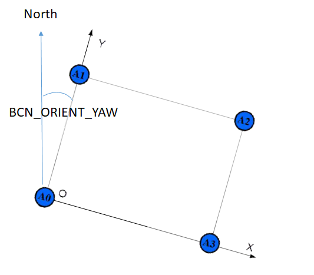
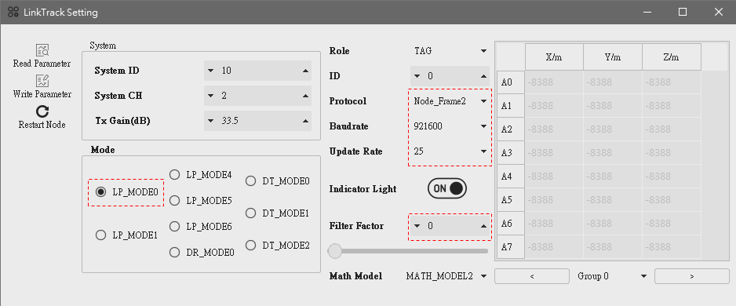
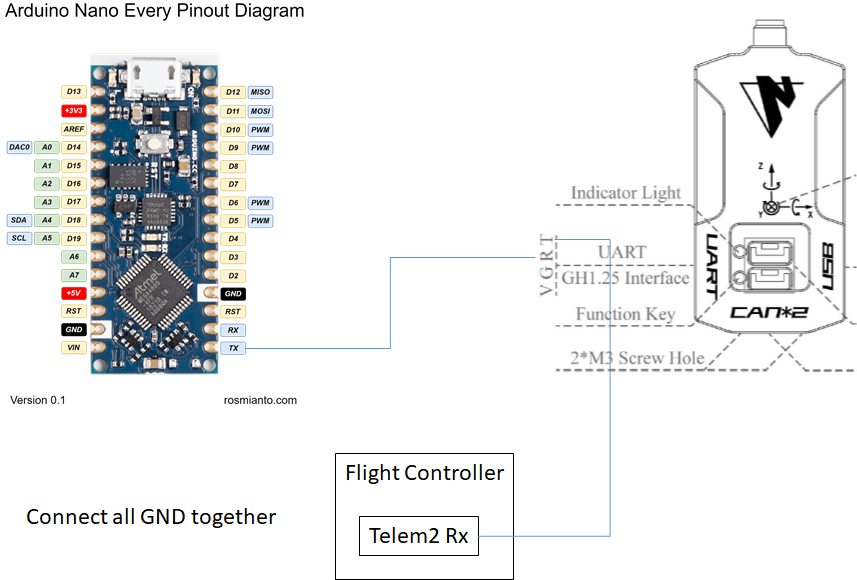

.. _common-nooploop:

=======================================
	Nooploop for Non-GPS Navigation
=======================================

[copywiki destination="copter,rover"]

This article explains how a `Nooploop <https://www.nooploop.com/en/>`__ system based on UWB(Ultra Wide Band) technology can be used as a short-range substitute for a GPS allowing position control modes like Loiter, PosHold, RTL, Auto indoors.

Required Hardware
=================

* 5 Nooploop LinkTrack nodes.
* one `Arduino Nano Every <https://store.arduino.cc/usa/nano-every>`__ (optional)
* 4 `portable chargers <https://www.amazon.com/s/ref=nb_sb_noss_2?url=search-alias%3Daps&field-keywords=portable+charger&rh=i%3Aaps%2Ck%3Aportable+charger>`__ with type A USB ports to power the anchors (optional)
* 4 `tripods <https://www.amazon.com/s/ref=nb_sb_noss_1?url=search-alias%3Daps&field-keywords=tripod&rh=i%3Aaps%2Ck%3Atripod>`__ to mount the anchors (optional)

Preparing the anchors
=====================

4 Nooploop nodes need to be configured to act as anchors. Follow Nooploop `LinkTrack user manual <https://www.nooploop.com/en/download/>`__ to setup and calibrate them.

Placing the anchors
===================

The anchors should be placed in a rectangular shape. Anchor 0 will act as "origin" and Y axis of Nooploop system will act as "North". The configuration is slightly simpler if the line from anchor 0 to anchor 1 is due North but it is not required as the :ref:`BCN_ORIENT_YAW <BCN_ORIENT_YAW>` parameter can be used to account this difference.

Preparing the tag
=================

Use Nooploop NAssistant tool to configure one node to act as a tag.

- set Protocol to Node_Frame2
- set Baudrate to 921600
- set Update Rate to 25
- set Filter Factor to 0 

Connecting the tag to the Flight Controller
===========================================

It is possible to directly connect UART port of the tag to the FC. However, UART Tx of certain FCs is not compatible with Nooploop UART Rx (According to developers at Nooploop, it seems to be caused by a CP2012 inside Nooploop nodes. It is possible that this problem can be solved by removing this CP2012). It causes the FC to be unable to communicate with the tag. Pixhawk 4 mini and Kakute F7 are confirmed to have this issue. In this case, an Arduino Nano Every can be used as a work-around. Use Ardnio IDE to upload `Nooploop work-around sketch <https://github.com/chobitsfan/nooploop_workaround.git>`__ to a Arduino Nano Every and connect its UART Tx to UART Rx of the tag. For the following we assume that the tag is connected to the FC's UART port corresponding to SERIAL1.

Configuration through the Ground Station
========================================

Ensure that Copter-4.1 (or higher) is loaded onto the autopilot and connect with a Ground Station (i.e. Mission Planner).

- set :ref:`BCN_TYPE <BCN_TYPE>` to 3 (means using Nooploop system)
- set :ref:`BCN_LATITUDE <BCN_LATITUDE>`, :ref:`BCN_LONGITUDE <BCN_LONGITUDE>` and :ref:`BCN_ALT <BCN_ALT>` to match your actual location.  Getting these values exactly correct is not particularly important although getting them close is required in order for the compass's declination to be correctly looked up from the database held within ArduPilot.
- set :ref:`BCN_ORIENT_YAW <BCN_ORIENT_YAW>` to the heading from the origin anchor to the 2nd anchor.  One way to capture this value is to stand at the origin holding the vehicle so that its nose points towards the second beacon.  Read the vehicle's heading from the HUD and enter this value into :ref:`BCN_ORIENT_YAW <BCN_ORIENT_YAW>`
- set :ref:`EK3_BCN_DELAY <EK3_BCN_DELAY>` to 20
- set :ref:`GPS_TYPE <GPS_TYPE>` to 0 to disable the GPS
- set :ref:`ARMING_CHECK <ARMING_CHECK>` to -9 to disable the GPS arming check
- set :ref:`SERIAL1_BAUD <SERIAL1_BAUD>` to 921 to set SERIAL1's baud rate to 921600
- set :ref:`SERIAL1_PROTOCOL <SERIAL1_PROTOCOL>` to 13 to enable reading the IndoorLoiter2 protocol
- set :ref:`BRD_SER1_RTSCTS <BRD_SER1_RTSCTS>` to 0 to ensure SERIAL1 does not use flow control, assuming it has this capability.

Ground Testing
==============

- Connect the Autopilot to a ground station.
- After about 1 minute the vehicle's position should jump to the latitude, longitude you input during the configuration step (above).
- Check that the vehicle's position is relatively stable (i.e. moving around less than one meter)
- Walk the vehicle around between the anchors and ensure that its position on the map updates correctly

Flight testing
==============

Setup the transmitter with Stabilize, AltHold and Loiter flight modes.
Take off in AltHold mode and maintain a stable hover.
Switch to Loiter but be ready to switch back to AltHold or Stabilize if the vehicle's position or altitude becomes unstable.

DataFlash logging
=================

The distance to the beacons can be found in the dataflash log's BCN message's D0, D1, D2, D3 fields.

