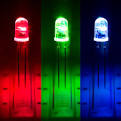
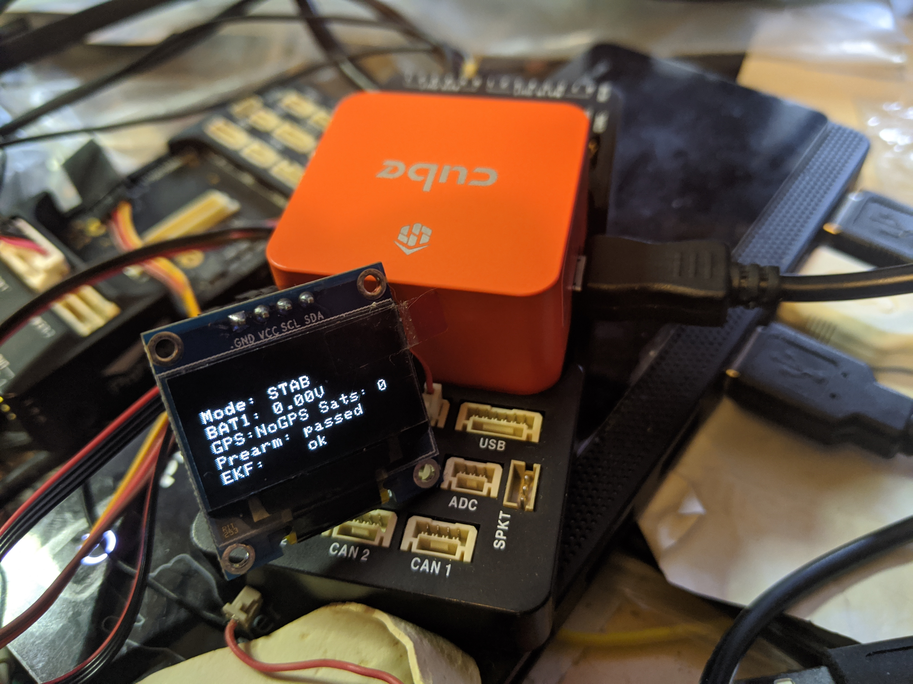

.. _common-ntf-devices:

=================================
Notification Device Configuration
=================================

ArduPilot provides the ability to notify users visually and/or aurally, of important status information and warnings. These can be provided on-board or externally via several types of devices: :ref:`single color LEDs, RGB LEDS, OLED displays<common-external-leds>` , and :ref:`Buzzers<common-buzzer>` .

LED and LED Display Configuration
=================================

LED indication meanings are explained in the :ref:`common-leds-pixhawk` section.

In order to use any of these, they must be selected using the :ref:`NTF_LED_TYPES<NTF_LED_TYPES>` bitmask for which devices are being used in the system:

+-------+---------------------------------------+
|  Bit  |     Bit Meaning                       |
+-------+---------------------------------------+
|  0	| Built in LED(s)  (always on-board)    |
+-------+---------------------------------------+
|  1	| Internal ToshibaLED                   |
+-------+---------------------------------------+
|  2	| External ToshibaLED  I2C              |
+-------+---------------------------------------+
|  3	| External PCA9685  on I2C              |
+-------+---------------------------------------+
|  4	| Oreo LED (Solo specific)              |
+-------+---------------------------------------+
|  5	| UAVCAN                                |
+-------+---------------------------------------+
|  6	| NCP5623 External  I2C                 |
+-------+---------------------------------------+
|  7	| NCP5623 Internal                      |
+-------+---------------------------------------+
|  8	| NeoPixel string **                    |
+-------+---------------------------------------+
|  9 	| ProfiLED                              |
+-------+---------------------------------------+

 ** Neopixel strings are attached via an output selected to have one of the Neopixel SERVOx_FUNCTIONs. Up to four outputs can be designated for Neopixel strings.

The brightness of the LEDs can be controlled via the :ref:`NTF_LED_BRIGHT<NTF_LED_BRIGHT>` parameter.

OLED Displays
-------------

In addition, two I2C connected OLED Displays are supported which display key autopilot status and status text messages: SSH1106 and SSD1306 compatible displays. These will display the text messages normally sent to a Ground Control Station, as well as some status information.

These are enabled via the :ref:`NTF_DISPLAY_TYPE<NTF_DISPLAY_TYPE>` parameter.

BUZZER
======

Buzzers can provide aural indications of status and warnings. Examples for a external piezo buzzer used with a Pixhawk are given :ref:`here <common-sounds-pixhawkpx4>` .

Several parameters are associated with buzzers for configuration and are detailed in the :ref:`common-buzzer` section.

