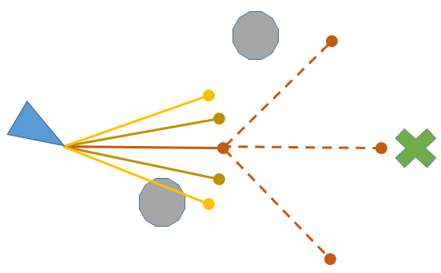

.. _common-oa-bendyruler:

=================================
Object Avoidance with Bendy Ruler
=================================

..  youtube:: E0KYLpXnD1A
    :width: 100%

Copter and Rover 4.0 (and higher) support "BendyRuler" for path planning around obstacles and fences.  The BendyRuler algorithm probes around the vehicle in many directions looking for open spaces and then tries to pick the direction that is sufficiently open while also moving the vehicle towards the final destination.

.. note:: 

    This is only applicable in AUTO, GUIDED, and RTL flight modes.

Configuration
-------------

-  :ref:`OA_TYPE <OA_TYPE>` = 1 (BendyRuler).  You may need to refresh parameters after changing this to see the parameters below.
-  :ref:`OA_LOOKAHEAD <OA_LOOKAHEAD>` : the distance (in meters) ahead of the vehicle that should be probed.  Obstacles further than this far away will be ignored.  This should be long enough that the path around obstacles can be "seen" but not too long or the vehicle will be overly cautious and not enter areas with a lot of obstacles. 5m is typical.
-  :ref:`OA_MARGIN_MAX <OA_MARGIN_MAX>` : the distance (in meters) that the vehicle should stay away from obstacles. 2m is a typical value.

If using a lidar or proximity sensor the following "obstacle database" parameters are available:

- :ref:`OA_DB_SIZE <OA_DB_SIZE>` : the maximum number of obstacles that can be tracked
- :ref:`OA_DB_EXPIRE <OA_DB_EXPIRE>` : the number of seconds after an obstacle disappears from view that it is removed from the database
- :ref:`OA_DB_QUEUE_SIZE <OA_DB_QUEUE_SIZE>` : the buffer size between the lidar and obstacle database.  Normally this can be left at the default value
- :ref:`OA_DB_OUTPUT <OA_DB_OUTPUT>` : controls whether tracked objects are visible on the GCS as small airplanes

Videos
------

..  youtube:: SPu0a23FGKc
    :width: 100%

[copywiki destination="copter,rover"]
