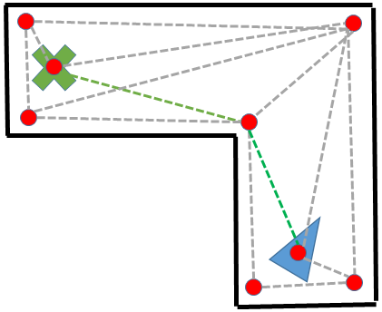

.. _common-oa-dijkstras:

================================
Object Avoidance with Dijkstra's
================================

..  youtube:: GAmNaDTzy3Q
    :width: 100%

Copter and Rover 4.0 (and higher) support `Dijkstra's <https://en.wikipedia.org/wiki/Dijkstra%27s_algorithm>`__ for path planning around fences and stay-out zones.  This well known algorithm internally builds up a list of "safe areas" calculated from the fence and stay-out zones and then finds the shortest path to the destination.

.. warning::

   Dijkstra's does not support avoiding objects sensed with lidar or proximity sensors

.. warning::

   Dijkstra's does not support Spline Waypoints. 

Configuration
-------------

-  :ref:`OA_TYPE <OA_TYPE>` = 2 (Dijkstra).  You may need to refresh parameters after changing this to see the parameters below.
-  :ref:`OA_MARGIN_MAX <OA_MARGIN_MAX>` : the distance (in meters) that the vehicle should stay away from the fences and stay-out zones

Videos
------

..  youtube:: JKxQGt6XW60
    :width: 100%

[copywiki destination="copter,rover"]
