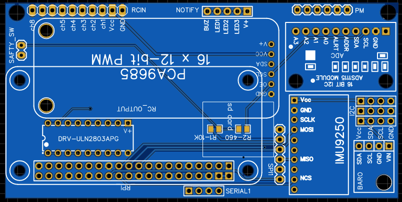

.. _common-obal-overview:

=================================================
Open Board Architecture for Linux - OBAL Overview
=================================================

Specifications
==============

-  **Processor** (`Raspberry PI Zero & 42 <https://www.raspberrypi.org/products/>`__)

-  **Sensors**

   -  MPU9250 as main accel, gyro and compass
   -  BMP-180 barometer
   
-  **Interfaces**

   -  UART, SPI, I2C
   -  PWM 8-Channels
   -  16 PWM servo outputs

How to get It
=============

Obal is an open source architecture DIY board. You need to get its components and build it yourself.

MPU: (`MPU 9250 <https://www.aliexpress.com/item/32693237987.html>`__)

BARO: (`BMP-180 <https://www.aliexpress.com/item/1005002119865159.html?spm=a2g0o.productlist.0.0.15ef372bcuH6pQ&algo_pvid=19d53257-b3c0-450b-9287-ac4520607140&algo_exp_id=19d53257-b3c0-450b-9287-ac4520607140-13&pdp_ext_f=%7B%22sku_id%22%3A%2212000018805134920%22%7D>`__)

ADS:  (`ADS-1115 <https://www.aliexpress.com/item/32817162654.html?spm=a2g0o.productlist.0.0.55997170mWAIaq&algo_pvid=feb3a693-f2d5-4752-ba96-89379533b8ff&algo_exp_id=feb3a693-f2d5-4752-ba96-89379533b8ff-2&pdp_ext_f=%7B%22sku_id%22%3A%2210000000609239300%22%7D>`__)

PWM: (`PCA9658 <https://www.aliexpress.com/item/32469378576.html?algo_pvid=3cf847e2-db99-4046-8d14-dc60fc9372db&aem_p4p_detail=202109110951464991717441224200031156071&algo_exp_id=3cf847e2-db99-4046-8d14-dc60fc9372db-0>`__)

Led & Buzzer Drive ULN2803: (`ULN2803 <https://www.sparkfun.com/products/312>`__)

R1 10KOhm: (`10KOhm SMD <https://www.amazon.com/Chanzon-Resistor-Tolerance-Resistors-Certificated/dp/B08QRTQVP1/ref=sr_1_4?dchild=1&keywords=0805+SMD+10K&qid=1631543411&sr=8-4>`__)

R2 470Ohm: (`470Ohm SMD <https://www.amazon.com/470-ohm-Resistor-Resistors-Tolerance/dp/B07DHGBR3W/ref=sr_1_2?dchild=1&keywords=0805+SMD+470&qid=1631543390&sr=8-2>`__)

LEDs 1W : (`LED 1W <https://www.amazon.com/HiLetgo-20pcs-Power-Light-80-90LM/dp/B07RQ57TM5/ref=sr_1_5?dchild=1&keywords=LED+Power+1W&qid=1631543937&sr=8-5>`__). Any LEDs can work here even the normal small leds.

Buzzer: (`Active Buzzer <https://www.banggood.com/5-PCS-Super-Loud-5V-Active-Alarm-Buzzer-Beeper-Tracker-9+5_5mm-for-RC-MultiRotor-FPV-Racing-Drone-p-1117207.html?gmcCountry=US&currency=USD&cur_warehouse=CN&createTmp=1&utm_source=googleshopping&utm_medium=cpc_bgs&utm_content=sandra&utm_campaign=sandra-ssc-us-all-0407&ad_id=512762581403&gclid=CjwKCAjw7fuJBhBdEiwA2lLMYZdcBKraXyTI-cDNRRcjE187jHpMr6ru5ZWuEifklgJrqVT3NawvwxoC-ocQAvD_BwE>`__)

Board: (`Board Gerber File <https://github.com/HefnySco/OBAL/blob/main/Hardware/Gerber_PCB_OBAL%20ver%200.2.zip?raw=true>`__) and you can order it from (`here <https://cart.jlcpcb.com/quote>`__) or any other pcb manufacturers.

More Information
================

`Schematics <https://oshwlab.com/mohammad.hefny/Ardupilot-OBAL-FCB>`__

More details can be found from the `Obal github <https://github.com/HefnySco/OBAL#readme/>`__.

..  youtube:: q7PciOGgZ34
    :width: 100%
[copywiki destination="plane,copter,rover,blimp"]