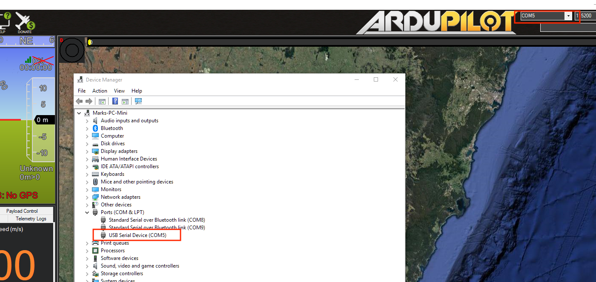

.. _common-omnibusf4pro:

==================
Omnibus F4 Pro
==================

.. figure:: ../../../images/omnibusf4pro.png
    :target: ../_images/omnibusf4pro.png
    :width: 450px

    above image and some content courtesy of `myairbot.com <https://store.myairbot.com/flight-controller/omnibus-f3-f4/omnibusf4prov3.html>`__

.. note::

   Support for this board has been introduced with ArduPilot's ChibiOs port.

Specifications
==============

-  **Processor**

   -  STM32F405 ARM

-  **Sensors**

   -  InvenSense MPU6000 IMU (accel, gyro)
   -  BMP280 barometer
   -  Voltage and current sensor

-  **Interfaces**

   -  UARTS
   -  PWM outputs
   -  RC input PWM/PPM, SBUS
   -  I2C port for external compass
   -  USB port
   -  Built-in OSD

Where to Buy
============

- available from multiple retailers including `myairbot.com <https://store.myairbot.com/flight-controller/omnibus-f3-f4/omnibusf4prov3.html>`__

Versions
==============
There have been many versions of this board and many clones. Best results, with no feature/performance impacts will be obtained with V3 boards and V5 boards which have solder jumpers for selecting "SBUS" or "PPM" RX input. This should be soldered to the "PPM" selection for ALL reciever types. Ardupilot will automatically detect and accept any supported format (SBUS/PPM/DSM/etc.) on the RX input with this jumper selection. In addition, be sure the board has a barometer, SD Card slot, and Current sense circuit.

Board Connections
==================
GPS is attached to UART6

Telem is available at UART 1

The shared UART3/I2C pins are enabled only for I2C operation to allow external compass or digital airspeed sensor attachment.

If you want to power the servos from the ESC BEC via the board's center rail for the servo outputs, then you should remove the diode as per here: https://www.rcgroups.com/forums/showthread.php?2874687, otherwise, independently power the servos directly from the ESC or independent BEC with no connection to the board's servo output center rail.

Video power provided on the video input and output center rail, is provide through an on-board noise filter. Either ~4.5V (labeled 5V) or VBAT-0.5V (VBAT) can be selected by solder pads on the back of the board.

Flashing Firmware
========================
Usually these boards are sold pre-flashed with betaflight / INav firwares and require both firmware and bootloader to be updated if you want to use ArduPilot, as an ArduPilot-compatible bootloader is required for subsequent ArduPilot firmware-upgrade handling.

Firmware files can be found `here <http://firmware.ardupilot.org/>`__
Besides the .apj files for firmware flashing via MissionPlanner, there's also .hex files for use with various utilities like dfu-util or betaflight / iNav GUIs. You will also find a _bl.hex that contains the firmware plus the ArduPilot compatible bootloader in case it is not already present on your board. 

The provided _bl.hex file can be flashed using BF or iNav GUI, likely the most convenient way to get ArduPilot on your board the first time.

Alternatively, the bootloader can be flashed separately. This requires the board to be put into DFU mode. Tools like dfu-util can be used to flash the bootlader. Once the bootlader is present, all subsequent firmware updates can be done using MissionPlanner's firmware functions.

Enter DFU Mode
--------------
To do this, you'll need to locate the DFU jumper on your board. On most board flavours this is a little push button thas needs to be
pressed while connecting your board to your PC via USB: 

.. image:: ../../../images/omnibusf4_dfu_button.png
    :target: ../_images/omnibusf4_dfu_button.png

Install dfu-util
-----------------
* Linux (Ubuntu)

  ::
    
    sudo apt-get install dfu-util
    
* OS X

  ::
    
    brew install dfu-util

* Windows

  Download the `dfu-util <http://dfu-util.sourceforge.net/releases/dfu-util-0.8-binaries/win32-mingw32/dfu-util-static.exe>`__ to your local system, e.g., under `D:\dfu-util`.

  Rename it to `dfu-util.exe`

  Append the path of the `dfu-util.exe` to the system environment variable `Path`: "My Computer" > "Properties" > "Advanced" > "Environment Variables" > "Path". Please note that paths in the variable `Path` are seperated by semicolon `;`. This will allow dfu-util to be executed globally in command prompt.

Flash Bootloader
----------------

Bootloader binaries for the current targets can be found `here <http://firmware.ardupilot.org/Tools/Bootloaders>`__.

Download omnibusf4pro_bl.bin for this board type. With your board connected via USB and put into DFU mode, open a terminal and flash the new bootloader with the following command line:

::

    sudo dfu-util -d 0483:df11 -c 1 -i 0  -a 0  -D omnibusf4pro_bl.bin  -s 0x08000000

Once the flashing is complete, power cycle the board and you should see a solid power LED and a rapidly blinking blue LED.

.. note::
   Alternatively, board-specific bootloaders can be built from source with ./waf using the --bootloader option.

Flash ArduPilot
---------------
Open Mission Planner and go to the Initial Setup tab. Verify that the COM port in the top right is the same as in Device Manager.

Choose "Load Custom Firmware" and browse to the respective .apj file. After the flash is complete, power cycle the device.

.. image:: ../../../images/openpilot-revo-mini-load-firmware.png
    :target: ../_images/openpilot-revo-mini-load-firmware.png

Congratulations! You're now running ArduPilot on your omnibusF4. You can use this same process to upgrade to newer versions of ArduPilot. Either use MP's firmware update functionality or compile your own desired vehicle firmware from source and upload the .apj file to the board.

Compile ArduPilot
-----------------
To build your own firmware, see the instructions on setting up a build envrionment and compiling the source code:
`Building the Code <http://ardupilot.org/dev/docs/building-the-code.html>`__
