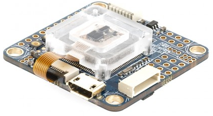

.. _common-omnibusf7:

==========
Omnibus F7
==========

    Above image and some content courtesy of `myairbot.com <https://store.myairbot.com/flight-controller/omnibus-f7/omnibusf7v2.html>`__

.. note::

   Support for this board is included in Copter-3.6 (and higher).

Specifications
==============

-  **Processor**

   -  STM32F7 ARM
   -  512KB flash

-  **Sensors**

   -  InvenSense MPU6000 IMU (accel, gyro) with vibration isolation
   -  InvenSense ICM20608 IMU (accel, gyros, compass) with vibration isolation
   -  BMP280 barometer
   -  Voltage and current sensor

-  **Interfaces**

   -  UARTS
   -  PWM outputs
   -  RC input PWM/PPM, SBUS
   -  I2C port for external compass
   -  USB port
   -  Built-in OSD

-  **Size and Dimensions**

   - 36mm x 36mm

Where to Buy
============

- available from multiple retailers including `myairbot.com <https://store.myairbot.com/flight-controller/omnibus-f7/omnibusf7v2.html>`__
