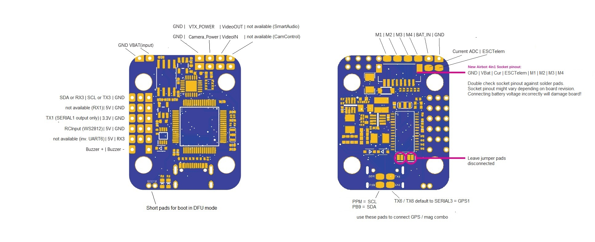
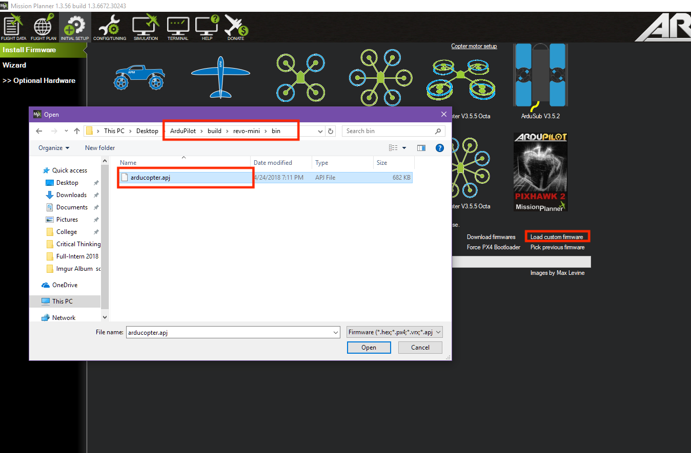

.. _common-omnibusnanov6:

===============================
Omnibus F4 Nano V6 and V6.x
===============================

Original Omnibus F4 Nano V6
===========================

.. image:: ../../../images/omnibusNanoV6.jpg
    :target: ../_images/omnibusNanoV6.jpg
    :width: 450px

V6.x hardware revision
======================

Above images and some content courtesy of `myairbot.com <https://store.myairbot.com/flight-controller/omnibus-f3-f4/omnibusf4nanov6.html>`__

.. note::

   Support for this board is available with Copter-3.6.0 (and higher)

Specifications
==============

-  **Processor**

   -  STM32F405 ARM

-  **Sensors**

   -  InvenSense MPU6000 IMU (accel, gyro)
   -  BMP280 barometer
   -  Voltage sensor

-  **Interfaces**

   -  2 full UARTS (RX and TX)
   -  1 RX only UART for ESC telemetry 
   -  4 PWM outputs
   -  RC input PPM, SBUS, CRSF etc.
   -  I2C port for external compass
   -  USB port
   -  Built-in OSD
   -  Onboard voltage sensor
   -  additional ADC for current sensor on V6.x revision only. Current sensing on original V6 available using ESC telemetry.
   -  Onboard winbond 25Q128 for dataflash-type logging 

Where to Buy
============

- available from multiple retailers including `myairbot.com <https://store.myairbot.com/flight-controller/omnibus-f3-f4/omnibusf4nanov6.html>`__

Default UART order
==================

- SERIAL0 = console = USB
- SERIAL1 = Telemetry1 = USART1 (only available on original V6 version)
- SERIAL2 = Telemetry2 = USART4 (RX only for ESC telemetry)
- SERIAL3 = GPS1 = USART6
- SERIAL4 = USART3 available in :ref:`BRD_ALT_CONFIG <BRD_ALT_CONFIG>` = 1 (firmware 4.1 or later)
- SERIAL5 = not assigned
- SERIAL6 = not assigned

Serial protocols can be adjusted to personal preferences.

Dshot capability
================

All motor/servo outputs are Dshot and PWM capable. However, mixing Dshot and normal PWM operation for outputs is restricted into groups, ie. enabling Dshot for an output in a group requires that ALL outputs in that group be configured and used as Dshot, rather than PWM outputs. The output group that must be the same (same PWM rate or Dshot, when configured as a normal servo/motor output) is: 1/2 and 3/4.

Logging
=======

Logging to on-board data flash is supported on this controller.

Versions
==============
There's various versions and clones of the OmnibusF4Nano. This refers to the original V6 and subsequent V6.x revision only with onboard BMP280 type barometer.

Board Connections
=================

Original V6 version
-------------------

    
Typical Arduplane system

GPS is attached to UART6

Telem is available at UART 1

The shared UART3/I2C pins are enabled for I2C operation in default :ref:`BRD_ALT_CONFIG <BRD_ALT_CONFIG>` = 0 to allow external compass and / or digital airspeed sensor attachment.
Alternatively they can be set to UART operation as SERIAL4 in :ref:`BRD_ALT_CONFIG <BRD_ALT_CONFIG>` = 1.

RC input is via pad marked LED on the board and is compatible all RX serial protocols supported by ArduPilot.
The Buzzer output pad has no functionality.

V6.x revision
-------------

.. note::

   This board revision has the fixed inverter moved to USART1 RX pin, so only TX1 pin can be used (output only). 2 full UARTS + I2C is available in :ref:`BRD_ALT_CONFIG <BRD_ALT_CONFIG>` = 1, using RX3 / TX3 pins as SERIAL4. In default :ref:`BRD_ALT_CONFIG <BRD_ALT_CONFIG>` = 0, RX3 and TX3 pins will default to I2C SDA and SCL respectively. RCInput is on WSL2812 pad. I2C and SERIAL3 for GPS / mag combo is on PPM (=SCL), PB9 (=SDA), RX6 and TX6 pads. Make sure to leave solder jumpers for inverter setup diconnected.

Battery monitoring
==================

Original V6 revision 
--------------------

Original V6 revision supports analog voltage monitoring on VBAT pin.

Set :ref:`BATT_MONITOR <BATT_MONITOR>` to 3 (= analog voltage only) and reboot.

Default pin values:

:ref:`BATT_VOLT_PIN <BATT_VOLT_PIN>` = 12

:ref:`BATT_VOLT_MULT <BATT_VOLT_MULT>` = 11

Optionally add voltage and / or current monitoring using BLHeli_32-capable ESCs. See instructions :ref:`here <common-dshot>` for setting up BLHeli_32 ESC telemetry.

V6.x revision
-------------

V6.x revision has an additional ADC available for external current sensor hardware / PDB connection in 4in1 socket / respective pads.

:ref:`BATT_CURR_PIN <BATT_CURR_PIN>` = 11

:ref:`BATT_AMP_PERVLT <BATT_AMP_PERVLT>` = 18.2

Set :ref:`BATT_MONITOR <BATT_MONITOR>` to 4 (= analog voltage and current) and reboot for full battery monitoring support.

.. note::
   
   Current pin defaults to pin 11 in ardupilot runtime. Alternatively, it can be used for analog RSSI input or connecting an analog airspeed sensor. Adjust :ref:`BATT_AMP_PERVLT <BATT_AMP_PERVLT>` default of 18.2 as required by the individual current sensor hardware used.

Flashing Firmware
=================
Usually these boards are sold pre-flashed with Betaflight / iNav firmwares. In order to use ArduPilot, first time flashing requires both the bootloader and the firmware to be updated. Subsequent ArduPilot firmware updates do not require updating the bootloader again. 

First time flashing
-------------------

Follow the instructions `here <https://ardupilot.org/plane/docs/common-loading-firmware-onto-chibios-only-boards.html>`__ using the "arduXXX_with_bl.hex" file for the "OmnibusNanoV6" target.

When instructed to enter DFU mode, locate the DFU button / jumper pads and keep the button pressed / jumper pads shorted while connecting the board to your computer via USB. If done successfully, the red power LED should light solid while the blue activity LED should not light at all.

Subsequent firmware updates
---------------------------

Follow the instructions `here <https://ardupilot.org/plane/docs/common-loading-firmware-onto-pixhawk.html>`__ but choose "Load Custom Firmware" and browse to the respective "arduXXX.apj" file for the "OmnibusNanoV6" target, or your own .apj file if building your own firmware.

Compile ArduPilot
-----------------

To build your own firmware, see the instructions on setting up a build envrionment and compiling the source code:
`Building the Code <https://ardupilot.org/dev/docs/building-the-code.html>`__
