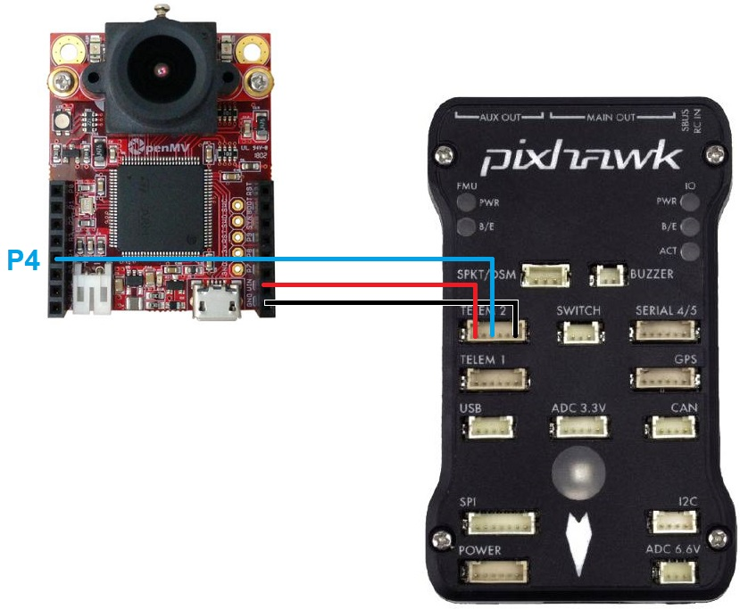
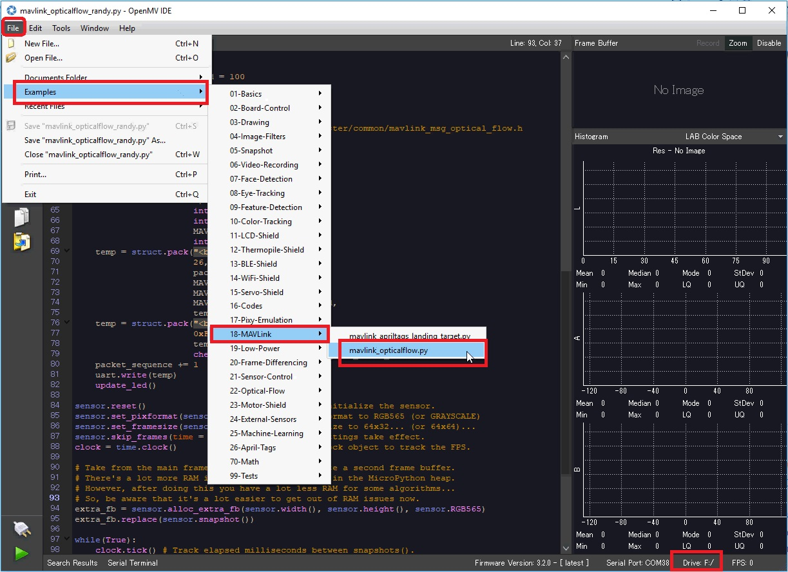

.. _common-openmv-optflow:

=======================
OpenMV for Optical Flow
=======================

[copywiki destination="copter,plane"]

The `OpenMV camera <https://openmv.io/>`__ is a programmable camera which includes support for optical flow.

..  youtube:: BmixVDBiIbA
    :width: 100%

.. warning::

   Support for this sensor will be included in Copter-4.0 (and higher)

Where to Buy
------------

The sensor can be purchased directly from `openmv.io <https://openmv.io/collections/cams>`__

Connection to Autopilot
-----------------------

- The camera should be mounted on the underside of the copter with the camera lens pointing downwards.  The camera edge with the lens should be towards the front of the vehicle.  The image above is incorrect because the autopilot's arrow is pointing down while the sensor's lens is close to the top
- Connect the camera's P4, VIN and GND pins to one of the autopilot's serial ports as shown above.  In the image above the sensor is connected to a Pixhawk's Telem2 port
- Set :ref:`FLOW_TYPE <FLOW_TYPE>` = 5 (MAVLink)
- Set :ref:`SERIAL2_PROTOCOL <SERIAL2_PROTOCOL>` = 1 (MAVLink) if using Serial2/Telem2, if connected to another serial port use the corresponding SERIALx_PROTOCOL parameter
- Set :ref:`SERIAL2_BAUD <SERIAL2_BAUD>` = 115
- Set :ref:`EK2_FLOW_DELAY <EK2_FLOW_DELAY>` = 80
- Optionally set :ref:`EK2_GPS_TYPE <EK2_GPS_TYPE>` = 3 to force the EKF to only use the optical flow sensor and not use the GPS

.. note::

   Official pinout for the camera can be found `here <https://cdn.shopify.com/s/files/1/0803/9211/files/cam-v3-pinout.png?6147773140464094715>`__

Camera Setup
------------

Official setup information can be found `here <http://docs.openmv.io/openmvcam/tutorial/index.html>`__ but the short form is:

- Connect the OpenMV camera to your computer.  On Windows the camera should appear as a new COM port and a virtual drive should also be created (this is where scripts are copied to below)
- `Download, install and run the OpenMV IDE <https://openmv.io/pages/download/>`__
- Select File, Examples, 18-MAVLink, mavlink_opticalflow.py
- On the bottom right, select the Drive that corresponds to the OpenMV camera's virtual drive
- Select Tools, save open script to OpenMV Cam
- Select Tools, Reset OpenMV Cam
- A green light on the camera should begin flashing which shows the script is running

Additional Notes
-----------------

- As with the :ref:`PX4Flow sensor <common-px4flow-overview>` a range finder is required to use the sensor for autonomous modes including :ref:`Loiter <loiter-mode>` and :ref:`RTL <rtl-mode>`
- :ref:`FlowHold <flowhold-mode>` does not require the use of a rangefinder
- The sensor has been successfully tested to altitudes of about 10m

Testing and Setup
-----------------

See :ref:`common-optical-flow-sensor-setup`
