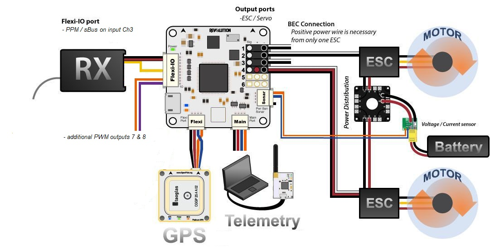
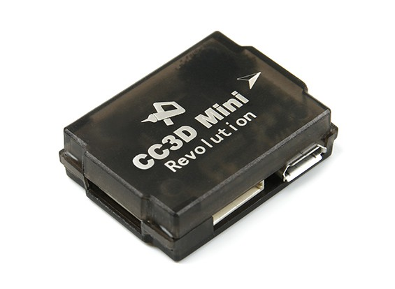
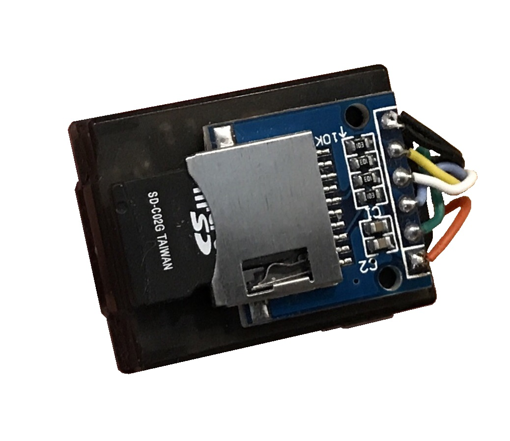
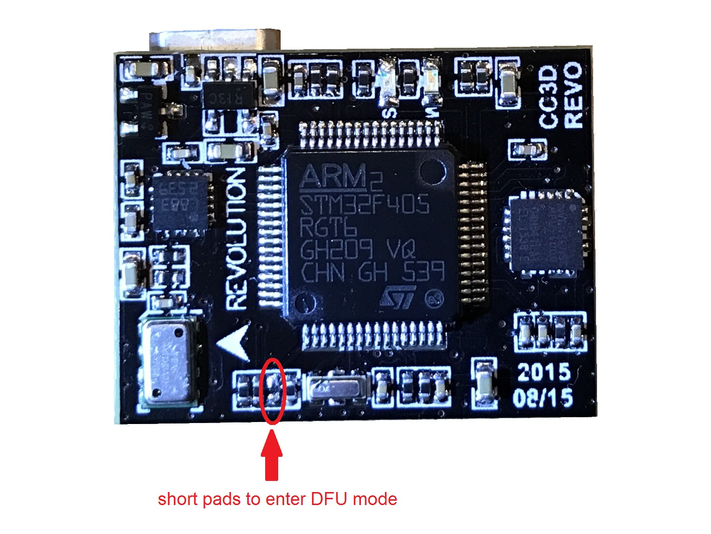
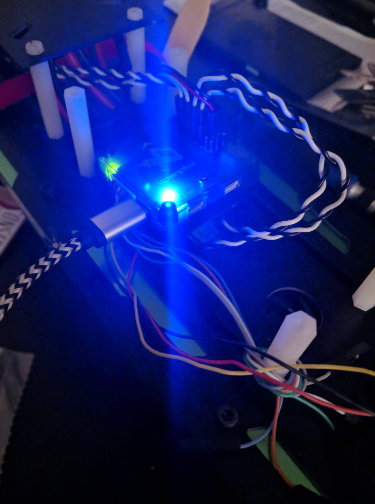
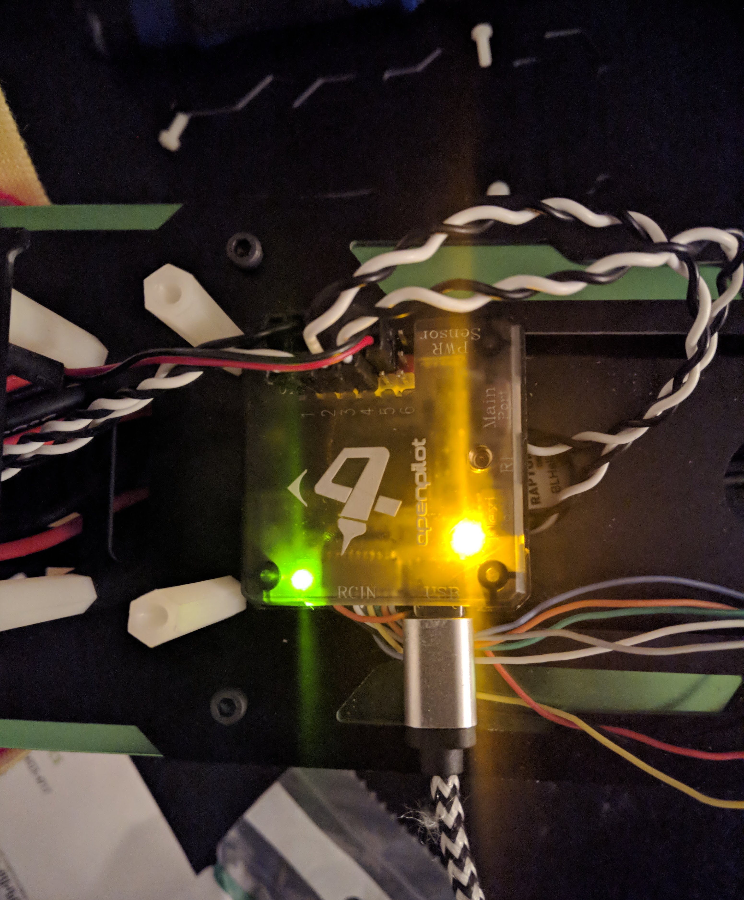

.. _common-openpilot-revo-mini:

=================================
OpenPilot Revolution and RevoMini
=================================

    

*Images and some content courtesy of the* `LibrePilot wiki <https://librepilot.atlassian.net/wiki/spaces/LPDOC/pages/26968084/OpenPilot+Revolution>`__

Specifications
==============

-  **Processor**

   -  STM32F405RGT6 ARM Cortex-M4 microcontroller
   -  168 Mhz/1 MB Flash
   -  32-bit failsafe co-processor

-  **Sensors**

   -  InvenSense MPU6000 IMU (accel, gyro)
   -  Honeywell HMC5883L compass
   -  MS5611 barometers

-  **Power**

   -  4.8V ~ 10V input power provided through ESC connection for fullsize Revolution
   -  5V max on RevoMini

-  **Default Interfaces**

   -  6 PWM outputs
   -  RC input PPM/sBus on RC input port's signal pin 1
   -  analog to digital inputs for battery voltage and current monitoring, more adcs possible on arbitrary pins
   -  GPS rx / tx on RC input signal pins 3 & 4 
   -  Telem1 on mainport
   -  Telem2 on Flexi port
   -  USB port
   -  SWD Port for flashing and debugging, including 3.3V output for optional periphereals
   -  MMCX antenna connector for integrated HopeRF RFM22B 100mW 433MHz (fullsize Revolution only)
   -  OPLink port on RevoMini. OPLink hardware is not supported by ArduPilot, but this port exposes pins to be used for supported periphereals like SD card adapter
   
- **Optional Settings**

   -  I2C on Flexi port
   -  RevoMini's OPLink port can be used for external SD card connection
   -  arbitrary pins can be used for various connections like 2nd GPS, additional PWM outputs etc. within certain restrictions
   

The RevoMini likely is the smallest footprint autpilot hardware to support ArduPilot. It does not offer CAN bus connectivity or sufficient onboard memory for storage of relevant logging data. However, an external SD card adapter can be added with limited effort.

Where to Buy
============

- Available from many retailers including `HobbyKing <https://hobbyking.com/en_us/openpilot-cc3d-revolution-revo-32bit-flight-controller-w-integrated-433mhz-oplink.html>`__.

Flashing Firmware
=================
Support for Revolution and RevoMini has been introduced with Ardupilot's ChibiOS port. Firmware files can be found `here <http://firmware.ardupilot.org/>`__
Besides the .apj files for firmware flashing via MissionPlanner, there's also .hex files for use with various utilities like dfu-util or betaflight / iNav GUIs. You will also find a _bl.hex that contains the firmware plus the ArduPilot compatible bootloader in case it is not already present on your board. 

The ArduPilot compatible bootloader is required for first time flashing of ArduPilot firmware. The provided _bl.hex file can be flashed using BF or iNav GUI, likely the most convenient way to get ArduPilot on your board the first time.

Alternatively, the bootloader can be flashed separately. This requires the board to be put into DFU mode. Tools like dfu-util can be used to flash the bootlader. Once the bootlader is present, all subsequent firmware updates can be done using MissionPlanner's firmware functions.

Enter DFU Mode
--------------
To do this, you'll need to locate and short two pads on the device. 

You can short the pads in any particular way (either with a wire, solder joint, or something else). Detailed instructions are available on the `Revo Mini LibrePilot Wiki <https://librepilot.atlassian.net/wiki/spaces/LPDOC/pages/29622291/Recover+board+using+DFU>`__. A small wire is the easiest way to short the device. You can also power the device via USB first, and then short the pads if using a wire. Once you have the device in DFU mode and connected to your machine continue with the steps here.

Install dfu-util
-----------------
Linux (Ubuntu)
::
    
    sudo apt-get install dfu-util
    
OS X
::
    
    brew install dfu-util
    
Windows

Refer to the Revo Mini LibrePilot wiki above. Install the Zadig USB driver and download the `LibrePilot_dfu_flash.zip <https://librepilot.atlassian.net/wiki/download/attachments/29622291/LibrePilot_dfu_flash.zip?version=2&modificationDate=1464128116188&cacheVersion=1&api=v2>`__. Extract the zip archive and open a command prompt or PowerShell window in the directory.

Flash Bootloader
----------------

Bootloader binaries for the current targets can be found `here <http://firmware.ardupilot.org/Tools/Bootloaders>`__

Download revo-mini_bl.bin for this board type. With your board connected via USB and put into DFU mode, open a terminal and flash the new bootloader with the following command line:

::

    sudo dfu-util -d 0483:df11 -c 1 -i 0  -a 0  -D revo-mini_bl.bin  -s 0x08000000

Once the flashing is complete, power cycle the board and you should see a solid power LED and a rapidly blinking blue LED.

Alternatively, board-specific bootloaders can be built from source with ./waf using the --bootloader option.

Flash ArduPilot
---------------
Open Mission Planner and go to the Initial Setup tab. Verify that the COM port in the top right is the same as in Device Manager.

.. image:: ../../../images/openpilot-revo-mini-com-ports.png
    :target: ../_images/openpilot-revo-mini-com-ports.png

Choose "Load Custom Firmware" and browse to the respective .apj file. After the flash is complete, power cycle the device.

.. image:: ../../../images/openpilot-revo-mini-load-firmware.png
    :target: ../_images/openpilot-revo-mini-load-firmware.png

Congratulations! You're now running ArduPilot on the OpenPilot Revolution Mini. You can use this same process to upgrade to newer versions of ArduPilot. Either use MP's firmware update functionality or compile your own desired vehicle firmware from source and upload the .apj file to the board.

    
Compile ArduPilot
-----------------
To build your own firmware, see the instructions on setting up a build envrionment and compiling the source code:
`Building the Code <http://ardupilot.org/dev/docs/building-the-code.html>`__
