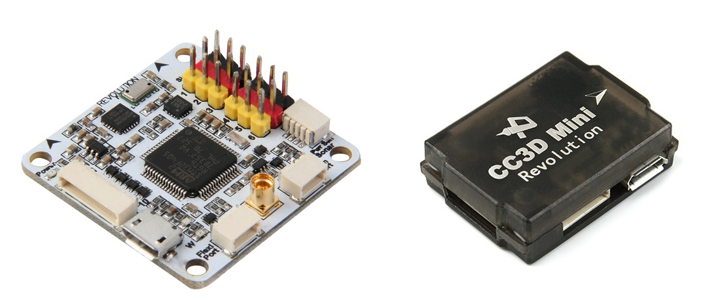
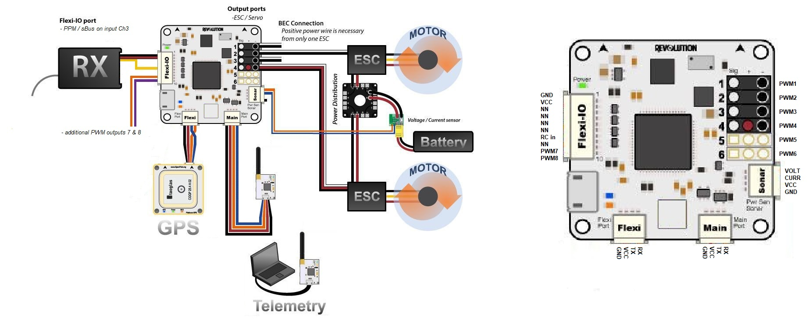
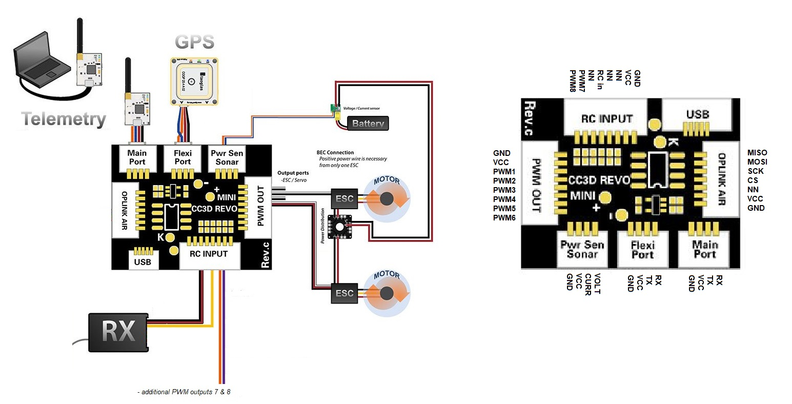
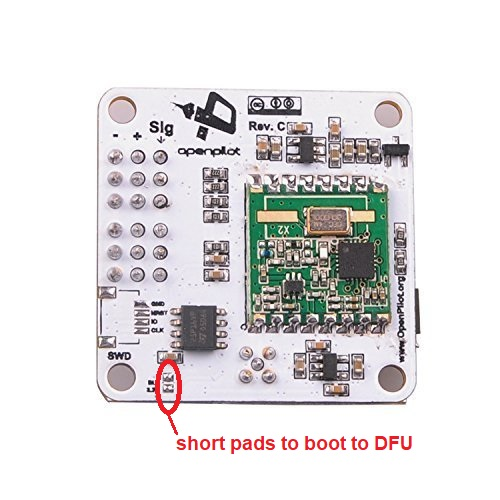

.. _common-openpilot-revo-mini:

=================================
OpenPilot Revolution and RevoMini
=================================

*Images and some content courtesy of the* `LibrePilot wiki <https://librepilot.atlassian.net/wiki/spaces/LPDOC/pages/26968084/OpenPilot+Revolution>`__

Specifications
==============

-  **Processor**

   -  STM32F405RGT6 ARM Cortex-M4 microcontroller
   -  168 Mhz/1 MB Flash

-  **Sensors**

   -  InvenSense MPU6000 IMU (accel, gyro)
   -  Honeywell HMC5883L compass
   -  MS5611 barometer
   
-  **Power**

   -  4.8V ~ 10V input power provided through ESC connection for fullsize Revolution
   -  5V max on RevoMini

-  **Default Interfaces**

   -  8 PWM outputs (1 - 6 on PWM output pins, 7 & 8 on Flex-IO / RCInput port)
   -  RC input (requires PPM/sBus) on Flex-IO / RCInput port's CH3 pin (yellow wire on fullsize revolution)
   -  analog to digital inputs for battery voltage and current monitoring ( set pins 12,11 in params ), more adcs possible on arbitrary pins
   -  GPS (SERIAL3) on Flexi Port
   -  Telemetry (SERIAL1) on Mainport
   -  USB (SERIAL0) port
   -  SWD Port for flashing and debugging, including 3.3V output for optional periphereals
   -  MMCX antenna connector for integrated HopeRF RFM22B 100mW 433MHz (fullsize Revolution only)
   -  OPLink port on RevoMini. OPLink hardware is not supported by ArduPilot, but this port exposes external SPI pins (SCK, CS, MOSI, MISO) that can be used for supported SPI periphereals like SD card adapters or SPI OSD breakout boards (requires additions to hardware definition file and compiling a custom firmware).
   
.. note::
    Per channel PWM-type RC inputs are not supported on this hardware. See reference for :ref:`supported RC systems <common-rc-systems>`

Default UART order
==================

- SERIAL0 = console = USB
- SERIAL1 = Telemetry1 = Mainport
- SERIAL2 = NN in default config
- SERIAL3 = GPS1 = FlexiPort
   
.. tip::
    See hardware definition file for more info on pinout:
    https://github.com/ArduPilot/ardupilot/blob/master/libraries/AP_HAL_ChibiOS/hwdef/revo-mini/hwdef.dat
   
   
Wiring diagrams
===============
**ArduPilot default pin assignments on fullsize Revolution and RevoMini**

    

    
   
Optional connectivity
=====================
**requires compiling custom firmware based on changes to hwdef**

-  I2C on Flexi port
-  RevoMini's OPLink port can be used for external SPI periphereals connection
-  arbitrary pins can be used for various connections like 2nd GPS, additional PWM outputs etc. within certain restrictions

The RevoMini likely is the smallest footprint autpilot hardware to support ArduPilot. It does not offer CAN bus connectivity or sufficient onboard memory for storage of relevant logging data. However, external I2C or SPI periphereals can be added with limited effort.

.. image:: ../../../images/revominiSD.jpg
    :target: ../_images/revominiSD.jpg
    

Where to Buy
============

- Available from many retailers including `HobbyKing <https://hobbyking.com/en_us/openpilot-cc3d-revolution-revo-32bit-flight-controller-w-integrated-433mhz-oplink.html>`__.

`Schematics <https://github.com/ArduPilot/Schematics/tree/master/OpenPilot-Revolution>`__

Firmware handling
=================
ArduPilot supports Revolution and RevoMini in Stable releases. Firmware files can be found `here <https://firmware.ardupilot.org/>`__

First time flashing ArduPilot requires to boot your device in DFU mode to flash an ArduPilot compatible bootloader and firmware file.

Enter DFU Mode
--------------
To do this, you'll need to locate and short two pads on the device. On fullsize Revolution they are designated as "SB" or "SBL":

On RevoMini they are located here:

.. image:: ../../../images/revomini1.jpeg
    :target: ../_images/revomini1.jpeg

You can short the pads in any particular way (either with a wire, solder joint, or something else). Detailed instructions are available on the `Revo Mini LibrePilot Wiki <https://librepilot.atlassian.net/wiki/spaces/LPDOC/pages/29622291/Recover+board+using+DFU>`__. A small wire is the easiest way to short the device. You can also power the device via USB first, and then short the pads if using a wire. Once you have the device in DFU mode and connected to your machine continue with the following steps to :ref:`load ArduPilot firmare onto ChibiOS boards <common-loading-firmware-onto-chibios-only-boards>`.

    
Compile ArduPilot
-----------------
To build your own firmware, see the instructions on setting up a build envrionment and compiling the source code:
`Building the Code <https://ardupilot.org/dev/docs/building-the-code.html>`__
