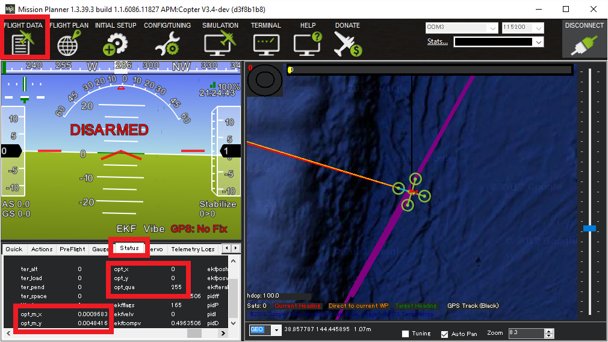

.. _common-optical-flow-sensor-setup:

[copywiki destination="copter,plane"]

=====================================
Optical Flow Sensor Testing and Setup
=====================================

Testing the sensor
==================

With the sensor connected to the autopilot, connect to the autopilot with the Mission Planner and open the Flight Data screen's Status tab.  If the sensor is operating you should see non-zero opt_m_x, opt_m_y and an opt_qua values.

Calibrating the sensor
======================
#. Connect to your autopilot and ensure that logging while disarmed is enabled (In Copter-3.3 set :ref:`LOG_BITMASK <copter:LOG_BITMASK>` to 131071.
#. Find a location with a textured surface and good lighting (natural light or strong incandescent)
#. Remove Propellers (safety first)
#. Power on the vehicle and hold level away from your body and at eye level
#. Rotate about the vehicle in roll through a range from -15 to +15
   degrees in about a second and then back again. Repeat this 5 to 10
   times. By closing one eye you will be able to keep the centre of the
   sensor stationary against the background while you do the rotation.
#. Repeat  about the vehicle pitch axis.
#. Download the data flash logs and plot the ``OF.flowX``, ``OF.bodyX``
   and ``IMU.GyrX`` data. It should look something like this:

   .. image:: ../../../images/OF-roll-calibration.png
       :target: ../_images/OF-roll-calibration.png
    
#. If ``OF.flowX`` is larger or smaller than ``OF.bodyX``, then it can
   be adjusted by changing the ``FLOW_FXSCALER`` parameter
#. IF ``OF.bodyX`` is uncorrelated or opposite sign to ``IMU.GyrX``,
   the :ref:`FLOW_ORIENT_YAW <copter:FLOW_ORIENT_YAW>` parameter is probably set incorrectly or
   you do not have the flow sensor pointing downwards
#. Plot the ``OF.flowY``, ``OF.bodyYband``, ``IMU.GyrY`` data. It should
   look something like this:

   .. image:: ../../../images/OF-pitch-calibration.png
       :target: ../_images/OF-pitch-calibration.png
   
#. If ``OF.flowY`` is larger or smaller than ``OF.bodyY``, then it can
   be adjusted by changing the ``FLOW_FYSCALER`` parameter
#. IF ``OF.bodyY`` is uncorrelated or opposite sign to ``IMU.GyrY``,
   the :ref:`FLOW_ORIENT_YAW <copter:FLOW_ORIENT_YAW>` parameter is probably set incorrectly or
   you do not have the flow sensor pointing downwards

Range Sensor Check
==================

Check the ``EKF5.meaRng`` message in the flashlog from your flow
sensor calibration test. Check the following:

#. There is continuous range measurement.
#. It outputs a range on the ground that is 10cm of the expected value
   (remember that measured range will increase when you roll or pitch
   the vehicle because the laser is then measuring on a slant)

Pre-Arm checks
==============

To allow arming and taking off in Loiter without a GPS the GPS arming
check should be turned off as shown below.  Unchecking "All" and "GPS"
and leave all other options checked.

.. image:: ../../../images/OptFlow_ArmingChecks.png
    :target: ../_images/OptFlow_ArmingChecks.png

Because optical flow requires good sonar/range finder data when the
optical flow is enabled, an additional pre-arm check is enforced.

**While the vehicle is disarmed you should lift the vehicle straight up
to at least 50cm but no higher than 2m** (if the rangefinder sees a
distance of over 2m you will need to restart the autopilot).

The error message when arming fails this check is "PreArm: check range
finder"

This check can be disabled by unchecking the "Parameter/Sonar" arming
check.

First Flight
============

#. Set :ref:`EK2_GPS_TYPE <EK2_GPS_TYPE>` = 0 (we don't want the optical flow being used by the EKF at this stage)
#. Perform a short test flight hovering in STABILIZE or AltHold for copter, or QSTABILIZE or QHOVER for QuadPlane, at small lean angles at heights ranging from 50cm to 3m with 
#. Download the flash log and plot the following in mission planner
#. EKF5.meaRng should correlate with the change in vehicle height
#. ``OF.flowX`` and ``OF.flowY`` should be varying
#. ``OF.bodyX`` and ``OF.bodyY`` should be consistent with IMU.GyrX and IMU.GyrY

Second Flight
=============

.. warning::

   You will need at least 15m of clear space around the vehicle to do this flight safely.
   If the optical flow velocity estimates are bad, you will have little warning and the copter may lean to its maximum lean angle very quickly.

#. Set :ref:`EK2_GPS_TYPE <EK2_GPS_TYPE>` = 3 to make the EKF ignore GPS and use the flow sensor
#. Ensure you have a loiter and hover mode available on you transmitter.
#. Set "EKF Origin" on Ground Control Station map. In Mission Planner, right click, select "Set Home here", and choose to set "set EKF origin here".
#. Take-off in loiter and bring the Copter/Quadplane to about 1m height
#. If the vehicle starts to accelerate away or there is erratic pitch or roll
   movement, then switch to hover and land. You will need to
   download the log file and share it on `the forums <https://discuss.ardupilot.org/c/arducopter>`__ to understand why.
#. If it holds location then congratulations, you have succeeded and can
   now start experimenting with height changes and moving it around in
   the loiter mode

Example Video (Copter-3.4)
==========================

..  youtube:: Bzgey8iR69Q
    :width: 100%
