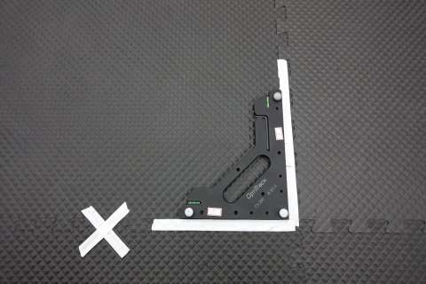
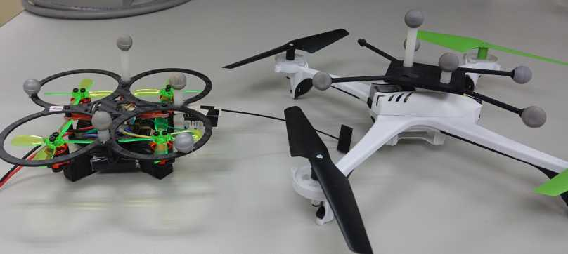
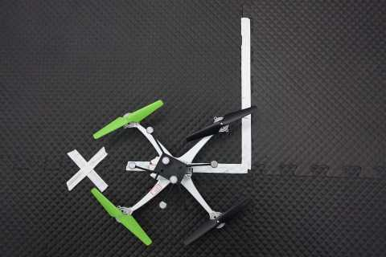
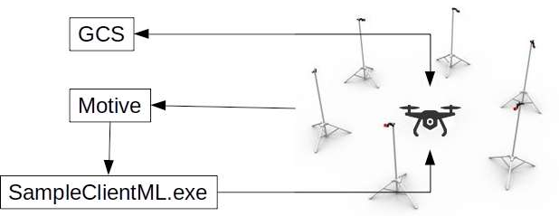

.. _common-optitrack:

================================
Optitrack for Non-GPS Navigation
================================

[copywiki destination="copter"]

This article explains how a `OptiTrack <https://optitrack.com/>`__ motion catpure system can be used as a short-range substitute for a GPS allowing position control modes like Loiter, Guided, RTL, and Auto indoors.

.. note::

   This is an new feature released in Copter-3.6 and currently only supported in EKF2.

.. youtube:: IocykCXJmhw
   :width: 100%

Required hardware
=================

Please refer to OptiTrack `build your own <https://optitrack.com/systems/>`__ tool for all hardware required to setup a motion capture system.

.. note::

   In order to track the both location and orientation of a drone, you need at least 4 markers.

Motion capture system setup
===========================

Please refer to OptiTrack `quick start guides <https://v20.wiki.optitrack.com/index.php?title=Quick_Start_Guide:_Getting_Started>`__ for hardware and software setup. When you set the ground plane, do not forget to mark the origin and the axis. The positive X will point to the "north" of our indoor flight environment (because we do not use compass, it do not need pointing to the real/magnetic north)

   Mark motion capture system coordinate system using tape

Required softwares
==================

* `Motive:Tracker <https://optitrack.com/products/motive/tracker/>`__
* `NatNet SDK <https://optitrack.com/products/natnet-sdk/>`__
* `Mission Planner source <https://github.com/ArduPilot/MissionPlanner>`__

Prepare the drone
=================

.. warning::

   It is highly recommended that use small drone for indoor flight and deploy cage in your test flight enviorment.

.. tip::

   If you are looking for a small drone for indoor flight test, Skyviper V2450 GPS drone or its successor journey GPS drone is a good choice. It is very affordable and running ArduPilot out-of-box. You can easily flash it wit custom build ArduPilot. If you perfer custom build small drone, there is a very good discuss `here <https://discuss.ardupilot.org/t/microarducopter-3-props-omnibus-nano-success/32568?u=chobitsfan>`__. The RTF quadcopter frame used in another example video is available from `sdmodel <https://goods.ruten.com.tw/item/show?21806678027603>`__.

First, you need to place markers on the drone. It is very important to place markers so that they form a stereoscopic, asymmetrical shape. Please refer to OptiTrack `rigid body marker placement <https://v20.wiki.optitrack.com/index.php?title=Rigid_Body_Tracking#Rigid_Body_Marker_Placement>`__ for details.

   Place markers on the drone

Then, put the drone in the ground plane and align it with X axis of motion capture system. The drone should heading to positive X direction.

   Align the drone with X axis

Select all markers in Motive and create a rigid body from them. Please refer to OptiTrack `creating rigid body <https://v20.wiki.optitrack.com/index.php?title=Rigid_Body_Tracking#Creating_Rigid_Body>`__ for details

Configuration the drone
=======================

- set :ref:`AHRS_EKF_TYPE <AHRS_EKF_TYPE>` to 2 and :ref:`EK2_ENABLE <EK2_ENABLE>` to 1. Currently, external navigation is only supported in EKF2
- set :ref:`COMPASS_USE <COMPASS_USE>`, :ref:`COMPASS_USE2 <COMPASS_USE2>`, :ref:`COMPASS_USE3 <COMPASS_USE3>` to 0. It makes ardupilot use orientation from motion capture system rather than compass, because there are many source casue electromagnetic interference in indoor enviorment
- set :ref:`EK2_GPS_TYPE <EK2_GPS_TYPE>` to 3 and :ref:`GPS_TYPE <GPS_TYPE>` to 0 to disable the GPS
- set :ref:`EK2_POSNE_M_NSE <EK2_POSNE_M_NSE>` to 0.1 or lower to increase the weighting of position measurements from motion capture system.

Send data to the drone
======================

   Example system block diagram

We need to modify NatNet SDK sample code and use it to read and send position data to the drone. Open Samples/NatNetSamples.sln, add all .cs files in MissionPlanner/ExtLibs/Mavlink/ (Mavlink.cs, MavlinkMessage.cs, MavlinkCRC.cs, etc) to the project called SampleClientML. You may need to change target framework to 4.6.1 and select "allow unsafe code" in project properties. 

In SampleClientML.cs, modify or add following code

.. code-block:: c#

   using System.Diagnostics;
   using System.Net;
   using System.Net.Sockets;

   public class SampleClientML {
       private static IPEndPoint drone_ep = new IPEndPoint(IPAddress.Parse("192.168.99.1"), 14550); //assume your drone is connected to PC running SampleClientML through wifi and its ip is 192.168.99.1
       private static Socket mavSock = new Socket(AddressFamily.InterNetwork, SocketType.Dgram, ProtocolType.Udp);
       private static MAVLink.MavlinkParse mavlinkParse = new MAVLink.MavlinkParse()
       private static Stopwatch stopwatch;
       static void Main() {
           stopwatch = new Stopwatch();
           stopwatch.Start();

inside function ``static void fetchFrameData(NatNetML.FrameOfMocapData data, NatNetML.NatNetClientML client)``

.. code-block:: c#

    if(data.iFrame % 4 == 0) //camera 120 fps, but ardupilot limit data rate to 70ms. I found 30hz is enough (in case some packet lost)

inside function ``static void processFrameData(NatNetML.FrameOfMocapData data)``

.. code-block:: c#

    if (rbData.Tracked == true) {
        long cur_ms = stopwatch.ElapsedMilliseconds;
        MAVLink.mavlink_att_pos_mocap_t att_pos = new MAVLink.mavlink_att_pos_mocap_t();
        att_pos.time_usec = (ulong)(cur_ms * 1000);
        att_pos.x = rbData.x; //north
        att_pos.y = rbData.z; //east
        att_pos.z = -rbData.y; //down
        att_pos.q = new float[4] { rbData.qw, rbData.qx, rbData.qz, -rbData.qy };
        byte[] pkt = mavlinkParse.GenerateMAVLinkPacket20(MAVLink.MAVLINK_MSG_ID.ATT_POS_MOCAP, att_pos);
        mavSock.SendTo(pkt, drone_ep);

.. note::

   The coordinate system of both Motive and ArduPilot are right-handed. While Z axis of ArduPilot is pointing down, Y axis of Motive is pointing up.  

Save and build the project

Ground testing
==============

- Connect the drone to a ground station
- Start Motive and make sure `data streaming <https://v20.wiki.optitrack.com/index.php?title=Data_Streaming>`__ is turned on, then start SampleClientML.exe we just build.
- If you see following message in ground station console (initial pos may vary), then the drone should be ready for flight test

*EKF2 IMU0 is using external nav data
EKF2 IMU0 initial pos NED = 0.1,-0.2,0.0 (m)
EKF2 IMU0 ext nav yaw alignment complete*

Flight testing
==============

Take off in AltHold mode and maintain a stable hover. Switch to Loiter but be ready to switch back to AltHold or Stabilize if the vehicle's position or altitude becomes unstable.

.. note::

   In order to take off in guided or auto mode, you need to use `GPS_GLOBAL_ORIGIN <https://mavlink.io/en/messages/common.html#SET_GPS_GLOBAL_ORIGIN>`__ to set the GPS location of motion capture system origin. It is not need to be accurate, any valid lat/lng is ok.

.. youtube:: JKzuaVQZclI
   :width: 100%
