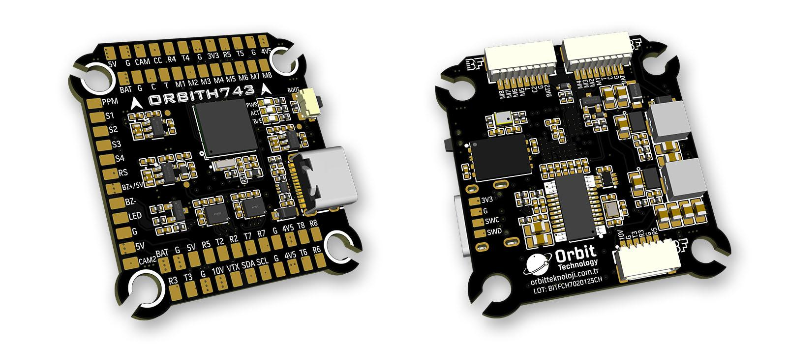
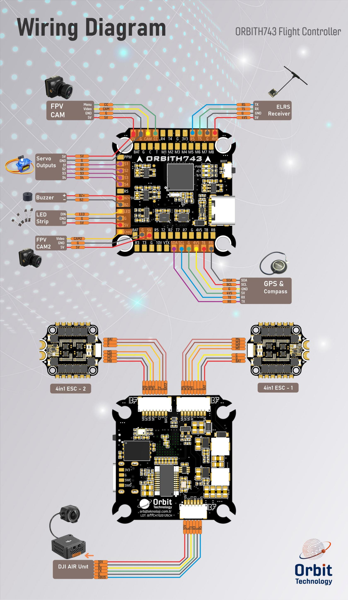

.. _common-orbith743:

==================
ORBITH743
==================

The above image and some content are courtesy of `orbitteknoloji.com.tr <https://www.orbitteknoloji.com.tr/>`__.

Specifications
==============

-  **Processor**

   -  STM32H743VIH6 (480MHz)
   -  256MByte Flash for data logging

-  **Sensors**

   -  InvenSense 2x ICM42688 IMU (accelerometer, gyroscope)
   -  DPS368 barometer
   -  Voltage & current sensor

-  **Power**

   -  2-6S LiPo input power
   -  5V 3A BEC for peripherals
   -  10V 3A BEC for video

-  **Interfaces**

   -  USB port (Type-C)
   -  8x UARTs
   -  12x PWM outputs via two 8-pin ESC connectors and/or solder pads
   -  1x RC input PWM/SBUS
   -  I2C port for external compass, airspeed sensor, etc.
   -  DJI Air Unit
   -  2x Power Monitors
   -  Buzzer and LED strip
   -  Built-in OSD

-  **Size and Dimensions**

   - 38.3 mm x 39.8 mm
   - 8.4 g

-  **Mounting Hole**

   - 30.5 mm x 30.5 mm

Wiring Diagram
==================

  
Default UART Order
==================

- SERIAL0 = USB (MAVLink2)
- SERIAL1 = UART1 (ESC Telemetry)
- SERIAL2 = UART2 (USER)
- SERIAL3 = UART3 (DJI HD Air Unit)
- SERIAL4 = UART4 (VTX)
- SERIAL5 = UART5 (RC Input)
- SERIAL6 = UART6 (GPS)
- SERIAL7 = UART7 (USER)
- SERIAL8 = UART8 (USER)

.. note:: Serial port protocols (Telem, GPS, etc.) can be adjusted to personal preferences.

RC Input
========

RC input is configured by default on SERIAL5 (UART5). The 4V5 pin is supplied by both USB and the onboard 5V BEC from the battery.

 - PPM is supported.
 - SBUS/DSM/SRXL connects to the RX5 pin.
 - FPort requires connection to TX5. Set :ref:`SERIAL5_OPTIONS<SERIAL5_OPTIONS>` = 7. See FPort Receivers.
 - CRSF also requires a TX5 connection, in addition to RX5, and automatically provides telemetry.

Any UART can be used for RC system connections in ArduPilot. See :ref:`common-rc-systems` for details.

RSSI
==========================

Analog inputs are provided.

- The RSSI reference pin number is "8". You can also use this pin for an airspeed sensor.

.. note:: Set :ref:`RSSI_TYPE<RSSI_TYPE>` = 1 for analog RSSI, or = 3 for RSSI provided by RC protocols such as CRSF.

OSD Support
===========

The ORBITH743 has an onboard OSD using :ref:`OSD_TYPE<OSD_TYPE>` = 1 (MAX7456 driver). The CAM and VTX pins provide connections for using the internal OSD.

DJI Video and OSD
=================

An "SH1.0 6P" connector supports a standard DJI HD VTX connection, and SERIAL3 is already set up for this by default. Pin 1 of the connector is 10V, so be careful not to connect this to any peripheral requiring 5V.

Dshot Capability
================

All motor outputs (M1–M8) are capable of Dshot, Bi-Directional Dshot (for motors marked as BIDIR), and PWM operation. The motors that support Bi-Directional Dshot are: M1 (PA0), M3 (PA2), M5 (PB0), M7 (PB4).

Mixing Dshot and PWM operation within the same timer group is not allowed.
When Dshot is enabled for any output in a group, all outputs in that group must be configured for Dshot. The output groups that must be configured uniformly (PWM or Dshot) are 1/2, 3/4, 5/6, 7/8.

Servo outputs (S1–S4) on PA15, PB3, PD12, and PD13 (TIM2 and TIM4 timers) are PWM only, and 13 (LED) are in separate groups and are not Dshot capable.

GPIOs
=====

The ORBITH743 outputs can be used as GPIOs (relays, buttons, RPM, etc.). To use them, you need to set the output's ``SERVOx_FUNCTION`` to -1. See :ref:`common-gpios` page for more information.

The numbering of the GPIOs for PIN variables in ArduPilot is:

 - PWM1 50
 - PWM2 51
 - PWM3 52
 - PWM4 53
 - PWM5 54
 - PWM6 55
 - PWM7 56
 - PWM8 57
 - PWM9 58
 - PWM10 59
 - PWM11 60
 - PWM12 61
 - LED 62
 - BUZZER 80
 - PINIO1 81 (internal)
 - PINIO2 82 (internal)

VTX Power Control
=================

GPIO 81 controls the VTX BEC output to pins marked “10V”. Setting this GPIO low removes voltage supply to pins.

Set a RELAYx_PIN to “81” to control the switching. Then select an RC channel for control (Chx) and set its RCx_OPTION to the appropriate Relay (1-6) that you had set its pin parameter above.

For example, use Channel 10 to control the switch using Relay 2:

    :ref:`RELAY2_PIN<RELAY2_PIN>` = “81”

    :ref:`RC10_OPTION<RC10_OPTION>` = “34” (Relay2 Control)

.. warning:: PINIO1 is for 10V DC-DC control (HIGH:on; LOW:off). Default 10V DC is ON. Please install an antenna on VTX when battery powered.

Camera Switch Control
=================

GPIO 82 controls the camera switch functionality through PINIO2. Setting this GPIO high or low will toggle between different camera inputs (e.g., front/rear camera).

Set a RELAYx_PIN to “82” to configure the pin for camera switching. Then select an RC channel (Chx) for control and set its RCx_OPTION to the appropriate Relay (1-6) that you had set its pin parameter above.

For example, use Channel 11 to control the camera switch using Relay 2:

    :ref:`RELAY2_PIN<RELAY2_PIN>` = “82”

    :ref:`RC11_OPTION<RC11_OPTION>` = “34” (Relay2 Control)

.. warning:: PINIO2 is used for toggling camera input (HIGH/LOW). Ensure correct wiring to switch between cameras as expected.

Connecting a GPS/Compass Module
===============================

This board does not include a GPS or compass, so an :ref:`external GPS/compass <common-positioning-landing-page>` should be connected in order for autonomous modes to function.

.. note:: If the GPS is attached to UART6 TX/RX and powered from the 5V pins, a battery must be plugged in for power to be provided.

.. tip:: You could use the 4V5 pin to supply both the RC and the GPS without a battery attached on the bench for setup as long as the total current does not exceed the USB source (normally 1A on most computers).

Battery Monitor Settings
========================

These should already be set by default. However, if lost or changed:

Enable Battery monitor with these parameter settings:

:ref:`BATT_MONITOR<BATT_MONITOR>` = 4

Then reboot.

First group of battery monitor pins & options:

 - :ref:`BATT_VOLT_PIN<BATT_VOLT_PIN__AP_BattMonitor_Analog>` = 10
 - :ref:`BATT_CURR_PIN<BATT_CURR_PIN__AP_BattMonitor_Analog>` = 11
 - :ref:`BATT_VOLT_MULT<BATT_VOLT_MULT__AP_BattMonitor_Analog>` = 10.1
 - :ref:`BATT_AMP_PERVLT<BATT_AMP_PERVLT__AP_BattMonitor_Analog>` = 80.0 (note: Please calibrate before use, depending on current sensor.)

Second group of battery monitor pins & options:

 - :ref:`BATT2_VOLT_PIN<BATT2_VOLT_PIN__AP_BattMonitor_Analog>` = 4
 - :ref:`BATT2_CURR_PIN<BATT2_CURR_PIN__AP_BattMonitor_Analog>` = 18
 - :ref:`BATT2_VOLT_MULT<BATT2_VOLT_MULT__AP_BattMonitor_Analog>` = 10.1
 - :ref:`BATT2_AMP_PERVLT<BATT2_AMP_PERVLT__AP_BattMonitor_Analog>` = 80.0 (note: Please calibrate before use, depending on current sensor.)

.. note:: This autopilot uses a high-precision current sensor input which is sensitive to ESC switching noise. Please check carefully before use that current readings are accurate across the usage range. If not, low ESR capacitors on the ESC power inputs may need to be added.

Where to Buy
============

- `orbitteknoloji.com.tr <https://orbitteknoloji.com.tr>`__

Firmware
========
This board does not come with ArduPilot firmware pre-installed. Use instructions :ref:`here to load ArduPilot the first time<common-loading-firmware-onto-chibios-only-boards>`.

Firmware for these boards can be found `here <https://firmware.ardupilot.org>`_ in sub-folders labeled "ORBITH743".

.. note:: If you experience issues with the device ceasing to initialize after power up, see :ref:`common-when-problems-arise` section for H7-based autopilots for a possible solution.

[copywiki destination="plane,copter,rover,blimp,sub"]