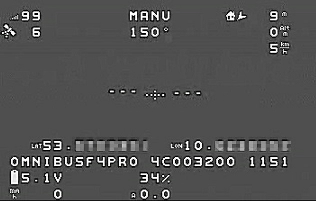

.. _common-osd-overview:

===
OSD
===

Onboard OSD functionality was introduced with the ChibiOS port to ArduCopter 3.6x, ArduPlane 3.9x and ArduRover 3.5x firmware versions. Mainly aiming at aio-boards with onboard MAX7456-type chips, it enables overlay of FC data using the onboard video system. Once enabled, it uses various panel items that can individually be set active and positioned on the screen using respective parameters. It allows to setup multiple screen layouts and switch between those using a spare RC channel.

.. note:: 

  Being an integral library of ArduPilot firmware, the OSD code provides the prerequisites to be redirected to various backends other than MAX-type chipsets, including testing on SITL setups without actual autopilot- or video-hardware needed.

Parameters
==========

To enable the OSD overlay on MAX7456-type chips, set parameter: ``OSD_TYPE`` to 1, reboot and reload parameters. 
This exposes the whole OSD parameter group. 

To set a RC channel for screen switching, use parameter ``OSD_CHAN``.

To set the units used to display, use parameter ``OSD_UNITS``:

- ``0`` = Metric (meters,kilometers,meters/sec,kilometers/hour,degs in C)
- ``1`` = Imperial (feet, miles, feet/sec, miles/hour, degs in F)
- ``2`` = ArduPilot Native (meters,kilometers,meters/sec,degs in C)
- ``3`` = Aviation (feet, nautical mile, feet/min, knots, degs in C)

To set vertical and horizontal display offset (space at top and left side of screen), use parameters ``OSD_H_OFFSET``, ``OSD_V_OFFSET``.

Several options can be set using :ref:`OSD_OPTIONS<OSD_OPTIONS>` (bitmask selection):

- bit0 = Enable use of compact number+decimal point fonts
- bit1 = Invert wind direction indicator (to point to the direction its blowing from instead of toward)
- bit2 = Invert horizon roll direction
     
Several font sets are included and can be changed during runtime (and those who can build the software can customize or add additional font sets....see libraries/AP_OSD/fonts/README.md) - :ref:`OSD_FONT<OSD_FONT>`:

- ``0`` = Clarity (default). A clearly visible large font
- ``1`` = Clarity Medium. Good visibility, less dominant than clarity default
- ``2`` = Betaflight.  bf- / inav-osd default style
- ``3`` = Bold. A bolder version of Betaflight
- ``4`` = Digital. 80's LED clock radio style
 
.. _screen-switching:

Screens and screen switching 
============================

For multiple screen layouts, each parameter's "OSD" part is trailed by a number, starting with "1"

* ``OSD1_PARAMETER`` - This number addresses the respective screen layout number, allowing to set individual items active on one screen but have them switched off on another screen. OSD settings default to 4 screens optionally available.

* Set parameters ``OSDn_CHAN_MIN`` and ``OSDn_CHAN_MAX`` to adjust RC channel pwm limits to use for switching to a respective screen.

There are different switch-method options to meet individual RC systems switch layout requirements. 
These can be set by parameter: :ref:`OSD_SW_METHOD<OSD_SW_METHOD>`.
The options are:

- 0 = switches to next screen if the set RC channel's (:ref:`OSD_CHAN<OSD_CHAN>`) value is changed
- 1 = directly selects a screen based on the set pwm limits for each respective screen. RC channel value must change for new pwm value to be recognized.
- 2 = toggles screens on a low to high transition of set RC channel. keeps toggling to next screen every 1s while channel value is kept high

Panel items
===========

Each OSD panel item uses a set of three variables to be set: 

- ``OSDn_ITEM_ENABLE`` - activates the respective item when set to 1.
- ``OSDn_ITEM_X`` and ``OSDn_ITEM_Y`` set the horizontal and vertical position of the item, starting with ``X = 0`` and ``Y = 0`` in the upper left corner of your screen. 

.. note::
   
    The typical MAXChip based OSD screen has a visible matrix of 30 horizontal x 13 vertical chars in NTSC standard, while PAL standard has 16 vertical chars. The OSD code enables auto-detection of NTSC vs. PAL to match input signal properties.
    
.. note::    ArduPilot calculates an sensor-less airspeed estimate that is used if no sensor is present or fails. :ref:`ARSPD_TYPE<ARSPD_TYPE>` must be set to zero in order to display this value as the airspeed item, if no sensor is present.
    
User Programmable Warnings
============================
Several user defined warnings can be set which will flash the respective osd panel item when warning level is reached or exceeded

- :ref:`OSD_W_BATVOLT<OSD_W_BATVOLT>` - Blinks battery voltage panel if less than this value. 0-100V with up tenth volt precision
- :ref:`OSD_W_RSSI<OSD_W_RSSI>` - Blinks rssi panel if less than this integet percentage value. 0-99%
- :ref:`OSD_W_NSAT<OSD_W_NSAT>` - Blinks #Sat panel if less than this number. 0-30

Testing OSD with SITL
=====================

OSD functionality can be tested without autopilot- or video-hardware using a :ref:`Software In The Loop (SITL) simulator <dev:sitl-simulator-software-in-the-loop>` setup. Follow the SITL-Instructions to setup a simulation environment. Run the simulator on current source code. 

A graphical OSD simulation in a separate window can be opened by adding the following option to sim_vehicle.py::

   --osd
   
The simulated OSD can now be set and configured via parameters.

.. tip::

   To see all available options type::
   
      ./sim_vehicle.py -help
   
