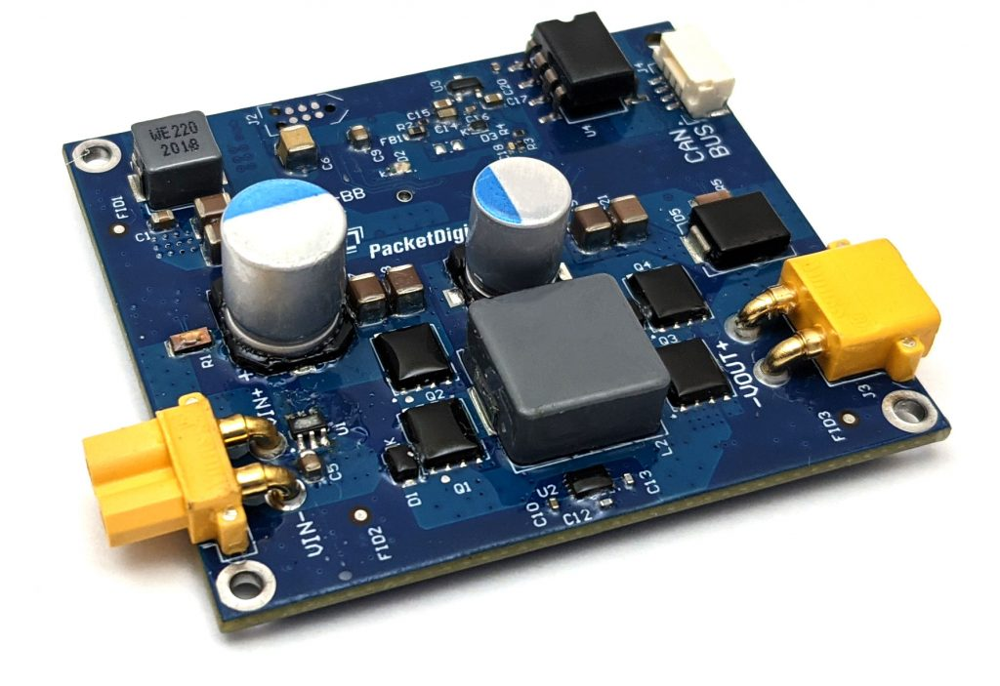
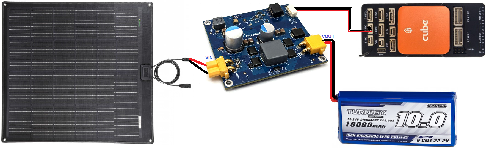
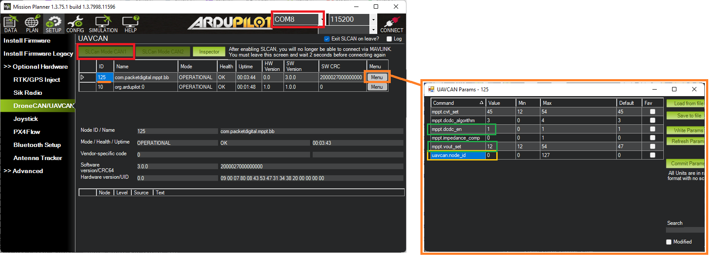

.. _common-packetdigital-mppt:

===================
Packet Digital MPPT
===================

The `Packet Digital MPPT solar controller <https://www.packetdigital.com/maximum-power-point-tracker/>`__ is specifically designed to help extend the range of unmanned vehicles through the use of solar panels.  This light weight controller includes a DroneCAN/UAVCAN interface allowing real-time monitoring of the solar system's performance.

Where to Buy
------------

- `Contact PacketDigital <https://www.packetdigital.com/contact/>`__ directly for pricing

Specifications
--------------

- Input Voltage: 12.5V to 50V
- Output Voltage: Up to 50V
- Input/Output Current Max: 5A
- Size: 60.96mm x 53.34mm x 17.4mm (LxWxH)
- Weight: 31g

For more details please see `packetdigital.com <https://www.packetdigital.com/maximum-power-point-tracker/>`__

Autopilot Connection
--------------------

Connect the solar panel, MPPT, battery and autopilot as shown above.

Once the solar panels provide more than 12V the board's LED should flash green.  Initially it may be easiest to connect a 4S or 6S battery to the board's VIN port.

Configuration
-------------

Connect a ground station (e.g. Mission Planner) to the autopilot and set the following parameters and then reboot the autopilot

- :ref:`BATT_MONITOR <BATT_MONITOR>` = 8 (UAVCAN)
- :ref:`CAN_P1_DRIVER <CAN_P1_DRIVER>` = 1 (UAVCAN)

Check the MPPT board's parameters by connecting through "SLCAN"

- Open Mission Planner's SETUP >> Optional Hardware >> DroneCAN/UAVCAN page
- From the top right, select the COM port for the autopilot's SLCAN connection (normally one higher than the MAVLink COM port)
- Press the "SLCan Mode CAN1" button. The table should be filled in as shown below.  If this does not work try changing to the Config screen, connect over MAVLink and set :ref:`CAN_SLCAN_CPORT <CAN_SLCAN_CPORT>` = 1.  Return to SETUP >> Optional Hardware >> DroneCAN/UAVCAN page and press the "SLCan Mode CAN1" button again

- Press the "Menu" button to view or change some of the MPPT's settings
  - mppt.vout_set configures the maximum voltage from the VOUT pin.  This should be equal to the battery's voltage when fully charged.
  - mppt.dcdc_en configures the board's startup behaviour.  If "0" the MPPT will not charge the battery until the autopilot is armed.  If "1" the MPPT will always attempt to charge the battery
  - uavcan.node_id should normally be left at "0" to allow the autopilot to dynamically allocate the MPPT's UAVCAN node id but if multiple UAVCAN battery monitors or MPPTs are used you can manually set this to to some value between 0 and 127 (e.g. "50") and then set :ref:`BATT_SERIAL_NUM <BATT_SERIAL_NUM>` to the same number 

Connecting more than one MPPT
-----------------------------

More than one Packet Digital MPPT board can be connected in parallel to the same battery (but different solar panels) to increase the total current provided.

To allow the autopilot to connect to all the MPPTs:

- Enable one battery monitor per MPPT by setting :ref:`BATTx_MONITOR <BATT_MONITOR>` = 8
- Use Mission Planner's SETUP >> Optional Hardware >> DroneCAN/UAVCAN page's "Menu" button to manually configure the uavcan.node_id of each MPPT
- set :ref:`BATTx_SERIAL_NUM <BATT_SERIAL_NUM>` to match the uavcan.node_ids set above

[copywiki destination="plane,copter,rover,dev"]
