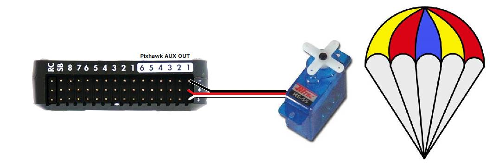
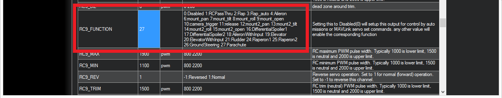

.. _common-parachute:

=========
Parachute
=========

.. image:: ../../../images/parachute.png
   :target: ../../images/parachute.png

This topic describes how to set up manual and automatic parachute
release.

.. warning::

   A parachute ejection can be dangerous.  This feature should be used with caution

..  youtube:: KmjPZIQ9c0A
    :width: 100%

Video above is from Henri's `DIYDrones discussion that led to this feature being added to Copter <https://diydrones.com/forum/topics/diy-parachute-deployment-mechanism-for-multicopter>`__.

What you will need
==================

A complete parachute mechanism like one of these:

-  `SkyCat <https://www.skycat.pro/shop/>`__
-  `CAD Drones <http://store.caddrones.com/products>`__

OR if you prefer a DIY solution, parachute release mechanism that can be
triggered by a PWM signal (i.e. a Servo) and a parachute large enough to
slow your multicopter's decent to less than 5m/s. Some recommended
parachute vendors:

-  `Fruity Chutes <https://fruitychutes.com/uav_rpv_drone_recovery_parachutes.htm>`__
-  `Opale Paramodels <https://www.opale-paramodels.com/fr/57-parachutiste-rc>`__
-  `Mars Mini <http://1uas.com/Gears/Parachutes-Protection-System/Mars-Mini>`__

Connecting to the Autopilot
===========================

The parachute release mechanism can be triggered from either a Relay or a PWM (i.e. Servo). Be sure that if a Relay pin is used, that the parachute release is active on a high level and that the Relay pin default, ``RELAY_DEFAULT`` is OFF or No Change, to avoid triggering the release during initialization, since all GPIOs are forced low during the bootloader period.

Setup through the Mission Planner
=================================

To configure the parachute release, first connect to the autopilot with Mission
Planner, and then open the CONFIG->Full Parameter List tab and
set the following parameters.

-  :ref:`CHUTE_ENABLED <CHUTE_ENABLED>` = "1". Then refresh parameters, or reboot, to see the Chute parameters.
-  :ref:`CHUTE_CRT_SINK<CHUTE_CRT_SINK>` should be set to the sink rate in m/s that will trigger the chute release.
-   :ref:`CHUTE_ALT_MIN<CHUTE_ALT_MIN>` determines the minimum altitude above HOME that allows parachute release to occur.

Servo Release
-------------

-  :ref:`CHUTE_TYPE <CHUTE_TYPE>` = "10" to release with a servo
-  :ref:`CHUTE_SERVO_ON <CHUTE_SERVO_ON>` should be set to the servo position required to release the parachute
-  :ref:`CHUTE_SERVO_OFF <CHUTE_SERVO_OFF>` should be the "resting" servo position.  I.e. the position the servo is in before the parachute is released
-  set :ref:`SERVO9_FUNCTION <SERVO9_FUNCTION>` = "27". On autopilots with an IOMCU (Outputs labeled MAIN and AUX), ``SERVO9`` refers to the Pixhawk's AUX OUT 1. To use AUX OUT2 instead set :ref:`SERVO10_FUNCTION <SERVO10_FUNCTION>` to 27, etc.

Relay Release
-------------

- Determine/Configure a pin to be a GPIO (see :ref:`common-gpios`).
- Set that pin number as one of the RELAY functions. ie For GPIO pin 51 using the first RELAY function, set :ref:`RELAY1_PIN<RELAY1_PIN>` = 51.
- Since GPIOs are always set low initially during the bootloader period, to avoid accidental release, always use a release mechanism that needs a high output level to trigger and set:
- :ref:`RELAY1_DEFAULT<RELAY1_DEFAULT>` = 1 or 2 (low or no change), which determines how RELAY1 pins is set during the post-bootloader, autopilot initialization period.
- :ref:`CHUTE_TYPE <CHUTE_TYPE>` = 0,1,2,or 3 to release with RELAY, RELAY2, RELAY3, or RELAY4 functions.

Manual Release
--------------

The pilot can manually release the parachute using an RC channel/switch: set an ``RCx_OPTION`` to either 22 (Parachute Release) or 23 (Parachute 3Pos). Either function, when the RC channel is high, above :ref:`CHUTE_ALT_MIN<CHUTE_ALT_MIN>`, and is armed (Copter) or flying (Plane). See following section for requirements.

MAVLink Command Release
-----------------------

The parachute may also be released/enabled/disabled via Ground Control Station command: MAV_CMD_DO_PARACHUTE (cmd id #208). This command has a parameter1 field that determines the action:

+----------+---------------------------+
+ param1   | Action                    +
+==========+===========================+
+   0      | Disable Parachute release +
+----------+---------------------------+
+   1      | Enable Parachute release  +
+----------+---------------------------+
+   2      | Release Parachute         +
+----------+---------------------------+

This command can be part of an AUTO mission as a DO_PARACHUTE waypoint.

[site wiki="plane"]
Failsafe Action
---------------

Plane also provides for a parachute release failsafe action for :ref:`FS_LONG_ACTN<FS_LONG_ACTN>` and ``BATTx_FS_CRT_ACT``.

Parachute Options
-----------------

Plane provides an option to force the release servo or relay to remain active forever (until reboot) once triggered. This used in high altitude situations where the servo or relay may be frozen due to extremely low temperatures, until lower altitude, and warmer temperatures allow opertion. This can be enabled by setting the :ref:`CHUTE_OPTIONS<CHUTE_OPTIONS>` bit 0 high.
[/site]

RC Disable/Enable of Parachute
------------------------------

You can disable or enable the parachute automatic release using an RC channel/switch: set an ``RCx_OPTION`` to 21. A high enables the automatic release function, low disables it. Manual release is unaffected. If set to 23 (Parachute 3Pos), the low position disables, middle position enables auto operation, a high will attempt to force release, as explained above, assuming the enabling conditions described below.

When will the parachute deploy?
===============================

When the "Crash Check" feature determines that the vehicle has lost
attitude control and has begun falling, the motors will be stopped and
the parachute will deploy automatically.  The following must all be true
for a full 1 seconds for the crash checker to trigger the parachute
release:

-  The motors are armed (Copter) or flying (Plane)
-  The vehicle is not landed (Copter only)
-  The vehicle is not in FLIP or ACRO flight mode (Copter only)
-  the roll and/or pitch angle of the vehicle is 30 degrees off from the
   target lean angle (Copter only)
-  the barometer shows the vehicle is not climbing (excessive baro noise CAN prevent release in some cases) (Copter & Plane)
-  the vehicle is above the :ref:`CHUTE_ALT_MIN <CHUTE_ALT_MIN>` altitude (Copter & Plane). A value of "0" disables this check.

..  youtube:: xaw3-oSahtE
    :width: 100%

Testing the chute
=================

Depending upon the release mechanism a parachute deployment can be
dangerous so please take care when performing these tests, removing the
parachute and vehicle propellers as is appropriate.

To test manual deployment:

-  Enable parachute release, if using a switch to disable release
-  Set the :ref:`CHUTE_ALT_MIN <CHUTE_ALT_MIN>` parameter to zero to disable the minimum
   altitude check
-  Arm the vehicle in stabilize mode and raise the throttle above
   minimum (disconnect motors or remove props) (not required for Plane)
-  Use one of the above manual RC channel switch activation methods or use Mission Planner SERVO/RELAY tab to switch the release Relay, MAVLink command, or set the PWM of the release servo.

You should see the motors stop, the parachute release mechanism activate, and if
telemetry is attached, "Parachute: Released!" should appear on the
Flight Data screen's HUD.

To test the automatic deployment:

-  Set the :ref:`CHUTE_ALT_MIN <CHUTE_ALT_MIN>` parameter to zero to disable the minimum
   altitude check
-  Arm the vehicle in stabilize mode and raise the throttle above
   minimum
-  somehow tilt the vehicle over by at least 30 degrees while lowering it (the barometer shows the vehicle is descending)

After 1 seconds, the motors should stop, the parachute servo will move
and if Mission Planner is attached, "Parachute: Released" should appear on
the Flight Data screen's HUD.

After the test is complete, return the :ref:`CHUTE_ALT_MIN <CHUTE_ALT_MIN>` to the desired
altitude (default is 10m)

[copywiki destination="copter,plane"]
