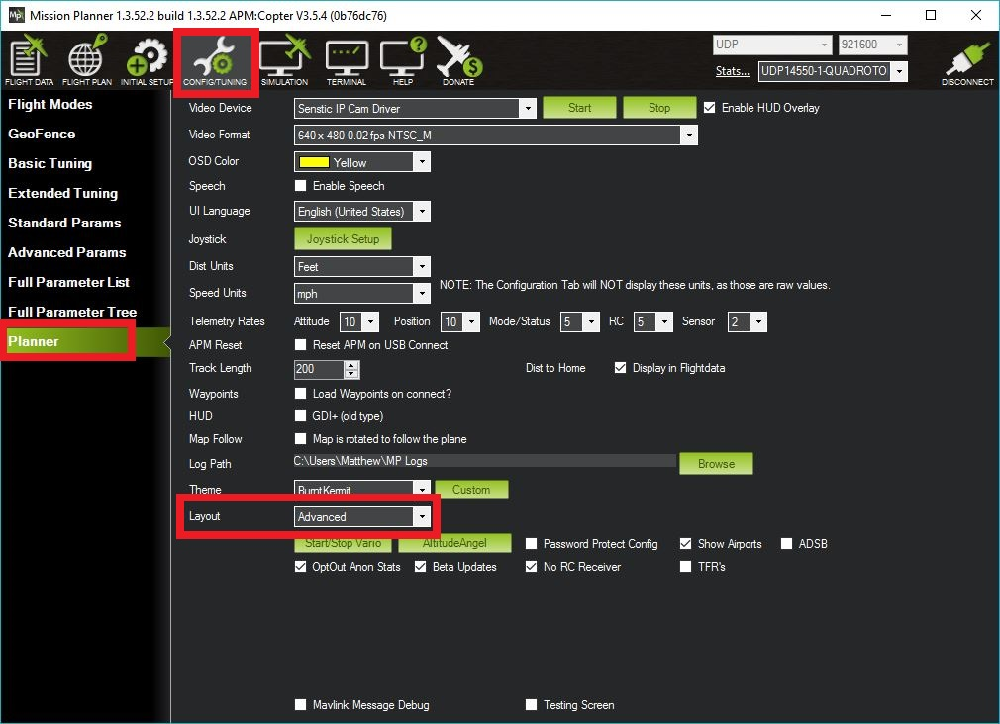

.. _common-parameter-reset:

===============
Parameter Reset
===============

This article shows several ways to reset all parameters to their default
values.

Option #1: Using the Mission Planner
====================================

Mission Planner has a dedicated **Reset to Default** button if the
"Advanced Layout" feature is enabled.

#. On the *Config/Tuning \| Planner* page set the Layout dropdown for Advanced

   |ParamReset_MPAdvancedView|
#. Connect the flight controller to *Mission Planner*, and on the
   **Config/Tuning \| Full Parameter List** or **Full Parameter Tree**
   page push the **Reset to Default** button.

   |ParamReset_MPResetToDefault|
   
#. The flight controller will automatically reboot, setting all parameters
   back to their default values.

Option #2: Change the SYSID_SW_MREV parameter
===============================================

On any Ground Control Station (that can write parameters) you can reset
parameters by setting the ``SYSID_SW_MREV`` parameter to zero. After
writing the parameter, reboot the board.

Option #3: Load another vehicle's firmware
==========================================

.. tip::

   This method is not recommended because it's unnecessarily time
   consuming.

Upload the firmware for a completely different vehicle type (I.e. if you
were using Copter, now upload the Rover firmware).  Reboot the board and
let it sit for 30 seconds to clear the EEPROM.  Then upload the original
firmware (i.e. Copter) to the flight controller.

.. |ParamReset_MPResetToDefault| image:: ../../../images/ParamReset_MPResetToDefault.png
    :target: ../_images/ParamReset_MPResetToDefault.png

