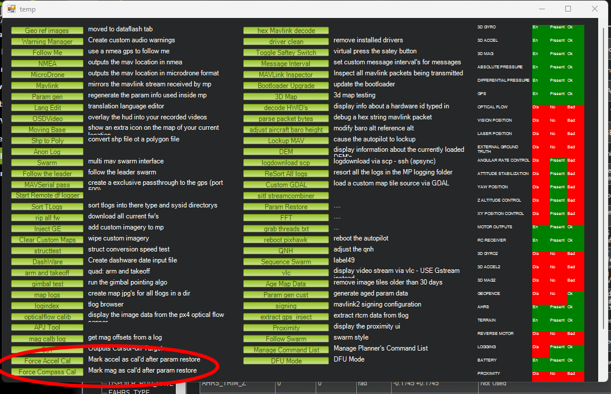

.. _common-parameter-reset:

===============
Parameter Reset
===============

This article shows several ways to reset all parameters to their default
values.If you would like to restore any of the existing setup parameters, save them to a file first!

Option #1: Using the Mission Planner
====================================

Mission Planner has a dedicated **Reset to Default** button. This will reset all parameters to the vehicle's defaults.

.. note:: It will not reset the DroneCAN dynamic node address table. The other parameter reset methods listed below will also reset that table so that new devices can use previous addresses of devices that are being replaced.

- Connect the autopilot to *Mission Planner*, and on the **CONFIG \| Full Parameter List** or **Full Parameter Tree** page push the **Reset to Default** button.

.. image:: ../../../images/ParamReset_MPResetToDefault.png
    :target: ../_images/ParamReset_MPResetToDefault.png

- The autopilot will automatically reboot, setting all parameters back to their default values.

Option #2: Change the FORMAT_VERSION parameter
==============================================

On any Ground Control Station (that can write parameters) you can reset
parameters by setting the :ref:`FORMAT_VERSION<FORMAT_VERSION>`  parameter to zero. After
writing the parameter, reboot the board.

Option #3: Load another vehicle's firmware
==========================================

.. tip::

   This method is not recommended because it's unnecessarily time
   consuming.

Upload the firmware for a completely different vehicle type (I.e. if you
were using Copter, now upload the Rover firmware).  Reboot the board and
let it sit for 30 seconds to clear the EEPROM.  Then upload the original
firmware (i.e. Copter) to the autopilot.

Restoring Calibrations after Resets
===================================

The above will also reset the flag used to indicate that Accelerometer and Compasses have been calibrated, so that even if you restore your old parameters from a file, the calibrations would still need to be repeated.

There are two methods to allow these to be restored.

.. warning:: **Only use this method if you are certain that the Accelerometer or Compass sensors have not changed in any manner since the parameters were stored in a file. Restoring inaccurate calibration data can lead to a crash!**

Using Mission Planner
---------------------

#. Press ALT+F to get to advanced commands.
 
#. Now restore your previously stored parameters (could have also been done as first step), which includes the calibration parameters, to the autopilot and reboot. Calibration should not be required to arm now.

#. Press the "Force Accel Cal" and/or "Force Compass Cal" to set the flag which indicates the cal has been done.

Using MAVProxy
--------------

Simply type "forcecal" will force the autopilot into a calibrated state. Be sure you have valid compass and IMU calibration values already loaded.

