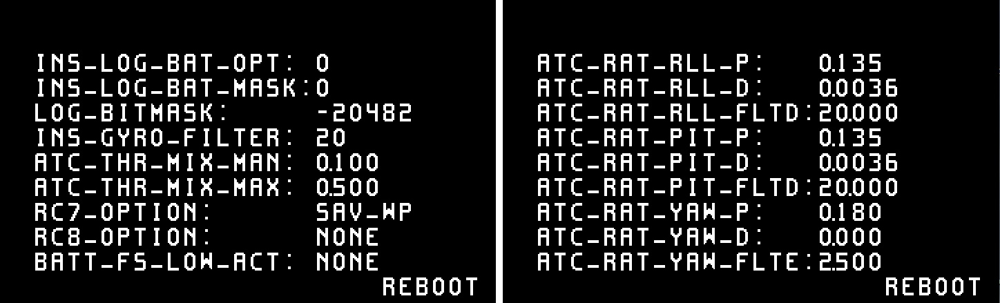
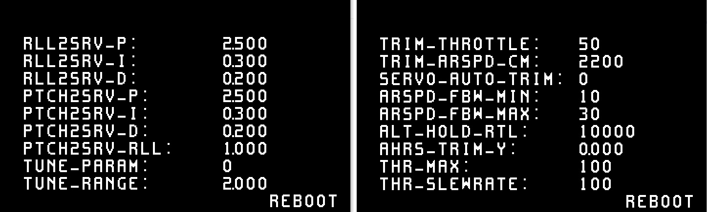
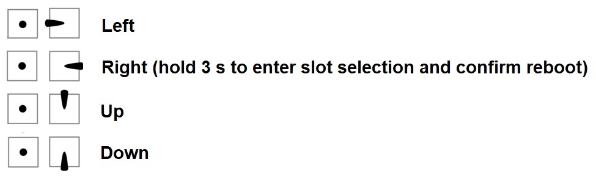

.. _common-paramosd:

========================
OSD based parameter menu
========================

This allows to set and adjust parameters using the ArduPilot onboard OSD and an RC transmitter's stick input. 
There's two additional OSD screens available (OSD5 and OSD6), with 9 "slots" each to hold parameters. The screens 
display a default set of paramaters to start with. Additionally, it is possible to change the parameter used in a 
respective slot directly (on-screen) using stick inputs, or using MAVProxy's osd-module command-line setup. 

Copter default screens:
-----------------------

Plane default screens:
----------------------

The RC transmitter's roll and pitch stick input is used to navigate through the screen, pick 
a parameter and adjust the parameter value. Parameter values can be adjusted in disarmed state only. 

Additionally there's a "save and reboot" button on each screen that allows to save the adjusted settings and reboot the 
flightcontroller if required. It defaults to "reboot", will auto-switch to "save" if a parameter value has been altered, 
and switch back to "reboot" after saving is completed. 

.. note::
   
   Using the "save" button after adjusting a parameter will make the adjustments persistent, otherwise the value will be reset to its prior state after a reboot.

Accessing parameter screens
===========================

To enable the parameter screens, set :ref:`OSD5_ENABLE <OSD5_ENABLE>` and :ref:`OSD6_ENABLE <OSD6_ENABLE>` = 1.
Parameter screens can be accessed in the same way the conventional osd screens are accessed. 
See the documentation on :ref:`OSD screens and switching <screen-switching>` for reference.
When one of the parameter screens is selected, adjustments can be made in disarmed state only. If a parameter screen is 
selected inflight, the screen allows display only. This allows live monitoring of automatic parameter adjustments, 
i.e. when performing autotune procedures or automatic servo trims.

Menu navigation
===============

Use the RC transmitter's roll and pitch input to navigate through the parameter screen. UP / DOWN and LEFT / RIGHT will navigate through 
the screen's parameter slots. The selected parameter will blink. Move right on the selected parameter to adjust its value using 
up or down stick input. Leave the selection with left roll stick input. On a typical mode 2 type transmitter this would be the right 
gimbal stick:

  
Parameter slot scroll-selection
===============================

Holding roll right for > 3 seconds on a parameter's value will highlight both the selected parameter and its value (blink). This allows 
you to scroll through the full list of parameters and place another paramater into that respective slot using pitch up and down stick input. 
Move left to exit parameter selection and get back into standard screen navigation.

.. note::

   OSD based parameter adjustment is designed to allow basic adjustments without any aditional data link or GCS setup required. However, 
   some parameters with exceptionally wide value ranges, as well as complex bitmap-type parameters might not be ideal for adjustment using parameter OSD.

Parameter range, increment and type-mnemonics
=============================================

OSD based parameter menu uses parameter metadata to estimate a useful value range and incrementation for each parameter. Additionally, support for the 
display of human-readable abbreviations instead of numeric values is provided for the following parameter types: 

- flightmodes

- servo functions

- serial protocols

- RC aux options

- failsafe actions

.. note::

   This feature may have limitations on certain parameters with exceptionally wide value ranges and when handling bitmap-type parameters. 

Populating a screen's parameter slots using MAVProxy's OSD module
=================================================================
 
OSD based parameter setting includes a `MAVProxy module <https://ardupilot.org/mavproxy/>`__ to populate each screen's parameter slots.
Connect your flight controller, connect tp MAVProxy and load the OSD module by typing :code:`module load osd`

.. note::
   
   The osd module is supported by MAVProxy 1.8.21 and later. Type :code:`pip install --upgrade pymavlink MAVProxy --user` 
   to update MAVProxy if required.

Use the following syntax to set and show a parameter, its type, minimum, maximum and increments:

:code:`param-set <screen> <index> <name> (<type> | <min> <max> <increment>)` 

:code:`param-show <screen> <index>` 

where 

:code:`screen` is the desired parameter screen number (5 or 6)

:code:`index`  is the desired parameter slot (1 - 9)

:code:`NAME` is the desired parameter's full name (case sensitive)

:code:`type` allows to set mnemonics to 

- :code:`FLIGHT_MODE`
- :code:`SERIAL_PROTOCOL`
- :code:`SERVO_FUNCTION`
- :code:`AUX_FUNCTION` (for RC options)
- :code:`FAILSAFE_ACTION` (plane: battery low and critical failsafe actions; copter: failsafe options)
- :code:`FAILSAFE_ACTION_1` (plane: short failsafe actions; copter: throttle and GCS failsafe options)
- :code:`FAILSAFE_ACTION_2` (plane: long failsafe actions; copter: battery failsafe actions)
- :code:`NONE`

:code:`MIN` allows to set a lower limit to the setteable range

:code:`MAX` allows to limit the settable range's maximum

:code:`INCREMENT` allows to use specific increments if required

Examples
--------

To set OSD5 parameter1 to TRIM_THROTTLE, type :code:`osd param-show 5 1 TRIM_THROTTLE`

To set OSD6 parameter2 to FLTMODE1 using respective mnemonics, type :code:`osd param-set 6 2 FLTMODE1 FLIGHT_MODE`

To set OSD5 parameter2 to LIM_ROLL_CD, limiting range from 2000 - 6000 with increments of 100, type :code:`osd param-set 5 2 LIM_ROLL_CD 2000 6000 100`

To show what OSD6 parameter2 is set to, type :code:`osd param-show 6 2`

.. note::
   
   Be aware that some :code:`TYPE` mnemonic options are vehicle-specific. Make sure to apply mnemonics to the correct vehicle type in order to avoid unexpected results

