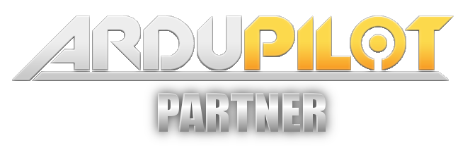

.. _common-partners-program:

==========================
ArduPilot Partners Program
==========================

The ArduPilot Project is the result of an immense amount of effort from software and hardware engineers, beta testers, web developers, documenters, researchers and many others.  A vast number of individuals, institutions and companies use and contribute to ArduPilot - in the spirit of Free and Open Source Software we freely and openly welcome their involvement in the project.  There is no cost to use, or contribute to, any software provided by ArduPilot.
The Project does incur costs though, so this page explains our Partners Program for :ref:`corporate sponsors <common-partners>`.

Why a Partners Program
======================
ArduPilot is a free and open-source software project that includes:

- Embedded firmware that is designed to serve as the control system for autonomous vehicles, and supports many different hardware targets listed on the Supported Hardware page
- A number of Ground Control Station software applications that allow management of vehicles running ArduPilot firmware, e.g. more convenient settings editing on an often more comfortable interface, firmware download and transfer, upgrading and conversion of settings between different devices and versions, fleet management, operations monitoring and more
- The https://ardupilot.org website, https://discuss.ardupilot.org forum and this wiki
- Server infrastructure dedicated to distributing software and firmware, and testing/building/distributing of the different variants for all the different supported platforms and options
- A global community of users with an enormous variety of goals and expectations
- A global team of developers with varying degrees of knowledge of the different aspects of the project’s code and of its management

In order to continue providing, maintaining and improving the rich ArduPilot ecosystem, the Project relies heavily on generous donations of time from many people - but we also incur financial costs that must be covered.  Simplistically, meeting these costs is what the Partners Program achieves.

How does my company become a partner?
=====================================
We ask for an annual donation of at least `$1000 USD through PayPal <https://www.paypal.com/cgi-bin/webscr?cmd=_s-xclick&hosted_button_id=BBF28AFAD58B2>`__  per year. For large companies or those who rely on ArduPilot as part of their core business, annual donations of `$5,000 <https://www.paypal.com/cgi-bin/webscr?cmd=_s-xclick&hosted_button_id=BBF28AFAD58B2>`__ , `$10,000 <https://www.paypal.com/cgi-bin/webscr?cmd=_s-xclick&hosted_button_id=BBF28AFAD58B2>`__  or more are greatly appreciated. If this is your first time, please email partners@ardupilot.org to express your desire to become a partner and include your company logo if you would like it to appear on :ref:`Partners page <common-partners>`.  We will send you a reminder in a year and if all goes well, you may choose to extend for another year.

In some countries it is not possible to donate through PayPal in which case you can donate by Credit Card using `Click&Pledge <https://co.clickandpledge.com/advanced/default.aspx?wid=34115>`__.  Be sure to enter the amount in the ArduPilot section, other sections are for other `SPI projects <http://www.spi-inc.org/>`__. Other methods can be found on the `SPI donations page <http://www.spi-inc.org/donations/>`__.

What do I get for becoming an ArduPilot Partner?
================================================
Beyond a warm feeling in your heart for helping a worthy project, we will coordinate an "Onboarding Meeting" and direct contact methods for the core Development Team members, so we can discuss your objectives, identify a unique engagement strategy for each Partner, and maintain good communication with you.  Your company can also attend the ArduPilot Partners monthly meeting.  This is a meeting held online, via our Mumble Server, on the first Wednesday or Thursday (depending upon your timezone) of each month.  It is attended by the core devs and presents an opportunity to get high-level updates on the project and influence how funds are spent (via proposals to the Funding Committee).  This update is recorded, and available to Partners shortly after it is held.  You may also find like-minded companies with whom you can cooperate in various ways.  

How are collected funds spent?
==============================
Funds are first used to cover fixed costs including servers to host the wiki, forum, autotest and build servers, other running expenses, plus a part-time employee who oversees code quality (amongst other things).
Any remaining funds will be used to pay for documentation efforts, hardware/software costs for developers working on ArduPilot related enhancements, and subsidise the annual Developers Conference.  A Funding Committee of 3 people is voted on annually from within the Development Team to oversee and control financial matters. 

I'm not a company, but I love your stuff, how can I help?
=========================================================
Please see our more general, :ref:`how-to-donate <common-donation>` page but in short, we accept donations of any amount from individuals as well.  Also please consider helping out with documentation, beta testing or code development.  Tell your friends and post videos of your successes with ArduPilot! 

I want a new feature, do I have to be a partner to get it?
==========================================================
No.  ArduPilot is, and always will be, open source.  Contributions to the code base, wherever they come from, are accepted based on their technical merits.  If you're not in a position to make the changes yourself, please add it to the `Issues list <https://github.com/ArduPilot/ardupilot/issues>`__ or consider contracting one of the companies listed on the :ref:`Commercial Support page <common-commercial-support>` to make the change.

[copywiki destination="copter,plane,rover,planner,planner2,antennatracker,dev,ardupilot,mavproxy"]

