.. _common-partners:

========
Partners
========

The project is the result of an immense amount of effort from software and hardware engineers, beta testers, web developers, documenters and many others.  A vast number of individuals and companies use ArduPilot and we welcome their involvement in the project.  This page highlights some of our main corporate partners and clarifies how it all works.

Corporate Partners
==================

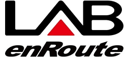

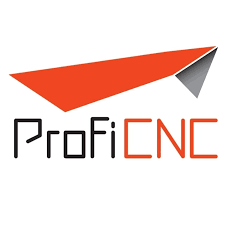
    

.. image:: ../../../images/supporters/supporters_logo_craftandtheory.png
    :width: 250px
    :target:  http://craftandtheoryllc.com

.. image:: ../../../images/supporters/supporters_logo_lightware.png
    :width: 250px
    :target:  http://www.lightware.co.za

.. image:: ../../../images/supporters/supporters_logo_hex.png
    :width: 250px
    :target:  http://www.hex.aero/

.. image:: ../../../images/supporters/supporters_logo_dronebility.png
    :width: 250px
    :target:  http://www.dronebility.com/

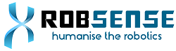

.. image:: ../../../images/supporters/supporters_logo_drotek.png
    :width: 250px
    :target:  http://www.drotek.com/

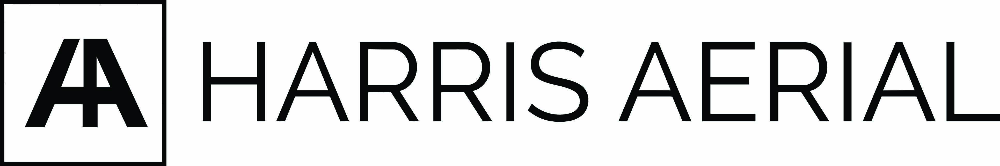

.. image:: ../../../images/supporters/supporters_logo_event38.png
    :width: 250px
    :target:  http://event38.com/

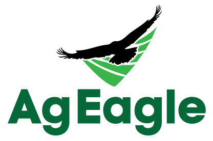

.. image:: ../../../images/supporters/supporters_logo_wurzbachelectronics.png
    :width: 250px
    :target:  https://wurzbachelectronics.com

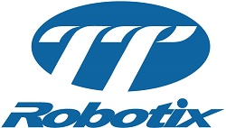

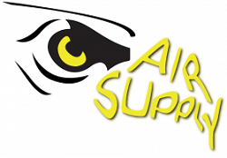

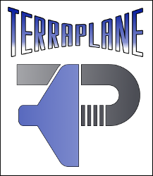

.. image:: ../../../images/supporters/supporters_logo_irlock.jpg
    :width: 250px
    :target:  https://irlock.com/

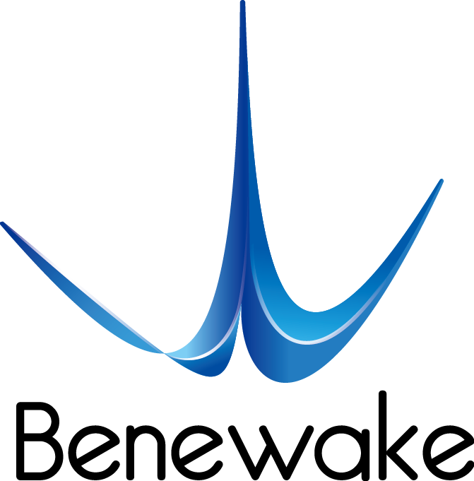

.. image:: ../../../images/supporters/supporters_logo_skywalker.png
    :width: 250px   
    :target:  http://sky-walker.co.jp/english/index.html

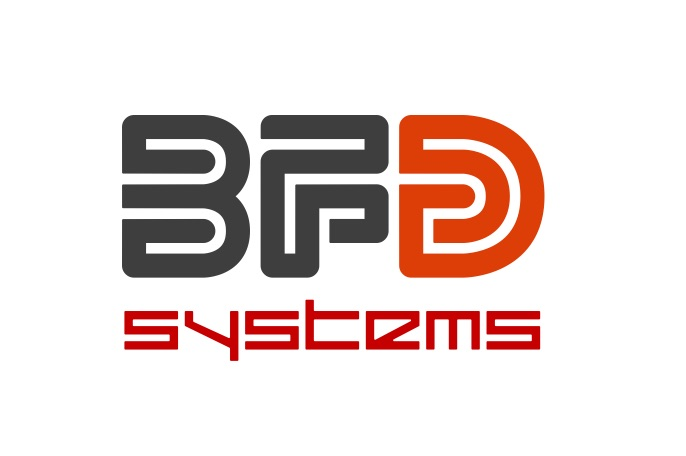

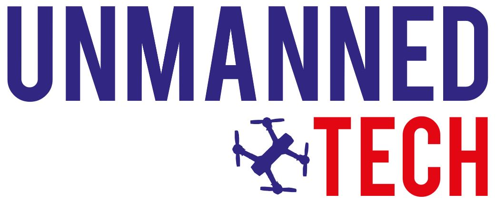

    
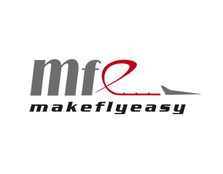

How does my company become a partner?
=====================================
We ask for an annual donation of at least `$1000 USD through PayPal <https://www.paypal.com/cgi-bin/webscr?cmd=_s-xclick&hosted_button_id=BBF28AFAD58B2>`__  per year. For large companies or those who rely on ArduPilot as part of their core business, annual donations of `$5,000 <https://www.paypal.com/cgi-bin/webscr?cmd=_s-xclick&hosted_button_id=BBF28AFAD58B2>`__ , `$10,000 <https://www.paypal.com/cgi-bin/webscr?cmd=_s-xclick&hosted_button_id=BBF28AFAD58B2>`__  or more are greatly appreciated. If this is your first time, please email partners@ardupilot.org to express your desire to become a partner and include your company logo if you would like it to appear on this page.  We will send you a reminder in a year and if all goes well, you may choose to extend for another year.

In some countries it is not possible to donate through PayPal in which case you can donate by Credit Card using `ClickAndPledge <https://co.clickandpledge.com/advanced/default.aspx?wid=34115>`__.  Be sure to enter the amount in the ArduPilot section, other sections are for other `SPI projects <http://www.spi-inc.org/>`__.  Other methods can be found on the `SPI donations page <http://www.spi-inc.org/donations/>`__.

What do I get for becoming an ArduPilot partner?
================================================
Beyond a warm feeling in your heart for helping a worthy project, your company can send a representative to the "ArduPilot Advisory Board" meeting.  This is a meeting held on the first Wednesday or Thursday (depending upon your timezone) of each month.  It is attended by the core devs and presents an opportunity to get high-level updates on the project and influence how funds are spent (the formal voting procedure is still to be finalised).  You may also find like-minded companies with whom you can cooperate in various ways.

How are collected funds spent?
==============================
Funds are first used to cover fixed costs including servers to host the wiki, autotest and build servers and other running expenses.
Any remaining funds will be used to pay for documentation efforts and hardware/software costs for developers working on ArduPilot related enhancements.  It is expected that a voting mechanism will be created in the near future to allow to influence how the collected funds are spent. 

I'm not a company, but I love your stuff, how can I help?
=========================================================
Please see our more general, :ref:`how-to-donate <common-donation>` page but in short, we accept donations of any amount from individuals as well.  Also please consider helping out with documentation, beta testing or code development.  Tell your friends and post videos of your successes with ArduPilot! 

I want a new feature, do I have to be a partner to get it?
==========================================================
No.  ArduPilot is, and always will be, open source.  Contributions to the code base, wherever they come from, are accepted based on their technical merits.  If you're not in a position to make the changes yourself, please add it to the `Issues list <https://github.com/ArduPilot/ardupilot/issues>`__ or consider contracting one of the companies listed on the :ref:`Commercial Support page <common-commercial-support>` to make the change.

[copywiki destination="copter,plane,rover,planner,planner2,antennatracker,dev,ardupilot"]
