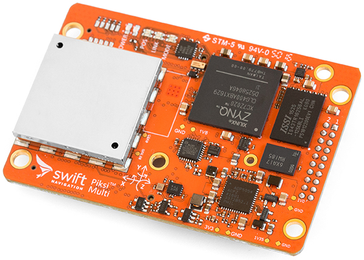

.. _common-piksi-multi-rtk-receiver:

===============================================
Swift Navigation's Piksi Multi RTK GPS Receiver
===============================================

This article provides a brief overview of Piksi Multi multi-band multi-constellation RTK GPS receiver, available from `Swift Navigation <https://www.swiftnav.com/>`__.

.. note::

     Piksi Multi RTK GPS is supported in Copter-3.5 (and higher), Plane 3.8.0 (and higher) and Rover 3.1 (and higher)

.. note::

     The previous offering from Swift Navigation, Piksi v2, is still supported by ArduPilot. That being said, Swift has announced Piksi v2's end-of-life, and new units are no longer available. Deprecated integration documentation for Piksi v2 is `available here <http://docs.swiftnav.com/wiki/Integrating_Piksi_with_the_Pixhawk_platform>`__.

What is Piksi Multi?
====================

Piksi Multi the first affordable multi-band multi-constellation RTK GPS unit. Not only does it provide centimeter-accurate positioning similar to other RTK GPS units, it additionally provides RTK lock times on the order of seconds. In comparison, single-frequency RTK GPS receivers require several minutes to aquire or reaquire an RTK FIX.

What is RTK GPS and why does multi-frequency matter?
====================================================

Real-time Kinematic GPS is a signal processing technique that improves the accuracy of a GPS receiver by removing sources of error through comparison with a second GPS receiver. Real-time kinematic (RTK) GPS exploits information about the GPS carrier wave to improve the accuracy of position estimates. RTK GPS compares the phase of the received carrier wave between two GPS receivers to derive an accurate vector between a stationary base station GPS and moving rover GPS. Note the requirement for two GPS receivers, in comparison to conventional GPS positioning that requires only a single receiver. This approach can provide centimeter-accurate positioning with millisecond latencies.

However, RTK GPS can only calculate centimeter-accurate positions once an integer ambiguity is resolved. For single-frequency receivers, ambiguity resolution algorithms have runtimes on the order of minutes. Multi-frequency receivers can additionally exploit information contained in the difference between the two frequencies. This insight allows Piksi Multi and other multi-frequency receivers to achieve RTK fixes in seconds.

ArduPilot Integration
=====================

See the `ArduPilot Integration Guide for Piksi Multi <https://support.swiftnav.com/support/solutions/articles/44001850784-piksi-multi-ardupilot-integration-guide>`__ supplied by Swift Navigation.
