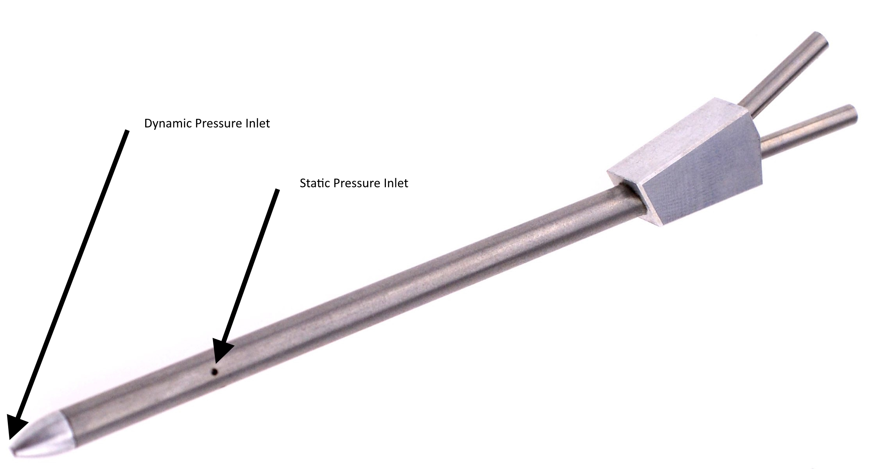
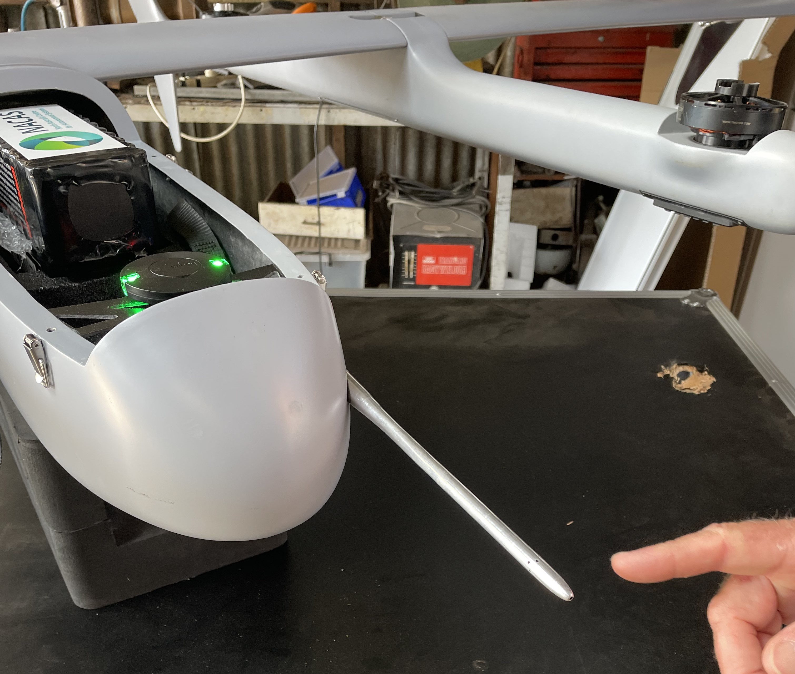
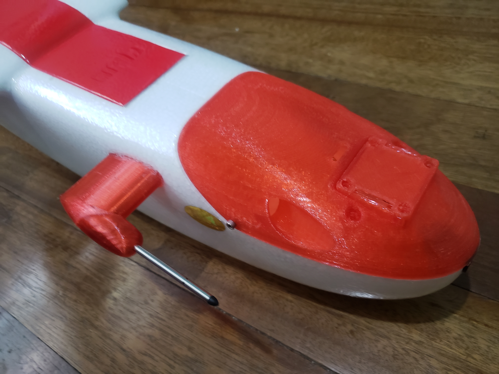

.. _common-pitot-considerations:

[copywiki destination="plane"]

=========================
Pitot Tube Considerations
=========================

Airspeed sensor accuracy is very dependent on the placement and construction of the pitot tube and static port. For vehicles that do not operate close to their stall speed, airspeed accuracy is not as critical and pitot/static port configuration and placement are not as critical, but some basic guidlines still need to be followed.

Pitot Dynamic Pressure Input/Static Port
========================================

Airspeed sensors work by measuring the differential pressure between a dynamic port facing the vehicle's relative wind and a static port measuring general prevailing air pressure. Usually, these ports are placed on a single pitot tube.

The pitot tube should be placed on the vehicle such that:

- The dynamic pressure port and static port do not get turbulence from propellers, or aircraft surfaces (boundary layers of wings, pressure fronts of leading edges, rotors generated by cameras, etc.)
- The ports should not be positioned as to be affected by angle of attack changes of the vehicle in its normal operating range of speeds. For example, mounting on the top of the aircraft nose on the fuselage will "blanket" the sensor as the angle of attack in flight is increased, leading to inaccurate readings.

The ideal location would be extended well beyond the nose of the aircraft or wing leading edge, as shown below:

But this does present handling and "trip" hazards that must be tolerated. However, such positioning is very important for vehicles operating near their stall point.

For sport aircraft which typically fly at speeds well above their stall point (>25-30% speed margin), fuselage placement such as shown below is more practical, with the downside of some (usually acceptable) speed reading variations during tight turns and full power climbs, etc.

This one is located out of propeller wash, away from turbulence causing fuselage features, away from surface boundary layer flow, but is still subject to fuselage blanketing on sliding turns which may cause some inaccuracies, but for this sport plane operating well above its stall point, it is not an issue.

Pitot Clogging
==============

Many pitot tubes typically supplied with commercial airspeed sensors have dynamic pressure port opening that are very small. In rain, clouds, or dense fog, water droplets can easily clog the port leading to highly inaccurate sensor readings, or AduPilot declaring the sensor has failed. For operations in these environments, be sure to use a pitot tube that has been designed for these conditions.

Cabin Static Port
=================

Some Ready To Fly vehicles use an internal cabin static port for the airspeed sensor instead of placement on the external pitot tube. These can sometimes provide adequate results, but can easily result in reading inaccuracies if the cabin in which they are located are subject to pressure changes in flight (ie. openings in cabin exposed to direct airflow) or configuration (ie. nose or belly camera removal exposing an opening in the fuselage). Therefore, this configuration is usually not recommended, especially if airspeed sensors are being used during an autolanding.

The impact of angle of attack on the cabin pressure (and by inference airspeed reading accuracy)can be checked by examining the BARO.Alt vs GPS.Alt log readings at various speeds, since the BARO is measuring altitude based on cabin pressure. 
