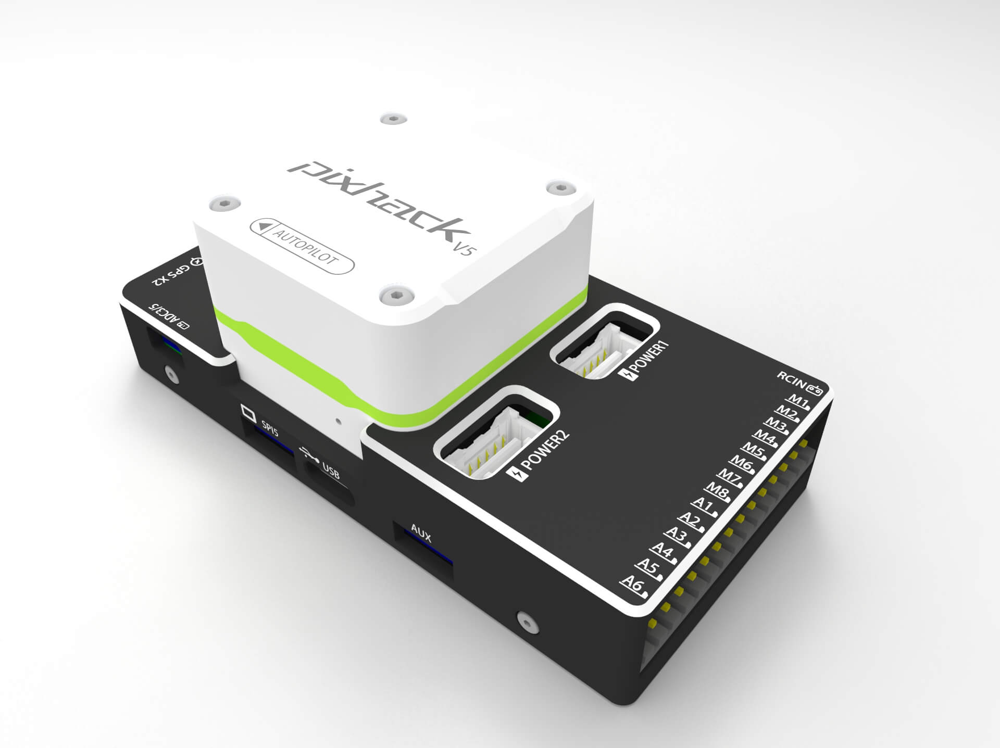

.. _common-pixhackV5-overview:

============================
Pixhack V5 Overview
============================

.. image:: ../../../images/pixhackv5/pixhackv5.jpg
    :target: ../images/pixhackv5/pixhackv5.jpg
    :width: 360px

The CUAV Pixhack v5 is an advanced autopilot designed and made by CUAV.
The board is based on the FMUv5 open hardware design, with further attribution `here <https://github.com/cuav/hardware/blob/master/PixHack_v5/README.md>`__.
It is intended primarily for academic and commercial users.

Specifications
==============

-  **Processor**

   -  32-bit ARM Cortex M7 core with DPFPU
   -  216 Mhz/512 KB RAM/2 MB Flash
   -  32-bit co-processor

-  **Sensors**

   -  Dual accel/gyro IMUs (InvenSense ICM20689 and Bosch BMI055)
   -  MS5611 barometer
   -  IST8310 magnetometer

-  **Power**

   -  Operating power: 4.3~5.4V
   -  USB Input: 4.75~5.25V
   -  High-power servo rail, up to 36V
      (servo rail does not power the flight controller)
   -  Dual battery monitor inputs
   -  Pixhack V5 can be triple redundant if power is provided
      to both battery monitor inputs and the USB port

-  **Interfaces**

   -  6 IOMCU PWM servo outputs
   -  8 FMU PWM servo outputs (D-Shot capable)
   -  3 dedicated PWM/Capture inputs on FMU
   -  S.Bus servo output
   -  R/C inputs for CPPM, Spektrum / DSM and S.Bus
   -  Analogue / PWM RSSI input
   -  5x general purpose serial ports
   -  4x I2C ports
   -  4x SPI buses
   -  2x CAN Bus ports

Where to Buy
============

Order from `here <https://store.cuav.net/index.php>`__.
Official retailers are listed `here  <https://leixun.aliexpress.com/>`__.

Quick Start
===========

Connector pinouts are detailed `here <../images/pixhackv5/pixhack-v5-connectors.jpg>`
Use the :ref:`Pixhawk Wiring QuickStart <common-pixhawk-wiring-and-quick-start>` as a general guide.

More Information
================

see more documentation `here  <http://doc.cuav.net/flight-controller/pixhack-v5/en/>`__

More Images
===========

