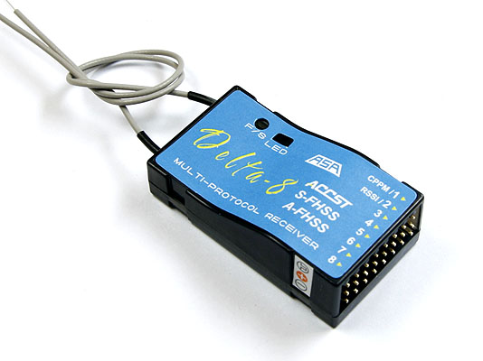

.. _common-pixhawk-and-px4-compatible-rc-transmitter-and-receiver-systems:

============================================================
Compatible RC Transmitter and Receiver Systems (Pixhawk/PX4)
============================================================

This article provides an overview of the RC Transmitter and Receiver
Systems that can be used with Pixhawk (and PX4) along with guidance on
how they are connected.

Overview
========

Pixhawk is compatible with 
    #. PPM RC receivers
    #. Futaba S.Bus receivers 
    #. Spektrum DSM and DSM2 receivers
    #. Spectrum DSM-X Satellite receivers
    #. MULTIPLEX SRXL version 1 and version 2 receivers

For traditional single-wire-per-channel (PWM) receivers a 
`PPM encoder <http://store.jdrones.com/pixhawk_px4_paparazzi_ppm_encoder_v2_p/eleppmenc20.htm>`__ can be
used to convert the receiver outputs to PPM-SUM.

Connecting the receiver
=======================

To connect a PPM receiver, Futaba S.Bus receiver, or PPM encoder,
connect the black ground, red power and white signal wires to the RC
pins. These S.BUS receivers have been tested and are known to work:
R2008SB, R6008SB.

.. image:: ../../../images/rc-input-wiring.jpg
    :target: ../_images/rc-input-wiring.jpg

For a **Spektrum DSM**, **DSM2**, or **DSM-X Satellite** receiver,
connect to the **SPKT/DSM** port.

.. image:: ../../../images/pixhawk_spektrum_connection.jpg
    :target: ../_images/pixhawk_spektrum_connection.jpg

.. _common-pixhawk-and-px4-compatible-rc-transmitter-and-receiver-systems-multiplex-srxl:

For a **MULTIPLEX SRXL** receiver, connect the **SPKT/DSM** port of the pixhawk to the **B/D** port of the MULTIPLEX SRXL receiver, without using the +3,3V voltage supplied at the **SPKT/DSM** port of the pixhawk and power the MULTIPLEX SRXL receiver separately.

.. image:: ../../../images/multiplex_srxl_B_D_port_to_pixhawk_spkt_dsm_pinout.jpg
    :target: ../_images/multiplex_srxl_B_D_port_to_pixhawk_spkt_dsm_pinout.jpg

Details how to enable the SRXL signal on MULTIPLEX receivers can be found in :ref:`SRXL R/C Receivers <common-srxl-receivers>`

These **MULTIPLEX SRXL** receivers have been tested and are known to work:
    #. RX-4/9 FLEXX #55837, Firmware 1.31 --> 4 servo sockets, 9 of 16 channels active on SRXL v2 datastream
    #. RX-4/16 FLEXX #55838, Firmware 1.31 --> 4 servo sockets, 16 of 16 channels active on SRXL v2 datastream
    #. RX-5 #55817, Firmware 1.26 --> 5 servo sockets, 5 of 12 channels active on SRXL v1 datastream
    #. RX-9-DR #55812, Firmware 1.26 --> 9 servo sockets, 9 of 12 channels active on SRXL v1 datastream
    #. RX-9-DR SRXL16 #55840, Firmware 1.35 --> 9 servo sockets, 16 of 16 channels active on SRXL v2 datastream
    #. RX-16-DR pro #55815, Firmware 1.35 --> 16 servo sockets, 16 of 16 channels active on SRXL v2 datastream

Radio systems that support PPM-Sum or S-Bus directly
====================================================

This section list radio systems that support PPM-Sum or S-Bus directly.

.. _common-pixhawk-and-px4-compatible-rc-transmitter-and-receiver-systems_frsky_taranis_ppm-sum_compatible_transmitter:

FrSky Taranis PPM-Sum Compatible Transmitter
--------------------------------------------

.. tip::

   This solution is **highly recommended** for all RC uses

The `FrSky Taranis RC Transmitter <http://www.frsky-rc.com/product/pro.php?pro_id=113>`__ is a
high quality open source RC Transmitter that is compatible with a
wide variety of high quality FrSky PPM-Sum compatible receivers.

.. image:: ../../../images/FRSkyTaranis.jpg
    :target: ../_images/FRSkyTaranis.jpg

.. note::

   This transmitter is a real bargain. You can buy it from different locations e.g. `Range Video <http://www.rangevideo.com/en/radios-and-receivers/96-frsky-taranis-24ghz-rc-system.html>`__ , `Aloft Hobbies <https://alofthobbies.com/catalogsearch/result/?cat=0&q=X9D>`__ or `HobbyKing <https://hobbyking.com/en_us/catalogsearch/result/?q=X9D>`__ .

FrSky Delta 8 MultiProtocol PPM-Sum Receiver
--------------------------------------------

-  This PPM-Sum compatible `FrSky Delta 8 Receiver <http://www.frsky-rc.com/product/pro.php?pro_id=110>`__ is
   multi-platform capable including Hitec Aurora 9 and Futaba RC
   transmitters.
-  For an Aurora 9, install a jumper between receiver signal pins 6 and
   7 (Hitec AFHSS) and pins 3 and 4 (CPPM mode) in order to bind.

.. note::
 
   For a Hitec Aurora 9 system you need to have version 3.01 or later of the firmware in the transmitter's AFHSS 2.4 GHz module.
    - If your module does not have version 3.01 or later firmware you will need the Hitec HPP-22 programmer module in order to upgrade it.
    - Upgrade both the AFHSS 2.4 GHz module and the transmitter itself to the latest versions following `HP-22 online
      instructions <http://hitecrcd.co.kr/tester/hpp_22.htm>`__.
    - If the transmitter's AFHSS module's blue LED will not illuminate during binding you will need to perform this firmware upgrade.

-  I am using the Delta 8 successfully with a PX4 and an Aurora 9, I had
   to complete the firmware upgrade procedure before I could bind.

Turnigy Transmitter Compatible With FrSky Transmitter Module
------------------------------------------------------------

.. image:: ../../../images/Turnigy9XR.jpg
    :target: ../_images/Turnigy9XR.jpg

FrSky Transmitter Adapter Module and PPM-Sum Receiver
-----------------------------------------------------

The FrSky PPM Sum Receiver and conversion module below will work with
Turnigy 9x, 9XR (above) and other RC transmitters.

FrSKY makes several receivers, some are compatible with PPM-Sum, some
are not, check at `FrSky's web site <http://www.frsky-rc.com/product/product.php?cate_id=12&cate_name=Receivers>`__.

The receiver shown is PPM-Sum compatible and is recommended (4 channel
receivers still do 8 channel PPM-Sum)

.. image:: ../../../images/receiver_frsky.gif
    :target: ../_images/receiver_frsky.gif

.. image:: ../../../images/receiver_frssky_d4r_2.jpg
    :target: ../_images/receiver_frssky_d4r_2.jpg

    
.. _common-pixhawk-and-px4-compatible-rc-transmitter-and-receiver-systems_futaba_transmitter_compatible_with_futaba_s-bus_receivers:

Futaba Transmitter Compatible With Futaba S-Bus Receivers
---------------------------------------------------------

Futaba S.BUS2 receivers are supported since Copter/Plane 3.2. The SBUS
receiver must be connected to the PPM input, not the adjacent SBUS output.

The list of supported receivers for the Pixhawk (or a PX4FMU in
combination with a PX4IO board) is given below:

-  Futaba / Ripmax `R7008SB <http://www.gpdealera.com/cgi-bin/wgainf100p.pgm?I=FUTL7675>`__ S.BUS 2 Receiver
-  Futaba / Ripmax `R6303SB <http://www.gpdealera.com/cgi-bin/wgainf100p.pgm?I=FUTL7661>`__ S.BUS Receiver
-  FrSky TFR4 SB 3/16ch 2.4Ghz S.BUS Receiver FASST Compatible
   (`HobbyKing <http://www.hobbyking.com/hobbyking/store/__27176__FrSky_TFR4_SB_3_16ch_2_4Ghz_S_BUS_Receiver_FASST_Compatible.html>`__)
-  Futaba FASST S.BUS `2.4 GHz Receiver R6303SB <http://www.gpdealera.com/cgi-bin/wgainf100p.pgm?I=FUTL7661>`__
   (tested by PX4 core team, very lightweight, only 7g)
-  FrSky FASST compatible S.BUS compatible TFR8 SB 8ch 2.4Ghz Receiver
   (`HobbyKing <http://www.hobbyking.com/hobbyking/store/__24785__FrSky_TFR8_SB_8ch_2_4Ghz_S_BUS_Receiver_FASST_Compatible.html>`__)

.. note::

   The list above is from `pixhawk.org here <https://pixhawk.org/peripherals/radio-control/futaba/start?s[]=sbus#sbussbus_2>`__.

.. image:: ../../../images/FutabaT8FG.jpg
    :target: ../_images/FutabaT8FG.jpg

Further notes on S-Bus / S-Bus 2 compatibility
----------------------------------------------

In addition to the receivers discussed in the :ref:`Futaba Transmitter Compatible With Futaba S-Bus Receivers <common-pixhawk-and-px4-compatible-rc-transmitter-and-receiver-systems_futaba_transmitter_compatible_with_futaba_s-bus_receivers>`
section above, we have anecdotal information that a number of other
receivers are also compatible (see discussion `Current state of SBus compatibility? <https://groups.google.com/forum/#!topic/drones-discuss/OpbxcBxkk8c>`__
on drones-discuss mailing list).

These include:

-  FrSky X4, X6 and X8 Receivers on SBUS.
-  Delta 8 FrSky receiver
-  X8R receivers (non-EU versions) with OpenTX -Taranis X9D, via the
   receiver SBUS out on the receiver to RCIN on the PixHawk.
-  OrangeRX R800 receiver that also has SBUS output, with both a
   Spektrum DX9 and also a Taranis X9D with OrangeRX transmitter module.
-  DX8 with OrangeRX R800 and also the Lemon RX 8-channel PPM
-  OrangeRX DSM receivers

.. tip::

   The parameter to enable the SBUS output from the PixHawk is
   BRD_SBUS_OUT.

Spektrum Satellite Receivers Operate on PPM-Sum
===============================================

-  Although Spektrum main receivers do not communicate by PPM-Sum their
   range extending "satellite" receivers do.
-  So it is feasible to use a single `Spektrum Satellite Receiver <http://www.spektrumrc.com/Products/Default.aspx?ProdID=SPM9645>`__
   to act as a PPM-Sum receiver with PX4 and Pixhawk.

   -  Simply pre-bind the Spektrum Satellite to your transmitter using a
      conventional Spektrum receiver with satellite attached.
   -  Then connect the tiny Spektrum Satellite receiver to the special
      "Spektrum" connector on either the PX4IO or Pixhawk.

-  Currently satellites only work with the Spektrum DX7 and DX8
   transmitters, Transmitters with more channels are (in progress).
-  Please note that you can use a Spektrum Satellite receiver with
   Pixhawk or PX4 if you bind it to the transmitter using a main
   Spektrum receiver module. It is not currently supported to bind the
   Satellite receiver directly to the transmitter while the receiver is
   connected to the Pixhawk or PX4.
-  Being a satellite, range is limited with this configuration and the
   preceding receivers and methods will provide greater range.

.. image:: ../../../images/spm9645.jpg
    :target: ../_images/spm9645.jpg

.. image:: ../../../images/PX4SpektrumSatellite1.jpg
    :target: ../_images/PX4SpektrumSatellite1.jpg

PPM encoder and telemetry radio
===============================

A `PPM Encoder <http://store.jdrones.com/pixhawk_px4_paparazzi_ppm_encoder_v2_p/eleppmenc20.htm>`__ will
allow you to use any Conventional RC receiver. Both the new and previous
versions of the *3DR PPM-Sum encoder* (the linked encoder is compatible) are shown
below:

.. figure:: ../../../images/PPM_cables_-_Copy.jpg
   :target: ../_images/PPM_cables_-_Copy.jpg

   Newest 3DR PPM-Sum encoder

.. figure:: ../../../images/PPMEncoderDesc.jpg
   :target: ../_images/PPMEncoderDesc.jpg

   Original 3DR PPM-Sumencoder

There are some downsides of using this encoder:

-  The PPM Encoder does require quite a bit of additional wiring to the receiver.
-  It uses quite a bit of power making it likely you will need to plug
   in your battery while doing radio setup with USB cable in Mission Planner.
-  The encoder also costs as much or more than several of the
   available PPM-Sum receivers including the FrSky Delta 8 below.

There is addition information :ref:`about connecting and configuring the encoder here <common-ppm-encoder>`.

Using the 3DR PPM Sum encoder in a system
-----------------------------------------

The diagram below shows how to use the original 3DR PPM-Sum encoder. The
linked encoder is used in the same way.

.. image:: ../../../images/PX4FMU_PX4IO_Wire_3DRradio2.jpg
    :target: ../_images/PX4FMU_PX4IO_Wire_3DRradio2.jpg

Using a Standard RC Radio Receiver with 3DR PPM Encoder
-------------------------------------------------------

-  **You can use a standard radio receiver with an 8 channel PPM Encoder
   in place of the PPM-SUM receiver.**

   -  An 8 Channel PPM Encoder is available from 
      `jDrones here <http://store.jdrones.com/pixhawk_px4_paparazzi_ppm_encoder_v2_p/eleppmenc20.htm>`__.
   -  Solder a 3x8 Right angle connector from the top into one end of
      the 8 Channel PPM Encoder board.
   -  With the 3x8 connector up and facing away from you, solder a 3x1
      Right angle connector on the right edge of the 8 Channel PPM
      Encoder board.

-  **Connect 5-8 output channels of your receiver to the inputs of the 8
   Channel Encoder (signal wire furthest from board) with 5-8 female to
   female servo jumpers.**

   -  Connect the PPM-SUM output of the Encoder with a 3 wire cable to
      the PX4IO boards PPM sum input (1x3 connector).

.. note::

   If you are using this PPM Encoder with PX4 it is important to know that
   when you are calibrating your transmitter you will quite likely need
   to hook up your flight battery to the PX4IO because the USB port
   alone can't supply enough power.
