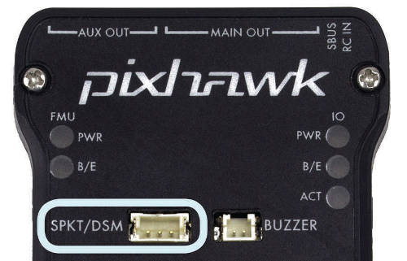
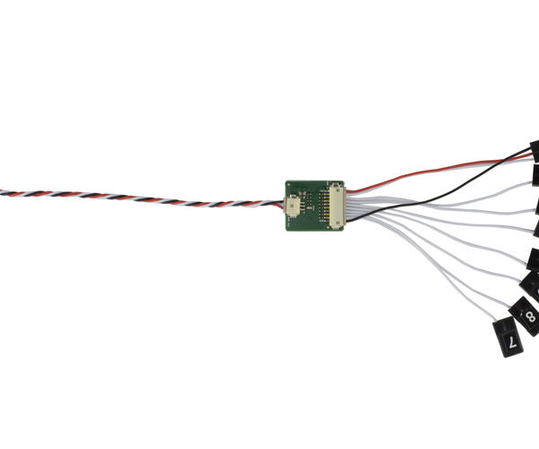
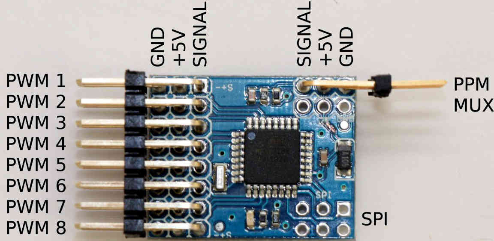

.. _common-pixhawk-and-px4-compatible-rc-transmitter-and-receiver-systems:

==============================================
Compatible RC Transmitter and Receiver Systems
==============================================

This article provides an overview of the RC Transmitter and Receiver
Systems that can be used with Pixhawk along with guidance on
how they are connected.

Overview
========

Pixhawk is compatible with 
    #. PPM-Sum receivers
    #. S.Bus receivers 
    #. Spektrum DSM, DSM2, and DSM-X Satellite receivers
    #. MULTIPLEX SRXL version 1 and version 2 receivers

For traditional single-wire-per-channel (PWM) receivers, a 
`PPM encoder <http://store.jdrones.com/pixhawk_px4_paparazzi_ppm_encoder_v2_p/eleppmenc20.htm>`__ can be
used to convert the receiver outputs to PPM-Sum.

Connecting the receiver
=======================

To connect a PPM-Sum receiver or an S.Bus receiver, plug the ground (black), power (red) and signal (usually white - orange in the diagram below) wires to the RC pins on the Pixhawk. The following S.Bus receivers have been tested and are known to work: FrSky `X8R <http://www.frsky-rc.com/product/pro.php?pro_id=105>`__, FrSky `XSR <http://www.frsky-rc.com/product/pro.php?pro_id=154>`__, Futaba R2008SB, Futaba R6008SB.

.. image:: ../../../images/RCIN_connection.jpg
    :target: ../_images/RCIN_connection.jpg

For a **Spektrum DSM**, **DSM2**, or **DSM-X Satellite** receiver,
connect to the **SPKT/DSM** port.

.. _common-pixhawk-and-px4-compatible-rc-transmitter-and-receiver-systems-multiplex-srxl:

For a **MULTIPLEX SRXL** receiver, connect the **SPKT/DSM** port of the Pixhawk to the **B/D** port of the MULTIPLEX SRXL receiver, without using the +3,3V voltage supplied at the **SPKT/DSM** port of the Pixhawk and power the MULTIPLEX SRXL receiver separately.

.. image:: ../../../images/multiplex_srxl_B_D_port_to_pixhawk_spkt_dsm_pinout.jpg
    :target: ../_images/multiplex_srxl_B_D_port_to_pixhawk_spkt_dsm_pinout.jpg

Details how to enable the SRXL signal on MULTIPLEX receivers can be found in :ref:`SRXL R/C Receivers <common-srxl-receivers>`

These **MULTIPLEX SRXL** receivers have been tested and are known to work:
    #. RX-4/9 FLEXX #55837, Firmware 1.31 --> 4 servo sockets, 9 of 16 channels active on SRXL v2 datastream
    #. RX-4/16 FLEXX #55838, Firmware 1.31 --> 4 servo sockets, 16 of 16 channels active on SRXL v2 datastream
    #. RX-5 #55817, Firmware 1.26 --> 5 servo sockets, 5 of 12 channels active on SRXL v1 datastream
    #. RX-9-DR #55812, Firmware 1.26 --> 9 servo sockets, 9 of 12 channels active on SRXL v1 datastream
    #. RX-9-DR SRXL16 #55840, Firmware 1.35 --> 9 servo sockets, 16 of 16 channels active on SRXL v2 datastream
    #. RX-16-DR pro #55815, Firmware 1.35 --> 16 servo sockets, 16 of 16 channels active on SRXL v2 datastream

Radio systems that support PPM-Sum or S.Bus directly
====================================================

This section list radio systems that support PPM-Sum or S.Bus directly.

.. _common-pixhawk-and-px4-compatible-rc-transmitter-and-receiver-systems_frsky_taranis_ppm-sum_compatible_transmitter:

FrSky Taranis X9D Plus and Taranis Q X7 RC Transmitters
-------------------------------------------------------

.. tip::

   These transmitters are **highly recommended** for all RC uses.

.. figure:: ../../../images/FrSky_Taranis_X7white.jpg
    :target: ../_images/FrSky_Taranis_X7white.jpg
    :width: 60 %
    :align: center

    New and even more affordable Taranis Q X7

.. figure:: ../../../images/FrSky_Taranis9XD_Plus.jpg
    :target: ../_images/FrSky_Taranis9XD_Plus.jpg
    :width: 90 %
    :align: center

    Taranis X9D Plus

.. note::

   Theses transmitters are a real bargain. You can buy them from different locations e.g. `Craft and Theory <http://www.craftandtheoryllc.com/packageq>`__, `Aloft Hobbies <https://alofthobbies.com/catalogsearch/result/?cat=0&q=X9D>`__ .

The `FrSky Taranis RC Transmitter <http://www.frsky-rc.com/product/pro.php?pro_id=113>`__ is a
high quality `OpenTX <http://www.open-tx.org/downloads.html>`__ (open source firmware) enabled RC Transmitter that is compatible with a wide variety of high quality FrSky PPM-Sum and S.Bus compatible receivers. 

One of the major advantages of the Taranis is that it can receive and display telemetry data **directly from ArduPilot** and on-board FrSky telemetry sensors, such as flight mode, GPS status, current drawn and cell voltages, and even ArduPilot messages, that can be added to your vehicle. For more information, see :ref:`FrSky telemetry <common-frsky-telemetry>`.

Both the Taranis X9D Plus and the Taranis Q X7 have integrated ACCST 2.4GHz transmitters that are compatible with X series FrSky receivers such as the very popular X8R or the newer and lighter XSR receivers. *This means that an additional JR type transmitter module is not required.* If needed, both the Taranis X9D Plus and the Taranis Q X7 have JR module bays for external radio transmitters.

Features that we like are:

* 2.4GHz ACCST frequency hopping radio transmitter with range that is sufficient for most VLOS applications
* Quad Ball Bearing Gimbals
* Audio Speech Outputs (values, alarms, settings, etc.)
* Vibration Alerts
* Receiver Signal Strength Indicator (RSSI) Alerts
* Open source firmware OpenTx
* Flash via USB
* High visibility LCD screen
* Very reliable and low latency telemetry with matched FrSky receiver
* Removable MicroSD card to store sounds, voices, models and custom scripts

The Taranis X9D and Taranis Q X7 can run the :ref:`FlightDeck <common-frsky-flightdeck>` telemetry user interface.

.. image:: ../../../images/FD-X9-1.jpg
    :target: http://www.craftandtheoryllc.com/feature
    :width: 60 %
    :align: center

FrSky X Receivers
-----------------

FrSky X receivers are compatible with the FrSky Taranis and XJT transmitter modules. They support S.Bus and bidirectional S.Port telemetry. For more information about FrSky X receivers, refer to the :ref:`receiver section on the FrSky telemetry page <frsky_receivers>`.

.. figure:: ../../../images/FrSky_x8r.jpg
    :scale: 20 %
    :align: center

    FrSky X8R receiver

.. warning::

  Make sure to connect the S.Bus port on the X8R receiver to the **RC IN** port of the Pixhawk/Cube. The S.Bus port on the Pixhawk is actually an *S.Bus out* connection!

.. figure:: ../../../images/FrSky_Ph2-X8R-FLVSS_adj.jpg
    :scale: 20 %
    :align: center

    FrSky X8R receiver and FLVSS LiPo Cell Voltage Sensor (optional) connected to The Cube. Both the S.Bus connection to the RC IN and the S.Port connections are shown.

Turnigy Transmitter Compatible With FrSky Transmitter Module
------------------------------------------------------------

FrSky Transmitter Module and S.Bus/PPM-Sum Receiver
---------------------------------------------------

The FrSky receiver and transmitter modules below will work with
Turnigy 9x, 9XR (above) and other RC transmitters.

FrSKY makes several PPM-Sum and S.Bus receivers and transmitters `FrSky's web site <http://www.frsky-rc.com/product/category.php?cate_id=17>`__.

The FrSky XJT module is a 2.4GHz frequency hopping "ACCST" transmitter that features Smart Port telemetry. It can operate in 8 channel, 16 channel and long range 12 channel mode. The XJT is compatible with the FrSky X series receivers such as the popular X8R and XSR. This radio 

The `X8R <http://www.frsky-rc.com/product/pro.php?pro_id=105>`__ and `XSR <http://www.frsky-rc.com/product/pro.php?pro_id=154>`__ receivers have S.Bus and CPPM outputs, and also feature Smart Port telemetry, which provides telemetry from ArduPilot and other on-board FrSky sensors (current sensor, cell voltage sensor, temperature sensor, ...)

.. figure:: ../../../images/FrSky_XJT_TX.jpg
    :target: ../_images/FrSky_XJT_TX.jpg
    :width: 60 %
    :align: center

    FrSky XJT transmitter module

.. figure:: ../../../images/FrSky_x8r.jpg
    :target: ../_images/FrSky_x8r.jpg
    :width: 60 %
    :align: center

    FrSky X8R receiver module with S.Bus and Smart Port telemetry

    FrSky XSR receiver module with S.Bus and Smart Port telemetry. This receiver module has a slightly less range as the X8R but is lighter and more compact.
    
.. _common-pixhawk-and-px4-compatible-rc-transmitter-and-receiver-systems_futaba_transmitter_compatible_with_futaba_s-bus_receivers:

Futaba Transmitter Compatible With Futaba S-Bus Receivers
---------------------------------------------------------

Futaba S.BUS2 receivers are supported since Copter/Plane 3.2.

The list of supported receivers for the Pixhawk (or a PX4FMU in
combination with a PX4IO board) is given below:

-  Futaba / Ripmax `R7008SB <http://www.gpdealera.com/cgi-bin/wgainf100p.pgm?I=FUTL7675>`__ S.BUS 2 Receiver
-  Futaba / Ripmax `R6303SB <http://www.gpdealera.com/cgi-bin/wgainf100p.pgm?I=FUTL7661>`__ S.BUS Receiver
-  FrSky TFR4 SB 3/16ch 2.4Ghz S.BUS Receiver FASST Compatible
   (`HobbyKing <http://www.hobbyking.com/hobbyking/store/__27176__FrSky_TFR4_SB_3_16ch_2_4Ghz_S_BUS_Receiver_FASST_Compatible.html>`__)
-  Futaba FASST S.BUS `2.4 GHz Receiver R6303SB <http://www.gpdealera.com/cgi-bin/wgainf100p.pgm?I=FUTL7661>`__
   (tested by PX4 core team, very lightweight, only 7g)
-  FrSky FASST compatible S.BUS compatible TFR8 SB 8ch 2.4Ghz Receiver
   (`HobbyKing <http://www.hobbyking.com/hobbyking/store/__24785__FrSky_TFR8_SB_8ch_2_4Ghz_S_BUS_Receiver_FASST_Compatible.html>`__)

.. note::

   The list above is from `pixhawk.org here <https://pixhawk.org/peripherals/radio-control/futaba/start?s[]=sbus#sbussbus_2>`__.

.. image:: ../../../images/FutabaT8FG.jpg
    :target: ../_images/FutabaT8FG.jpg

Further notes on S-Bus / S-Bus 2 compatibility
----------------------------------------------

In addition to the receivers discussed in the :ref:`Futaba Transmitter Compatible With Futaba S-Bus Receivers <common-pixhawk-and-px4-compatible-rc-transmitter-and-receiver-systems_futaba_transmitter_compatible_with_futaba_s-bus_receivers>`
section above, we have anecdotal information that a number of other
receivers are also compatible (see discussion `Current state of SBus compatibility? <https://groups.google.com/forum/#!topic/drones-discuss/OpbxcBxkk8c>`__
on drones-discuss mailing list).

These include:

-  FrSky X4, X6 and X8 Receivers on SBUS.
-  Delta 8 FrSky receiver
-  X8R receivers (non-EU versions) with OpenTX -Taranis X9D, via the
   receiver SBUS out on the receiver to RCIN on the PixHawk.
-  OrangeRX R800 receiver that also has SBUS output, with both a
   Spektrum DX9 and also a Taranis X9D with OrangeRX transmitter module.
-  DX8 with OrangeRX R800 and also the Lemon RX 8-channel PPM
-  OrangeRX DSM receivers

.. tip::

   The parameter to enable the SBUS output from the PixHawk is
   BRD_SBUS_OUT.

Spektrum Satellite Receivers Operate on PPM-Sum
===============================================

-  Although Spektrum main receivers do not communicate by PPM-Sum their
   range extending "satellite" receivers do.
-  So it is feasible to use a single `Spektrum Satellite Receiver <http://www.spektrumrc.com/Products/Default.aspx?ProdID=SPM9645>`__
   to act as a PPM-Sum receiver with Pixhawk.

   -  Simply pre-bind the Spektrum Satellite to your transmitter using a
      conventional Spektrum receiver with satellite attached.
   -  Then connect the tiny Spektrum Satellite receiver to the special
      "Spektrum" connector on either the PX4IO or Pixhawk.

-  Currently satellites only work with the Spektrum DX7 and DX8
   transmitters, Transmitters with more channels are (in progress).
-  The satellite receiver can be bound to transmitter with Mission Planner.
   This functionality is located in Radio Calibration screen on
   Initial Setup.

.. image:: ../../../images/dsm_bind.png
    :target: ../_images/dsm_bind.png

-  Being a satellite, range is limited with this configuration and the
   preceding receivers and methods will provide greater range.

.. image:: ../../../images/spm9645.jpg
    :target: ../_images/spm9645.jpg

.. image:: ../../../images/PX4SpektrumSatellite1.jpg
    :target: ../_images/PX4SpektrumSatellite1.jpg

PPM encoder and telemetry radio
===============================

A `PPM Encoder <http://store.jdrones.com/pixhawk_px4_paparazzi_ppm_encoder_v2_p/eleppmenc20.htm>`__ will
allow you to use any conventional RC receiver. Both the new and previous
versions of the *3DR PPM-Sum encoder* (the linked encoder is compatible) are shown
below:

   Newest 3DR PPM-Sum encoder

   Original 3DR PPM-Sumencoder

There are some downsides of using this encoder:

-  The PPM Encoder does require quite a bit of additional wiring to the receiver.
-  It uses quite a bit of power making it likely you will need to plug
   in your battery while doing radio setup with USB cable in Mission Planner.
-  The encoder also costs as much or more than several of the
   available PPM-Sum receivers including the FrSky Delta 8 below.

There is addition information :ref:`about connecting and configuring the encoder here <common-ppm-encoder>`.

Using the 3DR PPM Sum encoder in a system
-----------------------------------------

The diagram below shows how to use the original 3DR PPM-Sum encoder. The
linked encoder is used in the same way.

.. image:: ../../../images/PX4FMU_PX4IO_Wire_3DRradio2.jpg
    :target: ../_images/PX4FMU_PX4IO_Wire_3DRradio2.jpg

Using a Standard RC Radio Receiver with 3DR PPM Encoder
-------------------------------------------------------

-  **You can use a standard radio receiver with an 8 channel PPM Encoder
   in place of the PPM-SUM receiver.**

   -  An 8 Channel PPM Encoder is available from 
      `jDrones here <http://store.jdrones.com/pixhawk_px4_paparazzi_ppm_encoder_v2_p/eleppmenc20.htm>`__.
   -  Solder a 3x8 Right angle connector from the top into one end of
      the 8 Channel PPM Encoder board.
   -  With the 3x8 connector up and facing away from you, solder a 3x1
      Right angle connector on the right edge of the 8 Channel PPM
      Encoder board.

-  **Connect 5-8 output channels of your receiver to the inputs of the 8
   Channel Encoder (signal wire furthest from board) with 5-8 female to
   female servo jumpers.**

   -  Connect the PPM-SUM output of the Encoder with a 3 wire cable to
      the PX4IO boards PPM sum input (1x3 connector).

.. note::

   If you are using this PPM Encoder with PX4FMU it is important to know that
   when you are calibrating your transmitter you will quite likely need
   to hook up your flight battery to the PX4IO because the USB port
   alone can't supply enough power.

SRXL R/C Receivers
==================

.. toctree::
    :maxdepth: 1

    common-srxl-receivers