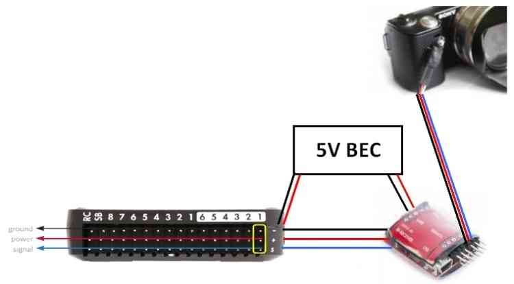

.. _common-pixhawk-auto-camera-trigger-without-chdk:

=============================================
Camera Shutter Triggering using Stratosnapper
=============================================

This tutorial shows how to automatically trigger the camera shutter from
ArduPilot using a Pixhawk and `Stratosnapper V2 <http://littlesmartthings.com/product/stratosnapper-2/>`__ (with an
IR Module).

.. tip::

   The *Stratosnapper v2* board supports a large number of output
   types: cables/connectors, infra-red, LANC, etc. The approach described
   in this article could be extended to target a `broad range of cameras <http://littlesmartthings.com/support-documentation/faq/supported-cameras-2/>`__
   from many popular brands.

Overview
========

ArduPilot allows you to :ref:`configure a servo or relay output as the control signal for the camera shutter <common-camera-shutter-with-servo>` so that it can be used in
:ref:`Camera Missions <common-camera-control-and-auto-missions-in-mission-planner>`.
Additional hardware is required to convert the shutter activation signal
to the format expected by the particular camera.

This tutorial shows how to set up a Pixhawk to connect to a Sony NEX5
using the *Stratosnapper v2* board with an IR trigger. This
configuration has been selected because the NEX5 is widely used for
aerial photography in UAVs, and because an IR Trigger does not require
an extra cable connected to your camera.

Parts and hardware connections
==============================

The diagram below shows the required parts and general cabling. This
includes the Pixhawk, IR Trigger device (*Stratosnapper*), IR LED and
camera, and the BEC to power the *Stratosnapper*.

.. image:: ../../../images/Pixhawklargeview.jpg
    :target: ../_images/Pixhawklargeview.jpg

Pixhawk board
-------------

Pixhawk has 6 AUX ports that may be used for triggering the camera (see
AUX1-AUX6 = RC9-RC14). This tutorial uses port 2/AUX2, as shown in the
diagram below:

.. image:: ../../../images/Pixhawkdetailview.jpg
    :target: ../_images/Pixhawkdetailview.jpg

IR trigger device
-----------------

The *Stratosnapper* with its inputs/outputs is shown below. The servo
inputs can be push-buttons, sticks, two or three-way switches, etc.
These are configured using a GUI configuration utility from your PC via
USB.

.. image:: ../../../images/stratosnapper2cables.jpg
    :target: ../_images/stratosnapper2cables.jpg

Note the two servo leads are connected on the input side of
*Stratosnapper*; one of these is to power the IR module.

.. warning::

   It is not possible to power the IR module (or any other device)
   from the Pixhawk AUX ports. You must either power provide a separate BEC
   to power the IR device or power the Pixhawk outputs rail with a BEC and
   power the device off that. 

The control signal from Pixhawk can be assigned to any of the 4 servo
inputs.

.. image:: ../../../images/SS2AUX1.jpg
    :target: ../_images/SS2AUX1.jpg

The output of the *Stratosnapper* is shown below. It connects to an IR
cable, which in turn triggers a IR led that must be placed in front of
your camera IR sensor:

.. image:: ../../../images/SS2IR.jpg
    :target: ../_images/SS2IR.jpg

IR LED positioning and camera gimbal
------------------------------------

Shown here is a picture of X8 Mr Grey (formerly known as Mr Red when was
used with APM).

The electronics are protected using a grey flower pot (the only colour
my wife had!) and we used some green gardening wire to shape the IR LED
cable so it is correctly positioned in front of the camera's IR sensor.
Gardeners & farmers are notoriously UAV friendly :-)

.. image:: ../../../images/vuegimbal1.jpg
    :target: ../_images/vuegimbal1.jpg

The Sony NEX5 is held in a 2-axis stabilized brushless gimbal (NEX5 not
shown...used to take this picture). Here below a zoomed view of the IR
LED positioning and gimbal:

.. image:: ../../../images/vuegimbal2.jpg
    :target: ../_images/vuegimbal2.jpg

The IR LED works well even in bright sunlight (verified in the field).
It also works some distance from the sensor (no problem within 5inches
of the Sony NEX5 sensor) and in any orientation with respect to the
sensor.

Camera shutter configuration in Mission Planner
===============================================

The :ref:`Camera Shutter Configuration in Mission Planner <common-camera-shutter-with-servo>` article explains how to
configure Pixhawk AUX output as a servo camera trigger.

The parameters used to configure this Stratosnapper/IR/NEX5 hardware are
listed below:

-  ``CAM_TRIG_TYPE``: 0 (Servo).
-  ``Shutter (Port)``: RC10 (AUX2).
-  ``Shutter Pushed``: 1800
-  ``Shutter Not Pushed``: 1100
-  ``Shutter Duration``: 10 (1 second)
-  ``Servo Limits Max``: 1900
-  ``Servo Limits Min``: 1100
-  ``CH7_OPT`` : 9 (Optional - enables manual shutter triggering on
   Copter only).

.. figure:: ../../../images/missionplannercameragimbalscreen.jpg
   :target: ../_images/missionplannercameragimbalscreen.jpg

   Mission Planner: Camera GimbalSetup Screen

IR device configuration (Stratosnapper V2)
==========================================

Every IR device has its own configuration method. *Stratosnapper* comes
with a simple GUI interface to define which PWM values will trigger what
port.

The IR device configuration is explained in this video:

https://player.vimeo.com/video/67660032

Testing and mission planning
============================

Once a camera trigger has been defined it can be used in :ref:`Camera Control and Auto Missions <common-camera-control-and-auto-missions-in-mission-planner>`
to take pictures and make area surveys.

The configuration in this article was tested when creating the :ref:`Survey (Grid) Example <common-camera-control-and-auto-missions-in-mission-planner_survey_grid_example>`.

**I hope this will help you in your own auto-photo-shoot missions!
Cheers, Hugues**
