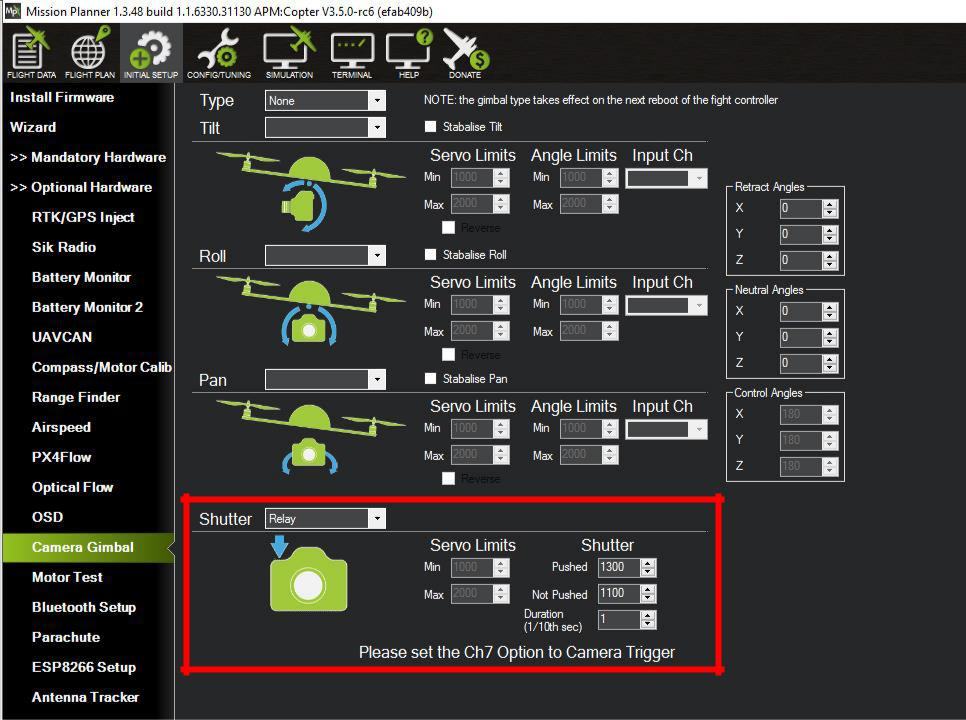

.. _common-pixhawk-camera-trigger-setup:

================================
Camera Trigger Setup for Pixhawk
================================

This guide is intended to help you modify a remote shutter release cable
for use with Ardupilot autopilots and setup the flight
controller for triggering the camera. This method eliminates the need
(and costs) for 3\ :sup:`rd` party triggering devices. In this specific
example, we will use a Sony Alpha 6000 (A6000) camera. This procedure
may work with other cameras however for this specific example, we will
use a Sony Alpha A6000 (A6000).

Items Required
==============

-  Sony A6000 (or other camera with wire shutter release)
-  ArduPilot compatible autopilot with a free GPIO pin to be used as a relay pin. See :ref:`common-gpios` for more information
-  Remote Shutter Release Cable (`see here for an affordable solution <https://www.amazon.com/SHOOT-DSC-RX100M3-DSC-RX100M20-DSC-RX100II-DSC-RX100III/dp/B00ME7N6P8/ref=sr_1_1?ie=UTF8&qid=1496578319&sr=8-1&keywords=Sony+A6000+Shutter+Release+Cable>`__)
-  Servo Pins (`link <https://www.digikey.com/products/en?keywords=952-2157-1-ND>`__)
-  Servo Pin Crimper (`link <https://www.servocity.com/pin-crimpers>`__)
-  Wire Stripper or Razor Blade
-  Laptop with Mission Planner Installed

**Step 1:** Preparing the Remote Shutter Release Cable

    a) Trim the Remote Shutter Release Cable to the desired cable length

b) Strip off approximately 2-3cm of the black sleeve making sure not to damage the 3 wires contained within the sleeve.

c) Remove approximately 3mm of the sleeves off of each of the three wires. You will need to make sure that there is enough of the sleeve removed that when the servo pin is crimped to the wire that there is contact between the pin and the exposed wire.

The three wires have the following functions:

 - RED: SHUTTER
 - YELLOW: GROUND
 - WHITE: FOCUS

**NOTE:** Your wire coloring may differ from this example. You can
identify which functions are controlled by each cable by connecting the
cable to your camera, powering it on and then shorting the cables in
pairs to identify which pair does what. For example, if you have a
GREEN, BLUE and BLACK set of wires and shorting BLUE and BLACK results
in the camera focusing, and then you short the GREEN AND BLUE wires and
nothing happens but shorting the GREEN AND BLACK results in the camera
exposing, then you know that the BLACK wire is ground, GREEN is shutter
and BLUE is focus.

d) Twist the exposed ends of the FOCUS and GROUND wires together then crimp a servo connector to the pair as well as to the exposed end of the SHUTTER wire

TIP: The Servo Pin has two sets of tabs which after crimping will fold
on each other and secure the wire. To make life a little easier, use a
small pair of needle nose pliers to press the pair of tabs on the end of
the servo pin tightly against the wires. This will prevent the wires
from coming out of the servo pin while trying to crimp them.

e) Insert the Servo Pins into a Servo connector, one pin on each side of the middle slot of the servo connector.

The cable is now ready for connection to your Pixhawk
Controller. Note that the Shutter Pin (in this case the RED wire) will
be on the SIGNAL side of the Auxiliary port while the WHITE/YELLOW wire
will be on the GROUND side of the Auxiliary port.

**Step 2:** Setting up your  autopilot to trigger
your camera via the Shutter Release Cable

a) Connect to your Autopilot via Mission Planner either through direct USB connection or wireless telemetry link.

b) Connect your modified shutter release cable to a free GPIO capable pin on the autopilot making sure to maintain the correct orientation for polarity. For example, by default on the Pixhawk, AUX5 or AUX6 is configured to be a GPIO and can be used as a Relay output.

c) Connect the shutter release cable to your camera and power the camera on

Since we have shorted the FOCUS and GROUND wires, the camera should
automatically pull focus. As of now, I have not found a way to connect
the SHUTTER, FOCUS and GROUND wires individually to the autopilot and
have the autopilot pull the camera focus and trigger the camera
in sequence. To get around this, the camera settings are set so that the
camera has the following features activated:

i.  Pre-Shutter Focus

ii. Continuous Auto-Focus

d) In Mission Planner, navigate to INITIAL SETUP -> CAMERA GIMBAL and change the SHUTTER drop-down menu to “RELAY”

NOTE: You can play around with the “Duration” values to increase or
decrease the responsiveness of the shutter command. With the Sony A6000,
a duration of 1/10\ :sup:`th` of a Second functions perfectly.

e) Proceed to the CONFIG/TUNING -> EXTENDED TUNING screen in Mission Planner and change the CH7 OPT to “Camera Trigger”. This will be necessary if you intend to use your remote controls CH7 to trigger the camera in addition to having the autopilot trigger the camera.

    
.. note:: As of 4.0 firmware versions, any GPIO can be assigned as the Camera Trigger pin via its ``SERVOx_FUNCTION`` parameter, and any RC channel can be assigned to control that trigger via its ``RCx_OPTION`` parameter.

f) Navigate to the FULL PARAMETER LIST under the main CONFIG/TUNING tab and locate the :ref:`CAM_TRIGG_TYPE<CAM_TRIGG_TYPE>` parameter. This parameter must show as 1 for “RELAY”. If it is not set to 1, change this parameter to 1 before proceeding to the next step.

g) Scroll down through the parameters until you get to :ref:`RELAY_PIN<RELAY_PIN>` (for the first relay pin...there can be up to 6) . Here you will want to set the :ref:`RELAY_PIN<RELAY_PIN>`  parameter to match the GPIO pin you have connected the shutter release cable to. Since we have connected the cable to AUX6 on a Pixhawk, we need to change the :ref:`RELAY_PIN<RELAY_PIN>`  parameter to “56” (56:Pixhawk AUXOUT6).

h) Now that the required parameters have been changed, click on “WRITE PARAMS”

**Step 3:** Testing the Remote Shutter Cable and Autopilot

Now that the cable has been modified and connected to the autopilot
which has been setup to trigger the camera via relay, let’s test it.

a) Navigate back to the FLIGHT DATA Screen and right click on the map to select “TRIGGER CAMERA NOW”

Once clicked, you should hear or see the camera expose. If the camera
does not expose, check the following:

-  Correct Orientation of cables (ie, Shutter Wire is connected to the SIGNAL pin on the correct port of the autopilot and Ground is connected to Ground)
-  Camera is On and not in an Error State
-  Camera lens is not too close to an object which may cause it to be unable to autofocus and expose

If you still are not getting the camera to expose and all of the
above-mentioned check points are not a problem, then you may want to
adjust the Shutter Duration mentioned in Step 2 Part D.

If your camera took a picture, congratulations! You are all set to take
pictures using the autopilot without needing third
party hardware!

Many thanks to Oliver Volkmann and `*www.microaerialprojects.com* <http://www.microaerialprojects.com/>`__
for contributing this page.

