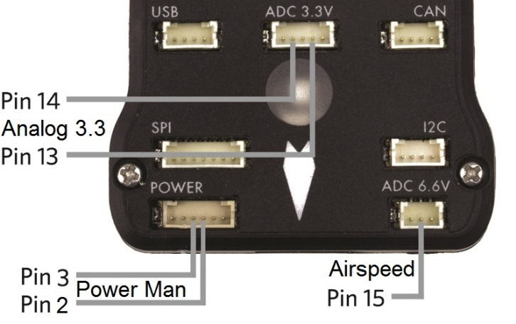

.. _common-pixhawk-overview:

================
Pixhawk Overview
================

Specifications
==============

-  **Processor**

   -  32-bit ARM Cortex M4 core with FPU
   -  168 Mhz/256 KB RAM/2 MB Flash
   -  32-bit failsafe co-processor

-  **Sensors**

   -  MPU6000 as main accel and gyro
   -  ST Micro 16-bit gyroscope
   -  ST Micro 14-bit accelerometer/compass (magnetometer)
   -  MEAS barometer

-  **Power**

   -  Ideal diode controller with automatic failover
   -  Servo rail high-power (7 V) and high-current ready
   -  All peripheral outputs over-current protected, all inputs ESD
      protected

-  **Interfaces**

   -  5x UART serial ports, 1 high-power capable, 2 with HW flow
      control
   -  Spektrum DSM/DSM2/DSM-X Satellite input
   -  Futaba S.BUS input (output not yet implemented)
   -  PPM sum signal
   -  RSSI (PWM or voltage) input
   -  I2C, SPI, 2x CAN, USB
   -  3.3V and 6.6V ADC inputs

-  **Dimensions**

   -  Weight 38 g (1.3 oz)
   -  Width 50 mm (2.0”)
   -  Height 15.5 mm (.6”)
   -  Length 81.5 mm (3.2”)
   
   
Purchase
========

The Pixhawk 1 was originally manufactured and sold by 3DR.

A slightly improved but fully compatible variant can now be obtained from mRo:
`mRo Pixhawk 2.4.6 Essential Kit! <https://store.mrobotics.io/Genuine-PixHawk-Flight-Controller-p/mro-pixhawk1-minkit-mr.htm>`__

Pixhawk connector assignments
=============================

.. image:: ../../../images/Pixhawk_with_legend.jpg
    :target: ../_images/Pixhawk_with_legend.jpg

.. image:: ../../../images/pixhawk-status-LEDs-definition.jpg
    :target: ../_images/pixhawk-status-LEDs-definition.jpg

Pixhawk top connectors
======================

.. image:: ../../../images/PixhawkLabled.jpg
    :target: ../_images/PixhawkLabled.jpg

Pixhawk PWM connectors for servos and ESCs and PPM-SUM in and SBUS out
======================================================================

.. image:: ../../../images/pixhawkPWM.jpg
    :target: ../_images/pixhawkPWM.jpg

Pixhawk connector diagram
=========================

.. image:: ../../../images/PixHawk_labelled.png
    :target: ../_images/PixHawk_labelled.png

**For all connectors pin 1 is on the right in the above image**

**Serial 1 (Telem 1) and Serial 2 (Telem 2) Pins: 6 = GND, 5 =
RTS, 4 = CTS, 3 = RX, 2 = TX, 1 = 5V.**

.. _common-pixhawk-overview_pixhawk_connector_pin_assignments:

Pixhawk connector pin assignments
=================================

TELEM1, TELEM2 ports
~~~~~~~~~~~~~~~~~~~~

.. raw:: html

   <table border="1" class="docutils">
   <tbody>
   <tr>
   <th>Pin </th>
   <th>Signal </th>
   <th>Volt </th>
   </tr>
   <tr>
   <td>1 (red)</td>
   <td>VCC</td>
   <td>+5V</td>
   </tr>
   <tr>
   <td>2 (blk)</td>
   <td>TX (OUT)</td>
   <td>+3.3V</td>
   </tr>
   <tr>
   <td>3 (blk)</td>
   <td>RX (IN)</td>
   <td>+3.3V</td>
   </tr>
   <tr>
   <td>4 (blk)</td>
   <td>CTS</td>
   <td>+3.3V</td>
   </tr>
   <tr>
   <td>5 (blk)</td>
   <td>RTS</td>
   <td>+3.3V</td>
   </tr>
   <tr>
   <td>6 (blk)</td>
   <td>GND</td>
   <td>GND</td>
   </tr>
   </tbody>
   </table>

GPS port
~~~~~~~~

.. raw:: html

   <table border="1" class="docutils">
   <tbody>
   <tr>
   <th>Pin</th>
   <th>Signal</th>
   <th>Volt</th>
   </tr>
   <tr>
   <td>1 (red)</td>
   <td>VCC</td>
   <td>+5V</td>
   </tr>
   <tr>
   <td>2 (blk)</td>
   <td>TX (OUT)</td>
   <td>+3.3V</td>
   </tr>
   <tr>
   <td>3 (blk)</td>
   <td>RX (IN)</td>
   <td>+3.3V</td>
   </tr>
   <tr>
   <td>4 (blk)</td>
   <td>CAN2 TX</td>
   <td>+3.3V</td>
   </tr>
   <tr>
   <td>5 (blk)</td>
   <td>CAN2 RX</td>
   <td>+3.3V</td>
   </tr>
   <tr>
   <td>6 (blk)</td>
   <td>GND</td>
   <td>GND</td>
   </tr>
   </tbody>
   </table>

SERIAL 4/5 port - due to space constraints two ports are on one connector.
~~~~~~~~~~~~~~~~~~~~~~~~~~~~~~~~~~~~~~~~~~~~~~~~~~~~~~~~~~~~~~~~~~~~~~~~~~

.. raw:: html

   <table border="1" class="docutils">
   <tbody>
   <tr>
   <th>Pin</th>
   <th>Signal</th>
   <th>Volt</th>
   </tr>
   <tr>
   <td>1 (red)</td>
   <td>VCC</td>
   <td>+5V</td>
   </tr>
   <tr>
   <td>2 (blk)</td>
   <td>TX (#4)</td>
   <td>+3.3V</td>
   </tr>
   <tr>
   <td>3 (blk)</td>
   <td>RX (#4)</td>
   <td>+3.3V</td>
   </tr>
   <tr>
   <td>4 (blk)</td>
   <td>TX (#5)</td>
   <td>+3.3V</td>
   </tr>
   <tr>
   <td>5 (blk)</td>
   <td>RX (#5)</td>
   <td>+3.3V</td>
   </tr>
   <tr>
   <td>6 (blk)</td>
   <td>GND</td>
   <td>GND</td>
   </tr>
   </tbody>
   </table>

ADC 6.6V
~~~~~~~~

.. raw:: html

   <table border="1" class="docutils">
   <tbody>
   <tr>
   <th>Pin</th>
   <th>Signal</th>
   <th>Volt</th>
   </tr>
   <tr>
   <td>1 (red)</td>
   <td>VCC</td>
   <td>+5V</td>
   </tr>
   <tr>
   <td>2 (blk)</td>
   <td>ADC IN</td>
   <td>up to +6.6V</td>
   </tr>
   <tr>
   <td>3 (blk)</td>
   <td>GND</td>
   <td>GND</td>
   </tr>
   </tbody>
   </table>

ADC 3.3V
~~~~~~~~

.. raw:: html

   <table border="1" class="docutils">
   <tbody>
   <tr>
   <th>Pin</th>
   <th>Signal</th>
   <th>Volt</th>
   </tr>
   <tr>
   <td>1 (red)</td>
   <td>VCC</td>
   <td>+5V</td>
   </tr>
   <tr>
   <td>2 (blk)</td>
   <td>ADC IN</td>
   <td>up to +3.3V</td>
   </tr>
   <tr>
   <td>3 (blk)</td>
   <td>GND</td>
   <td>GND</td>
   </tr>
   <tr>
   <td>4 (blk)</td>
   <td>ADC IN</td>
   <td>up to +3.3V</td>
   </tr>
   <tr>
   <td>5 (blk)</td>
   <td>GND</td>
   <td>GND</td>
   </tr>
   </tbody>
   </table>

I2C
~~~

.. raw:: html

   <table border="1" class="docutils">
   <tbody>
   <tr>
   <th>Pin</th>
   <th>Signal</th>
   <th>Volt</th>
   </tr>
   <tr>
   <td>1 (red)</td>
   <td>VCC</td>
   <td>+5V</td>
   </tr>
   <tr>
   <td>2 (blk)</td>
   <td>SCL</td>
   <td>+3.3 (pullups)</td>
   </tr>
   <tr>
   <td>3 (blk)</td>
   <td>SDA</td>
   <td>+3.3 (pullups)</td>
   </tr>
   <tr>
   <td>4 (blk)</td>
   <td>GND</td>
   <td>GND</td>
   </tr>
   </tbody>
   </table>

CAN
~~~

.. raw:: html

   <table border="1" class="docutils">
   <tbody>
   <tr>
   <th>Pin</th>
   <th>Signal</th>
   <th>Volt</th>
   </tr>
   <tr>
   <td>1 (red)</td>
   <td>VCC</td>
   <td>+5V</td>
   </tr>
   <tr>
   <td>2 (blk)</td>
   <td>CAN_H</td>
   <td>+12V</td>
   </tr>
   <tr>
   <td>3 (blk)</td>
   <td>CAN_L</td>
   <td>+12V</td>
   </tr>
   <tr>
   <td>4 (blk)</td>
   <td>GND</td>
   <td>GND</td>
   </tr>
   </tbody>
   </table>

SPI
~~~

.. raw:: html

   <table border="1" class="docutils">
   <tbody>
   <tr>
   <th>Pin</th>
   <th>Signal</th>
   <th>Volt</th>
   </tr>
   <tr>
   <td>1 (red)</td>
   <td>VCC</td>
   <td>+5V</td>
   </tr>
   <tr>
   <td>2 (blk)</td>
   <td>SPI_SCK</td>
   <td>3.3V</td>
   </tr>
   <tr>
   <td>3 (blk)</td>
   <td>SPI_MISO</td>
   <td>+3.3V</td>
   </tr>
   <tr>
   <td>4 (blk)</td>
   <td>SPI_MOSI</td>
   <td>+3.3V</td>
   </tr>
   <tr>
   <td>5 (blk)</td>
   <td>!SPI_NSS</td>
   <td>+3.3V</td>
   </tr>
   <tr>
   <td>6 (blk)</td>
   <td>!GPIO</td>
   <td>+3.3V</td>
   </tr>
   <tr>
   <td>7 (blk)</td>
   <td>GND</td>
   <td>GND</td>
   </tr>
   </tbody>
   </table>

POWER
~~~~~

.. raw:: html

   <table border="1" class="docutils">
   <tbody>
   <tr>
   <th>Pin</th>
   <th>Signal</th>
   <th>Volt</th>
   </tr>
   <tr>
   <td>1 (red)</td>
   <td>VCC</td>
   <td>+5V</td>
   </tr>
   <tr>
   <td>2 (blk)</td>
   <td>VCC</td>
   <td>+5V</td>
   </tr>
   <tr>
   <td>3 (blk)</td>
   <td>CURRENT</td>
   <td>up to +3.3V</td>
   </tr>
   <tr>
   <td>4 (blk)</td>
   <td>VOLTAGE</td>
   <td>up to +3.3V</td>
   </tr>
   <td>5 (blk)</td>
   <td>GND</td>
   <td>GND</td>
   </tr>
   <td>6 (blk)</td>
   <td>GND</td>
   <td>GND</td>
   </tr>
   </tbody>
   </table>

SWITCH
~~~~~~

.. raw:: html

   <table border="1" class="docutils">
   <tbody>
   <tr>
   <th>Pin</th>
   <th>Signal</th>
   <th>Volt</th>
   </tr>
   <tr>
   <td>1 (red)</td>
   <td>VCC</td>
   <td>+3.3V</td>
   </tr>
   <tr>
   <td>2 (blk)</td>
   <td>!IO_LED_SAFETY</td>
   <td>GND</td>
   </tr>
   <tr>
   <td>3 (blk)</td>
   <td>SAFETY</td>
   <td>GND</td>
   </tr>
   </tbody>
   </table>

Console Port
~~~~~~~~~~~~

The system's serial console runs on the port labeled SERIAL4/5. The
pinout is standard serial pinout, to connect to a standard FTDI cable
(3.3V, but it's 5V tolerant).

.. raw:: html

   <table border="1" class="docutils">
   <tbody>
   <tr>
   <th>Pixhawk</th>
   <th></th>
   <th>FTDI</th>
   <th>
   </th>
   </tr>
   <tr>
   <td>1</td>
   <td>+5V (red)</td>
   <td>
   </td>
   <td>N/C</td>
   </tr>
   <tr>
   <td>2</td>
   <td>Tx</td>
   <td></td>
   <td>N/C</td>
   </tr>
   <tr>
   <td>3</td>
   <td>Rx</td>
   <td>
   </td>
   <td>N/C</td>
   </tr>
   <tr>
   <td>4</td>
   <td>Tx</td>
   <td>5</td>
   <td>Rx (yellow)</td>
   </tr>
   <tr>
   <td>5</td>
   <td>Rx</td>
   <td>4</td>
   <td>Tx (orange)</td>
   </tr>
   <tr>
   <td>6</td>
   <td>GND</td>
   <td>1</td>
   <td>GND (black)</td>
   </tr>
   </tbody>
   </table>

Spektrum/DSM Port
~~~~~~~~~~~~~~~~~

The Spektrum/DSM port is for connecting Spektrum DSM-2/DSMX receiver
modules.

.. raw:: html

   <table border="1" class="docutils">
   <tbody>
   <tr>
   <th>Pin</th>
   <th>Signal</th>
   <th>Volt</th>
   </tr>
   <tr>
   <td>1 (white)</td>
   <td>Signal</td>
   <td>+3.3V</td>
   </tr>
   <tr>
   <td>2 (black)</td>
   <td>GND</td>
   <td>GND</td>
   </tr>
   <tr>
   <td>3 (red)</td>
   <td>VCC</td>
   <td>+3.3V</td>
   </tr>
   </tbody>
   </table>

Connecting and disconnecting DF13 connectors
============================================

..  youtube:: Kfu8M8t2fWY
    :width: 100%
	    
.. _common-pixhawk-overview_pixhawk_analog_input_pins:

Pixhawk analog input pins
=========================

This section lists the analog pins available on the Pixhawk. These are
virtual pins, defined in the firmware.

**Virtual Pin 2 and Power connector Pin 4**: power
management connector voltage pin, accepts up to 3.3V, usually attached
to a power module with 10.1:1 scaling

**Virtual Pin 3 and Power connector Pin 3**: power management connector
current pin, accepts up to 3.3V, usually attached to a power module
with 17:1 scaling

**Virtual Pin 4 and (No connector Pin)**: VCC 5V rail sensing. This
virtual pin reads the voltage on the 5V supply rail. It is used to
provide the HWSTATUS.Vcc reading that ground stations use to display 5V
status

**Virtual Pin 13 and ADC 3.3V connector Pin 4**: This takes a max of
3.3V. May be used for sonar or other analog sensors.

**Virtual Pin 14 and ADC 3.3V connector Pin 2**: This takes a max of
3.3V. May be used for second sonar or other analog sensor.

**Virtual Pin 15 and ADC 6.6V connector Pin 2**: analog airspeed sensor
port. This has 2:1 scaling builtin, so can take up to 6.6v analog
inputs. Usually used for analog airspeed, but may be used for analog
sonar or other analog sensors.

**Virtual Pin 102**: Servo power rail voltage. This is an internal
measurement of the servo rail voltage made by the IO board within the
Pixhawk. It has 3:1 scaling, allowing it to measure up to 9.9V.

**Virtual Pin 103**: RSSI (Received Signal Strength Input) input pin
voltage (SBus connector output pin). This is the voltage measured by the
RSSI input pin on the SBUS-out connector (the bottom pin of the 2nd last
servo connector on the 14 connector servo rail).

This can alternatively serve as SBus out by setting the
``BRD_SBUS_OUT`` parameter ( :ref:`Copter <copter:BRD_SBUS_OUT>`,
:ref:`Plane <plane:BRD_SBUS_OUT>`, :ref:`Rover <rover:BRD_SBUS_OUT>`).

.. _common-pixhawk-overview_pixhawk_digital_outputs_and_inputs_virtual_pins_50-55:

Pixhawk digital outputs and inputs (Virtual Pins 50-55)
=======================================================

The Pixhawk has no dedicated digital output or input pins on its DF13
connectors, but you can assign up to 6 of the "AUX SERVO" connectors to
be digital outputs/inputs. These are the first 6 of the 14 three-pin
servo connectors on the end of the board. They are marked as AUX servo
pins 1 - 6 on the silkscreen as seen above.

To set the number of these pins that are available as digital
inputs/outputs, set the :ref:`BRD_PWM_COUNT<BRD_PWM_COUNT>` parameter. On Pixhawk this
defaults to 4, which means the first 4 AUX connectors are for servos
(PWM) and the last 2 are for digital inputs/outputs. If you set
:ref:`BRD_PWM_COUNT<BRD_PWM_COUNT>` to 0 then you would have 6 virtual digital pins and
still have 8 PWM outputs on the rest of the connector.

The 6 possible pins are available for PIN variables as pin numbers 50 to
55 inclusive. So if you have :ref:`BRD_PWM_COUNT<BRD_PWM_COUNT>` at the default value of 4,
then the two digital output pins will be pin numbers 54 and 55.

In summary:

If BRD_PWM_CNT= 2 then

50 = RC9

51 = RC10

52 = Aux 3

53 = Aux 4

54 = Aux 5

55 = Aux 6

If BRD_PWM_CNT= 4 then

50 = RC9

51 = RC10

52 = RC11

53 = RC12

54 = Aux 5

55 = Aux 6

If BRD_PWM_CNT= 6 then

50 = RC9

51 = RC10

52 = RC11

53 = RC12

54 = RC13

55 = RC14

By default, the pins are digital outputs as outlined above. A digital
pin will instead be a digital input if it is assigned to a parameter
that represents a digital input. For example, setting :ref:`CAM_FEEDBACK_PIN<CAM_FEEDBACK_PIN>`
to 50 will make pin 50 the digital input that receives a signal from the
camera when a picture has been taken.

.. _common-pixhawk-overview_powering:

Powering
========

The topic :ref:`Powering the Pixhawk <common-powering-the-pixhawk>`
explains both simple and advanced power-supply options for the Pixhawk.

See also
========

`Schematics <https://github.com/ArduPilot/Schematics/tree/master/3DR>`__ 

.. toctree::
    :maxdepth: 1

    LEDs <common-leds-pixhawk>
    Safety Switch <common-safety-switch-pixhawk>
    Sounds <common-sounds-pixhawkpx4>
    Pixhawk Serial Names <common-pixhawk-serial-names>

[site wiki="planner"]
    Pixhawk Wiring Quick Start <common-pixhawk-wiring-and-quick-start>
    Powering the Pixhawk <common-powering-the-pixhawk>
    Mounting the Autopilot <common-mounting-the-flight-controller>
    Compatible RC Transmitter and Receiver Systems (Pixhawk) <common-pixhawk-and-px4-compatible-rc-transmitter-and-receiver-systems>
[/site]
