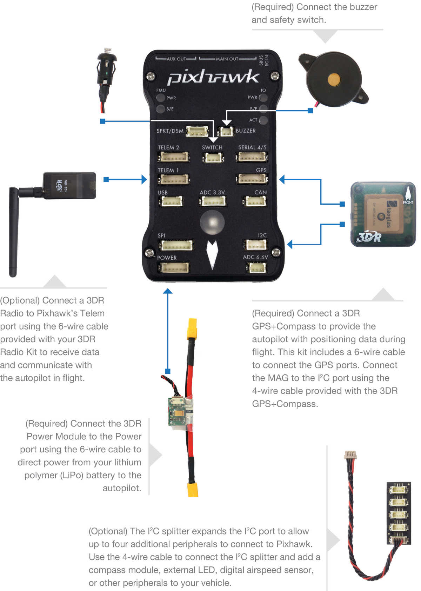

.. _common-pixhawk-wiring-and-quick-start:

==========================
Pixhawk Wiring Quick Start
==========================

This article provides high level information about how to power Pixhawk
and connect its most important peripherals.

.. warning::

   Do not connect any servos to the direct PWM outputs of your
   receiver. The RCIN port on the Pixhawk is designed for low power devices
   only, and a servo may draw a lot of current when moving rapidly. If you
   connect a servo directly onto your receiver while the receiver is
   powered from the RCIN port of your Pixhawk you may damage your
   Pixhawk.

Pixhawk Wiring Chart
====================

[site wiki="copter"]
Copter users should also see the :ref:`Advanced Pixhawk Quadcopter Wiring Chart <copter:advanced-pixhawk-quadcopter-wiring-chart>`.
[/site]

Power Pixhawk
=============

Pixhawk is typically powered via its "power" port, as shown in the
picture below. The power port simultaneously powers Pixhawk and reads
voltage and current analog measurements produced by an optional power
module. Information about powering the Pixhawk can be found in the topic
:ref:`Powering the Pixhawk <common-powering-the-pixhawk>`.

.. image:: ../../../images/pixhawkpower-port.jpg
    :target: ../_images/pixhawkpower-port.jpg

Connect remote control inputs
=============================

Pixhawk is compatible with PPM remote control (RC) receivers, Futaba
S.Bus receivers, and Spektrum DSM,DSM2, and DSM-X Satellite receivers.
For traditional single-wire-per-channel (PWM) receivers a PPM encoder
can be used to convert the receiver outputs to PPM-SUM.  Information
about compatible receivers and how they are connected can be found in
:ref:`Compatible RC Transmitter and Receiver Systems (Pixhawk/PX4) <common-pixhawk-and-px4-compatible-rc-transmitter-and-receiver-systems>`.

.. figure:: ../../../images/FRSkyTaranis.jpg
   :target: ../_images/FRSkyTaranis.jpg

   FRSky Taranis Transmitter

Connect buzzer and safety switch
================================

The buzzer and safety switch button are mandatory for Pixhawk. Connect
to the BUZZER and SWITCH ports as shown.

.. warning::

   Mount the beeper is at least 5cm away from the flight
   controller or the noise may upset the accelerometers.

3DR GPS+Compass
===============

The :ref:`3DR UBlox GPS + Compass Module <common-installing-3dr-ublox-gps-compass-module>` is the
recommended GPS for Pixhawk on ArduPilot.  The GPS ports are connected
with the six-position DF13 cable, and the MAG port is connected to the
I2C port with the four-position DF13 cable.

.. figure:: ../../../images/GPS_TopAndSide.jpg
   :target: ../_images/GPS_TopAndSide.jpg

   3DR UBlox GPS + Compass Module

The topic :ref:`3DR UBlox GPS + Compass Module <common-installing-3dr-ublox-gps-compass-module_connecting_to_pixhawk>`
shows how to connect to Pixhawk and include additional configuration and
mounting information.

Connect Motors
==============

.. image:: ../../../images/pixhawk_motor_outputs.jpg
    :target: ../_images/pixhawk_motor_outputs.jpg

[site wiki="copter"]
For Copter see :ref:`Connect ESCs and Motors <copter:connect-escs-and-motors>`.

In overview, for copters connect each signal wire from the PDB to the
main output signal (S) pins by motor number:

-  Pin 1 = Motor 1 - - Pin 5 = Motor 5
-  Pin 2 = Motor 2 - - Pin 6 = Motor 6
-  Pin 3 = Motor 3 - - Pin 7 = Motor 7
-  Pin 4 = Motor 4 - - Pin 8 = Motor 8
[/site]

[site wiki="plane"]
For planes connect the control channel wires to the main output signal
pins:

-  Pin 1 = Aileron
-  Pin 2 = Elevator
-  Pin 3 = Throttle
-  Pin 4 = Rudder
[/site]

[site wiki="rover"]
For Rovers connect the throttle and steering wires to the main output
signal pins:

-  Pin 3 = Throttle
-  Pin 1 = Steering
The skid-steer parameters are used to configure vehicles that have fixed wheels and steer like tank tracks (do not use servos to steer the wheels but rather use differential speed between the left and right wheels). The parameters are: SKID_STEER_OUT and SKID_STEER_IN. When enabled, flight controller's ouput RC1 is used for the left track control, and ouput RC3 is used for right track control.
[/site]

Connect other peripherals
=========================

Depending on your hardware there may be any number of other peripherals
attached, including sensors, cameras, grippers etc. These can be found
as sub-pages of the topic :ref:`Optional Hardware <common-optional-hardware>`.

Information about connecting these peripherals to Pixhawk is found in
the respective pages.

Related information
===================

-  :ref:`Pixhawk Overview <common-pixhawk-overview>` - includes specifications, pin assignments etc.
-  `3DR Pixhawk Quick Start PDF <https://3dr.com/wp-content/uploads/2014/03/pixhawk-manual-rev7.pdf>`__
   - duplicates some content from this wiki article

   
.. toctree::
    :maxdepth: 1

    Powering the Pixhawk <common-powering-the-pixhawk>
    Compatible RC Tx/Rx Systems (Pixhawk/PX4) <common-pixhawk-and-px4-compatible-rc-transmitter-and-receiver-systems>

[site wiki="copter"]
    Advanced Pixhawk Quadcopter Wiring Chart <advanced-pixhawk-quadcopter-wiring-chart>
[/site]
