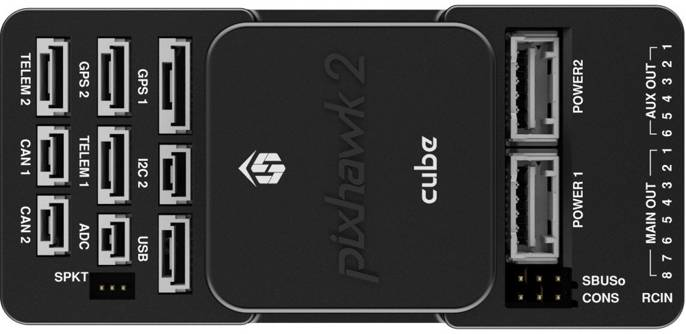
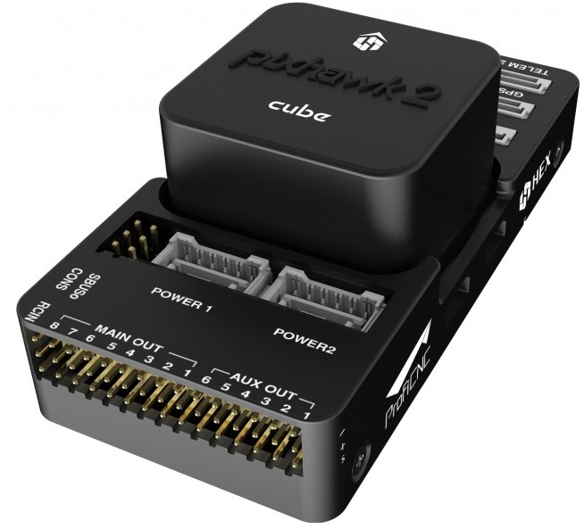

.. _common-pixhawk2-overview:

============================
Pixhawk 2 (TheCube) Overview (Work In Progress)
============================

Specifications
==============

-  **Processor**

   -  32-bit ARM Cortex M4 core with FPU
   -  168 Mhz/256 KB RAM/2 MB Flash
   -  32-bit failsafe co-processor

-  **Sensors**

   -  Triple Redundancy IMU
   -  MPU6000 as main accel and gyro
   -  ST Micro 16-bit gyroscope
   -  ST Micro 14-bit accelerometer/compass (magnetometer)
   -  MEAS barometer

-  **Power**

   -  Ideal diode controller with automatic failover
   -  Servo rail high-power (7 V) and high-current ready
   -  All peripheral outputs over-current protected, all inputs ESD
      protected

-  **Interfaces**

   -  5x UART serial ports, 1 high-power capable, 2 with HW flow
      control
   -  Spektrum DSM/DSM2/DSM-X Satellite input
   -  Futaba S.BUS input (output not yet implemented)
   -  PPM sum signal
   -  RSSI (PWM or voltage) input
   -  I2C, SPI, 2x CAN, USB
   -  3.3V and 6.6V ADC inputs

-  **Dimensions**

   -  Weight XX g (X.X oz)
   -  Width XX mm (X.X”)
   -  Height XX.5 mm (.X”)
   -  Length XX.5 mm (X.X”)
   
Quick Start
===========

Use the Pixhawk 1 Quick start as a guide. PH2 update coming soon

see :ref:`Pixhawk 1 Wiring QuickStart <common-pixhawk-wiring-and-quick-start>`.

More Information
================

see  `www.pixhawk2.com  <http://www.pixhawk2.com>`__

More Images
===========

