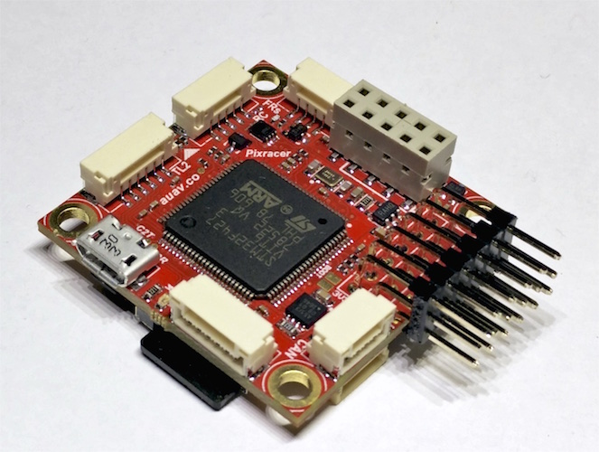
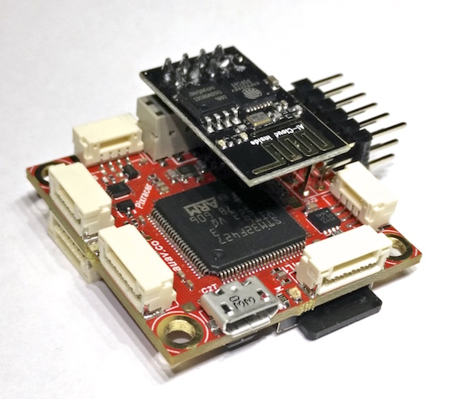

.. _common-pixracer-overview:

=================
Pixracer Overview
=================

The `Pixracer <https://store.mrobotics.io/mRo-PixRacer-R14-Official-p/auav-pxrcr-r14-mr.htm>`__ is the first
autopilot of the new FMUv4 Pixhawk generation. It comes with a small
Wifi extension board, upgraded sensors, more flash and better connectors
than the original Pixhawk.

.. figure:: ../../../images/pixracer_bottom.jpg
   :target: ../_images/pixracer_bottom.jpg
   :width: 400px

Overview
========

The `Pixracer <https://store.mrobotics.io/mRo-PixRacer-R14-Official-p/auav-pxrcr-r14-mr.htm>`__ is the
common name for the FMUv4 generation of Pixhawk flight controllers. It has been
designed primarily for the demanding requirements of small multicopters, but of course can be used on planes and other
vehicles which require no more than 6 pwm outputs for controlling escs
and motors. Pixracer is available from the `mRobotics <https://store.mrobotics.io/mRo-PixRacer-R14-Official-p/auav-pxrcr-r14-mr.htm>`__

.. tip::

   At time of writing the autopilot is still being evolved/improved.
   The final version may very slightly from the information provided
   here.

This video below provides a detailed overview of the board. Additional
information can be found on
`pixhawk.org <https://pixhawk.org/modules/pixracer>`__ and the `mRobotics <https://store.mrobotics.io/mRo-PixRacer-R14-Official-p/auav-pxrcr-r14-mr.htm>`__.

..  youtube:: mpb6Cq023N8
    :width: 100%

Specifications
==============

-  **Processor**:

   -  MCU - STM32F427VIT6 rev.3
   -  Ultra low noise LDOs for sensors and FMU
   -  FRAM - FM25V02-G

-  **Sensors**

   -  Gyro/Accelerometer: Invensense MPU9250 Accel / Gyro / Mag (4 KHz)
   -  Gyro/Accelerometer: Invensense ICM-20608 Accel / Gyro (4 KHz)
   -  Barometer: MS5611
   -  Compass: Honeywell HMC5983 magnetometer with temperature
      compensation

-  **Power**

   -  5-5.5VDC from USB or PowerBrick connector. Optional/recommended
      `ACSP4 +5V/+12V Power Supply <https://store.mrobotics.io/product-p/auav-acsp4-mr.htm>`__.

-  **Interfaces/Connectivity**

   -  Wifi: ESP-01 802.11bgn Flashed with MavESP8266
   -  MicroSD card reader
   -  Micro USB
   -  RGB LED
   -  GPS (serial + I2C)
   -  TELEM1/TELEM2
   -  Wifi serial
   -  FrSky Telemetry serial
   -  Debug connector (serial + SWD)
   -  Connectors: GPS+I2C, RC-IN, PPM-IN, RSSI, SBus-IN, Spektrum-IN,
      USART3 (TxD, RxD, CTS, RTS), USART2 (TxD, RxD, CTS, RTS),
      FRSky-IN, FRSky-OUT, CAN, USART8 (TxD, RxD), ESP8266 (full set),
      SERVO1-SERVO6, USART7 (TxD, RxD), JTAG (SWDIO, SWCLK), POWER-BRICK
      (VDD, Voltage, Current, GND), BUZZER-LED_BUTTON.

-  **Dimensions**

   -  Weight ?
   -  36 x 36mm with 30.5 x 30.5mm hole grid with 3.2mm holes

Connector pin assignments
=========================

Unless noted otherwise all connectors are JST GH

TELEM1, TELEM2+OSD ports
------------------------

.. raw:: html

   <table border="1" class="docutils">
   <tbody>
   <tr>
   <th>Pin</th>
   <th>Signal</th>
   <th>Volt</th>
   </tr>
   <tr>
   <td>1 (red)</td>
   <td>VCC</td>
   <td>+5V</td>
   </tr>
   <tr>
   <td>2 (blk)</td>
   <td>TX (OUT)</td>
   <td>+3.3V</td>
   </tr>
   <tr>
   <td>3 (blk)</td>
   <td>RX (IN)</td>
   <td>+3.3V</td>
   </tr>
   <tr>
   <td>4 (blk)</td>
   <td>CTS (IN)</td>
   <td>+3.3V</td>
   </tr>
   <tr>
   <td>5 (blk)</td>
   <td>RTS (OUT)</td>
   <td>+3.3V</td>
   </tr>
   <tr>
   <td>6 (blk)</td>
   <td>GND</td>
   <td>GND</td>
   </tr>
   </tbody>
   </table>

GPS port
--------

.. raw:: html

   <table border="1" class="docutils">
   <tbody>
   <tr>
   <th>PIN</th>
   <th>SIGNAL</th>
   <th>VOLT</th>
   </tr>
   <tr>
   <td>1 (red)</td>
   <td>VCC</td>
   <td>+5V</td>
   </tr>
   <tr>
   <td>2 (blk)</td>
   <td>TX (OUT)</td>
   <td>+3.3V</td>
   </tr>
   <tr>
   <td>3 (blk)</td>
   <td>RX (IN)</td>
   <td>+3.3V</td>
   </tr>
   <tr>
   <td>4 (blk)</td>
   <td>I2C1 SCL</td>
   <td>+3.3V</td>
   </tr>
   <tr>
   <td>5 (blk)</td>
   <td>I2C1 SDA</td>
   <td>+3.3V</td>
   </tr>
   <tr>
   <td>6 (blk)</td>
   <td>GND</td>
   <td>GND</td>
   </tr>
   </tbody>
   </table>

FrSky Telemetry / SERIAL4
-------------------------

.. raw:: html

   <table border="1" class="docutils">
   <tbody>
   <tr>
   <th>PIN</th>
   <th>SIGNAL</th>
   <th>VOLT</th>
   </tr>
   <tr>
   <td>1 (red)</td>
   <td>VCC</td>
   <td>+5V</td>
   </tr>
   <tr>
   <td>2 (blk)</td>
   <td>TX (OUT)</td>
   <td>+3.3V</td>
   </tr>
   <tr>
   <td>3 (blk)</td>
   <td>RX (IN)</td>
   <td>+3.3V</td>
   </tr>
   <tr>
   <td>4 (blk)</td>
   <td>GND</td>
   <td>GND</td>
   </tr>
   </tbody>
   </table>

RC Input (accepts PPM / S.BUS / Spektrum / SUMD / ST24)
-------------------------------------------------------

.. raw:: html

   <table border="1" class="docutils">
   <tbody>
   <tr>
   <th>PIN</th>
   <th>SIGNAL</th>
   <th>VOLT</th>
   </tr>
   <tr>
   <td>1 (red)</td>
   <td>VCC</td>
   <td>+5V</td>
   </tr>
   <tr>
   <td>2 (blk)</td>
   <td>RC IN</td>
   <td>+3.3V</td>
   </tr>
   <tr>
   <td>3 (blk)</td>
   <td>RSSI IN</td>
   <td>+3.3V</td>
   </tr>
   <tr>
   <td>4 (blk)</td>
   <td>VDD 3V3</td>
   <td>+3.3V</td>
   </tr>
   <tr>
   <td>5 (blk)</td>
   <td>GND</td>
   <td>GND</td>
   </tr>
   </tbody>
   </table>

CAN
---

.. raw:: html

   <table border="1" class="docutils">
   <tbody>
   <tr>
   <th>PIN</th>
   <th>SIGNAL</th>
   <th>VOLT</th>
   </tr>
   <tr>
   <td>1 (red)</td>
   <td>VCC</td>
   <td>+5V</td>
   </tr>
   <tr>
   <td>2 (blk)</td>
   <td>CAN_H</td>
   <td>+12V</td>
   </tr>
   <tr>
   <td>3 (blk)</td>
   <td>CAN_L</td>
   <td>+12V</td>
   </tr>
   <tr>
   <td>4 (blk)</td>
   <td>GND</td>
   <td>GND</td>
   </tr>
   </tbody>
   </table>

Power
-----

.. raw:: html

   <table border="1" class="docutils">
   <tbody>
   <tr>
   <th>PIN</th>
   <th>SIGNAL</th>
   <th>VOLT</th>
   </tr>
   <tr>
   <td>1 (red)</td>
   <td>VCC</td>
   <td>+5V</td>
   </tr>
   <tr>
   <td>2 (blk)</td>
   <td>VCC</td>
   <td>+5V</td>
   </tr>
   <tr>
   <td>3 (blk)</td>
   <td>CURRENT</td>
   <td>+3.3V</td>
   </tr>
   <tr>
   <td>4 (blk)</td>
   <td>VOLTAGE</td>
   <td>+3.3V</td>
   </tr>
   <tr>
   <td>5 (blk)</td>
   <td>GND</td>
   <td>GND</td>
   </tr>
   <tr>
   <td>6 (blk)</td>
   <td>GND</td>
   <td>GND</td>
   </tr>
   </tbody>
   </table>

Switch
------

.. raw:: html

   <table border="1" class="docutils">
   <tbody>
   <tr>
   <th>PIN</th>
   <th>SIGNAL</th>
   <th>VOLT</th>
   </tr>
   <tr>
   <td>1 (red)</td>
   <td>SAFETY</td>
   <td>GND</td>
   </tr>
   <tr>
   <td>2 (blk)</td>
   <td>!IO_LED_SAFETY</td>
   <td>GND</td>
   </tr>
   <tr>
   <td>3 (blk)</td>
   <td>CURRENT</td>
   <td>+3.3V</td>
   </tr>
   <tr>
   <td>4 (blk)</td>
   <td>BUZZER-</td>
   <td>-</td>
   </tr>
   <tr>
   <td>5 (blk)</td>
   <td>BUZZER+</td>
   <td>-</td>
   </tr>
   </tbody>
   </table>

Debug port (JST SM06B connector)
--------------------------------
.. raw:: html

   <table border="1" class="docutils">
   <tbody>
   <tr>
   <th>PIN</th>
   <th>SIGNAL</th>
   <th>VOLT</th>
   </tr>
   <tr>
   <td>1 (red)</td>
   <td>VCC TARGET SHIFT</td>
   <td>+3.3V</td>
   </tr>
   <tr>
   <td>2 (blk)</td>
   <td>CONSOLE TX (OUT)</td>
   <td>+3.3V</td>
   </tr>
   <tr>
   <td>3 (blk)</td>
   <td>CONSOLE RX (IN)</td>
   <td>+3.3V</td>
   </tr>
   <tr>
   <td>4 (blk)</td>
   <td>SWDIO</td>
   <td>+3.3V</td>
   </tr>
   <tr>
   <td>5 (blk)</td>
   <td>SWCLK</td>
   <td>+3.3V</td>
   </tr>
   <tr>
   <td>6 (blk)</td>
   <td>GND</td>
   <td>GND</td>
   </tr>
   </tbody>
   </table>

Where to Buy
============

- We suggest buying directly from `mRobotics <https://store.mrobotics.io/mRo-PixRacer-R14-Official-p/auav-pxrcr-r14-mr.htm>`__.
- Whilst PixRacer can be sourced from other retailers, the specific design may differ and not have been tested by the Development Team.  Known retailers of 3rd party PixRacer boards are `HobbyKing <https://hobbyking.com/en_us/new-pixracer-xracer-autopollot-v1-0-fmuv4-generation.html>`__, and `Banggood <https://www.banggood.com/Pixracer-Autopilot-Xracer-V1-0-Flight-Controller-Mini-PX4-Built-in-Wifi-For-FPV-Racing-RC-Multirotor-p-1056428.html?>`__, ...

See also
========

.. toctree::
    :maxdepth: 1

    PixRacer Serial Names <common-pixracer-serial-names>

.. note::

   Some information and images in this page were copied from
   `pixhawk.org <https://pixhawk.org/>`__,
   `docs.px4.io <https://docs.px4.io/en/flight_controller/pixracer.html>`__ and the
   `mRobotics shop <https://store.mrobotics.io/mRo-PixRacer-R14-Official-p/auav-pxrcr-r14-mr.htm>`__
   
