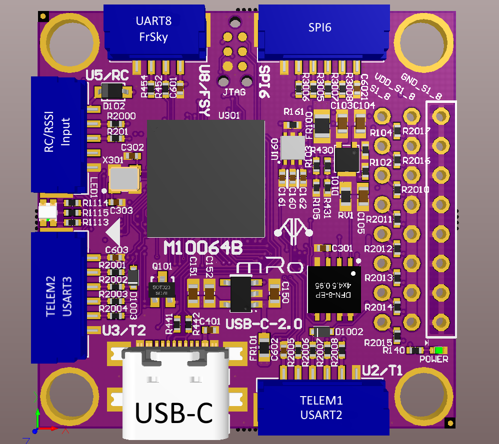
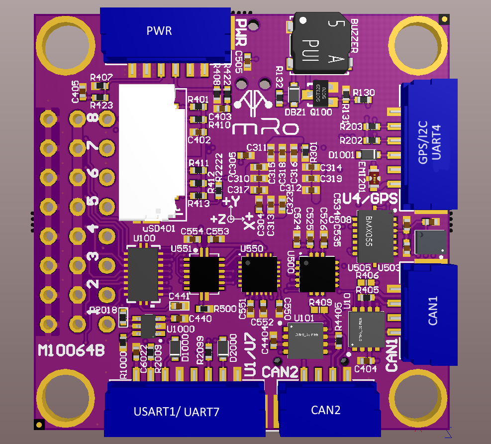

.. _common-pixracer-pro:

============
Pixracer Pro
============

The `Pixracer Pro <https://store.mrobotics.io>`__ is the next generation
autopilot of mRo's Pixracer family.

Overview
========

The `Pixracer Pro <https://store.mrobotics.io>`__ is the next generation of mRobotics' family of Pixracer autopilots. It has been designed primarily for the demanding requirements of small multicopters, but of course can be used on planes and other vehicles which require no more than 8 pwm outputs for controlling escs and motors. 

.. tip::

   At time of writing the autopilot is still being evolved/improved.
   The final version may very slightly from the information provided
   here.

Specifications
==============

-  **Processor**:

   -  MCU - STM32H743IIK6
   -  2MB flash allows full features of ArduPilot to be flashed
   -  256KB FRAM - FM25V02-G

-  **Sensors**

   -  Gyro/Accelerometer: Invensense ICM-20948 / Gyro / Mag (? KHz)
   -  Gyro/Accelerometer: Invensense ICM-20602 Accel / Gyro (? KHz)
   -  Gyro/Accelerometer: Bosch BMI088 Accel / Gyro (? KHz)
   -  Barometer: DSP310

-  **Power**

   -  5-5.5VDC from USB or PowerBrick connector. Optional/recommended
      `ACSP4 +5V/+12V Power Supply <https://store.mrobotics.io/product-p/auav-acsp4-mr.htm>`__.
   -  Ultra low noise LDOs for sensors and FMU

-  **Interfaces/Connectivity**

   -  MicroSD card reader
   -  Micro-C USB
   -  RGB LED
   -  GPS (serial + I2C)
   -  TELEM1/TELEM2
   -  FrSky Telemetry serial port
   -  On-Board Buzzer
   -  8 Servo/Motor Outputs, 3.3V (default) or 5V level selectable (GPIO 74)
   -  Connectors: GPS+I2C (USART4), RC-IN/PPM-IN/RSSI/SBus-IN/Spektrum-IN,
      USART3 (TxD, RxD, CTS, RTS), USART2 (TxD, RxD, CTS, RTS),
      USART8(FRSky-IN/FRSky-OUT), CAN1, CAN2, 
      SERVO1-SERVO8, USART1/USART7 (TxD, RxD), SPI6, POWER-BRICK
      (VDD, Voltage, Current, GND).

-  **Dimensions**

   -  Weight ?
   -  Size

Connector pin assignments
=========================

Unless noted otherwise all connectors are JST GH

USART2,USART3 (TELEM1/TELEM2)connectors
---------------------------------------

===    ======       =================
PIN    SIGNAL       VOLTAGE/TOLERANCE
===    ======       =================
1       +5V             +5V
2       TX              +3.3V/5V
3       RX              +3.3V/5V
2       CTS             +3.3V
3       RTS             +3.3V/5V
6       GND             GND
===    ======       =================

UART1/UART7 connector
---------------------

===    ======       =================
PIN    SIGNAL       VOLTAGE/TOLERANCE
===    ======       =================
1       +5V             +5V
2       TX1             +3.3V/5V
3       RX1             +3.3V/5V
4       GND             GND
5       +5V             +5V
6       TX7             +3.3V/5V
7       RX7             +3.3V/5V
8       GND             GND
===    ======       =================

USART4 (GPS+I2C) connector
--------------------------

===    ======       =================
PIN    SIGNAL       VOLTAGE/TOLERANCE
===    ======       =================
1       +5V             +5V
2       TX              +3.3V/5V
3       RX              +3.3V/5V
4       SCL             +3.3V/5V
5       SDA             +3.3V/5V
6       GND             GND
===    ======       =================

USART8 (FrSky Telemetry)
------------------------
===    ======       =================
PIN    SIGNAL       VOLTAGE/TOLERANCE
===    ======       =================
1       +5V             +5V
2       TX              +3.3V/5V
3       RX              +3.3V/5V
4       GND             GND
===    ======       =================

RC/RSSI Input Connector(accepts PPM / S.BUS / Spektrum / SUMD / ST24)
---------------------------------------------------------------------

===    ============   =================
PIN    SIGNAL         VOLTAGE/TOLERANCE
===    ============   =================
1       +4.5V           +4.5V **
2       RC input        +3.3V/5V
        (USART6 RX)
3       RSSI input      +3.3V/5V
4       +3.3V           +3.3V (for Spektrum RX power)
5       GND             GND
===    ============   =================

** normally supply outputs only valid when power module is powered, but this output is also active when USB is connected.

CAN1 and CAN2 connectors
------------------------

===    ======       =================
PIN    SIGNAL       VOLTAGE/TOLERANCE
===    ======       =================
1       +5V             +5V
2       CH              +3.3V/5V
3       CL              +3.3V/5V
4       GND             GND
===    ======       =================

Power connector
---------------

===    =============   =================
PIN    SIGNAL          VOLTAGE/TOLERANCE
===    =============   =================
1      +5V in          +5V
2      +5V in          +5V
3      CURR sense in   +3.3V/5V
4      VOLT sense in   +3.3V/5V
5       GND             GND
6       GND             GND
===    =============   =================

SPI6 connector
--------------

===    =============   =================
PIN    SIGNAL          VOLTAGE/TOLERANCE
===    =============   =================
1      +5V in           +5V
2      MISO             +3.3V/5V
3      SCK              +3.3V/5V
4      CS               +3.3V/5V
5      MOSI             +3.3V/5V
6      GND              GND
===    =============   =================

Default UART order
==================

=========  ==================  =========
Parameter  Default Protocol**  Connector
=========  ==================  =========
SERIAL0    console             USB
SERIAL1    Telemetry1          USART2 (supports CTS and RTS signaling)
SERIAL2    Telemetry2          USART3 (supports CTS and RTS signaling)
SERIAL3    GPS1                UART4
SERIAL4    GPS2                UART8  (targeted for FrSky Telem, but must change SERIAL4_PROTOCOL)
SERIAL5    USER                USART1
SERIAL6    USER                UART7
SERIAL7    SLCAN               USB (second composite USB interface)
=========  ==================  =========

** User may change SERIALx_PROTOCOL as required for application

Dshot capability
================

All motor/servo outputs are Dshot and PWM capable. However, mixing Dshot and normal PWM operation for outputs is restricted into groups, ie. enabling Dshot for an output in a group requires that ALL outputs in that group be configured and used as Dshot, rather than PWM outputs. The output groups that must be the same (PWM rate or Dshot, when configured as a normal servo/motor output) are: 1/2/3/4, 5/6, and 7/8.

Where to Buy
============

- `mRobotics <https://store.mrobotics.io/>`__

See also
========

.. toctree::
    :maxdepth: 1

    PixRacer Serial Names <common-pixracer-serial-names>

