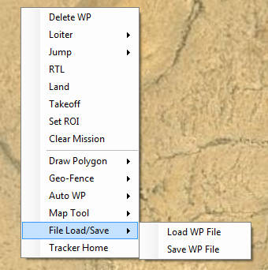
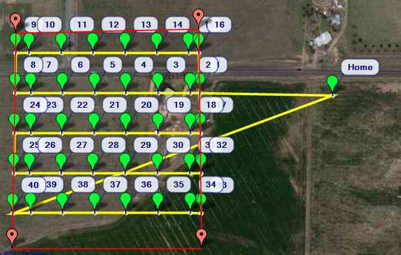

.. _common-planning-a-mission-with-waypoints-and-events:

============================================
Planning a Mission with Waypoints and Events
============================================

This page describes generic waypoint setup for all types of vehicles.

[site wiki="rover"]
.. note::

   Rover users: For a simpler Rover specific guide to setting up
   waypoints please see :ref:`Learning a Mission <rover:learning-a-mission>`.
[/site]

.. _common-planning-a-mission-with-waypoints-and-events_setting_the_home_position:

Setting the Home Position
=========================

For **Copter**, **Plane** and **Rover** the home position is set as the location where the vehicle
was armed. This means if you execute an RTL, it will return to
the location where it was armed, so arm your vehicle in the location you
want it to return to, or use a rally point to setup an alternative return point.

Video: Produce and save a Multi-waypoint Mission
================================================

..  youtube:: HAjkuJdjZw4
    :width: 100%

Video: Load an already saved Multi-waypoint Mission
===================================================

..  youtube:: nBq8YHShkVU
    :width: 100%

Instructions
============

In the screenshot below, a Copter mission starts with an auto takeoff to
20 meters altitude; then goes to WP 2 rising to 100 meters altitude on
the way, then waits 10 seconds; then the craft will proceed to WP 3
(descending to 50 meters altitude on the way), then returns to launch.
After reaching the launch position, the craft will land.
The mission assumes that the launch position is set at the home
position.

.. figure:: ../../../images/mp_mission_planning.jpg
   :target: ../_images/mp_mission_planning.jpg

   Copter: Mission Planning Example

You can enter waypoints and other commands (see the 
:ref:`Mission commands <common-planning-a-mission-with-waypoints-and-events_mission_commands>` 
section below for more information). In
the dropdown menus on each row, select the command you want. The column
heading will change to show you what data that command requires. Lat and
Lon can be entered by clicking on the map. Altitude is relative to your
launch altitude/home position, so if you set 100m, for example, it will
fly 100m above you.

**Default Alt** is the default altitude when entering new waypoints. See :ref:`common-understanding-altitude` for altitude definitions.

**Verify height** means that the Mission Planner will use Google Earth
topology data to adjust your desired altitude at each waypoint to
reflect the height of the ground beneath. So if your waypoint is on a
hill, if this option is selected the *Mission Planner* will increase
your ALT setting by the height of the hill. This is a good way to make
sure you don't crash into mountains!

Once you are done with your mission, select **Write** and it will be
sent to APM and saved in EEPROM. You can confirm that it's as you wanted
by selecting **Read**.

You can save multiple mission files to your local hard drive by
selecting **Save WP File** or read in files with **Load WP File** in the
right-click menu:

Tips
====

-  Prefetch: You can cache map data so you don't need Internet access at
   the field. Click the **Prefetch** button, and hold down **Alt** to
   draw a box to download the selected imagery of a location.
-  Grid: This allows you to draw a polygon (right click) and
   automatically create waypoints over the selected area. Note that it
   does not do "island detection", which means if you have a big polygon
   and a little one inside of that, the little one will not be excluded
   from the big one
   (see `this <http://wiki.openstreetmap.org/wiki/Relation:multipolygon>`__ for
   more). Also, in the case of any polygon that partialy doubles backs
   on itself (like the letter U), the open area in the center will be
   included as part of the flyover.
-  Setting your home location to the current location is easy, just
   click **Home Location** above where you enter your home location, and
   it will set your home location to the current coordinates.
-  You can measure the distance between waypoints by right-clicking at
   one end and selecting Measure Distance. Then right-click on the other
   end and select **Measure Distance** again. A dialog box will open
   with the distance between the two points.

Auto grid
=========

You can also have the *Mission Planner* create a mission for you, which
is useful for function like mapping missions, where the aircraft should
just go back and forth in a "lawnmower" pattern over an area to collect
photographs.

To do this, in the right-click menu select Polygon and draw a box around
the area you want to map. Then select Auto WP, Grid. Follow the dialog
box process to select altitude and spacing. The *Mission Planner* will
then generate a mission that looks something like this:

   Mission Planner auto-generated grid

   
.. _common-planning-a-mission-with-waypoints-and-events_mission_commands:

Mission commands
================

*Mission Planner* provides a filtered list of the commands appropriate
for the current vehicle type, and adds column headings for the
parameters that need user-supplied values. These include navigation
commands to travel to waypoints and loiter in the vicinity, DO commands
to execute specific actions (for example taking pictures), and condition
commands that can control when DO commands are able to run.

.. figure:: ../../../images/MissionList_LoiterTurns.png
   :target: ../_images/MissionList_LoiterTurns.png

   Example: LOITER_TURNS command withheadings for number of turns, direction, and location to loiteraround.

The full set of mission commands supported by all ArduPilot platforms
are listed in :ref:`MAVLink Mission Command Messages (MAV_CMD) <common-mavlink-mission-command-messages-mav_cmd>`. This
includes the full name of each command (as defined in the protocol
definition), information about which parameters are supported, and also
the corresponding *Mission Planner* column headings.

.. note::

   Mission Planner uses a cut-down version of the full command name.
   For example, commands like MAV_CMD_NAV_WAYPOINT,
   MAV_CMD_CONDITION_DISTANCE, MAV_CMD_DO_SET_SERVO are listed in MP
   as WAYPOINT, CONDITION_DISTANCE and DO_SET_SERVO respectively.

[site wiki="copter"]
There is also a Copter-specific :ref:`Copter Mission Command List <copter:mission-command-list>`.
[/site]

How to prefetch a stored Mission Map
====================================

..  youtube:: 1s8gsXTdPY8
    :width: 100%

Occasionally You will see some really big Numbers
=================================================

..  youtube:: J5ClTnggZKk
    :width: 100%

[copywiki destination="copter,plane,rover,planner"]
