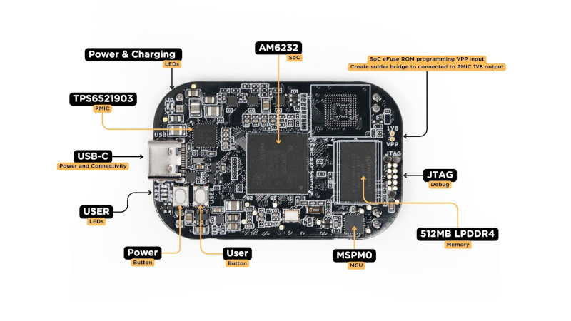
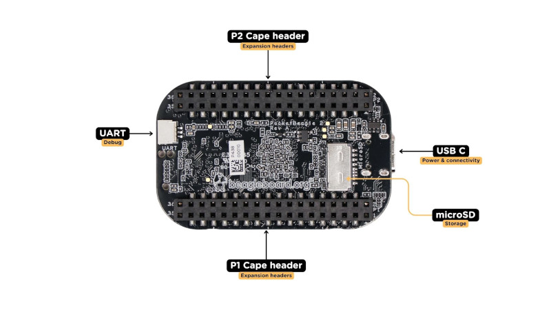
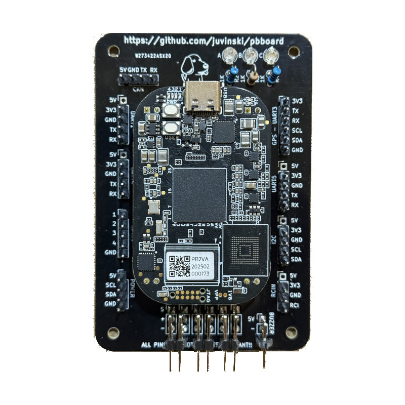
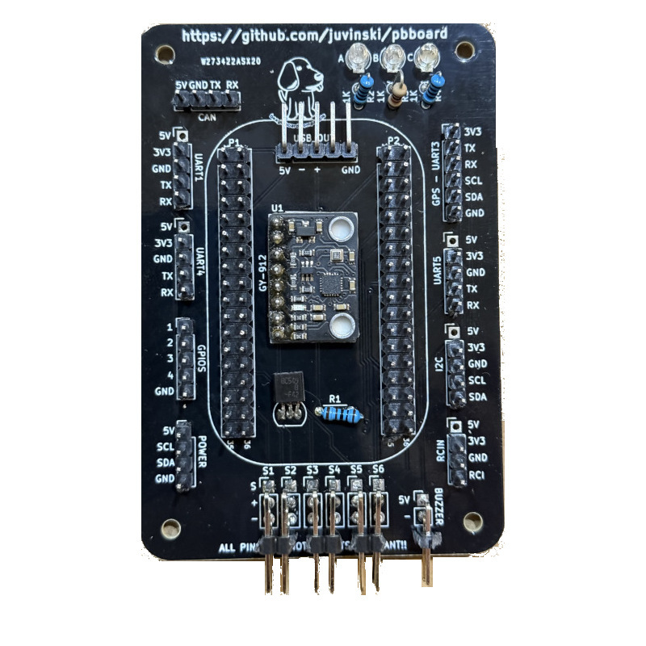

.. _common-pocketbeagle2:

===============
PocketBeagle 2
===============

`PocketBeagle 2 <https://www.beagleboard.org/boards/pocketbeagle-2>`__ (PB2) is an upgraded version of the popular PocketBeagle, designed as an ultra-compact, low-cost, and powerful single-board computer (SBC). Targeted at developers, students, and hobbyists, PocketBeagle 2 retains the simplicity and flexibility of its predecessor while delivering enhanced performance and expanded features to support modern development needs. PocketBeagle 2 is ideal for creating IoT devices, robotics projects, and educational applications. Its small form factor and low power consumption make it a versatile platform for embedded development, whether prototyping or deploying at scale.

PocketBeagle 2 is based on Texas Instruments AM6254 SoC. Its multiple A53 cores can provide higher performance than the classic PocketBeagle. The new design comes with pre-soldered headers, a 3-pin JST-SH 1.00mm UART debug port, a USB-C port, Texas Instruments MSPM0L1105 Cortex-M0+ MCU for ADC, 512MB RAM, and a LiPo Battery charger.

.. note::

   For now, the only supported version is Rev A0 shipped with AM6232 (dual-core A53, no GPU).

Specifications
==============

-  **Processor**

   -  Texas Instruments AM6232 SoC
   -  Multicore 64-bit Arm Cortex-A53 microprocessor subsystem at up to 1.4 GHz
   -  Each A53 Core has 32KB L1 DCache with SECDED ECC and 32KB L1 ICache with Parity protection
   -  Single-core Arm® Cortex®-M4F MCU at up to 400MHz
   -  Dual-core Programmable Real-Time Unit Subystem (PRUSS) running up to 333 MHz
   -  512MB LPDDR4 3200MHz

-  **OS**

   -  Linux (Debian)

.. note::

   For now, the only supported version is Rev A0 shipped with AM6232 (dual-core A53, no GPU).

DIY Cape
========
The board and all information about the board can be found in the github `here. <https://github.com/juvinski/pbboard>`__

-  **Schematic**

The schematic can be found in this `link. <https://github.com/juvinski/pbboard/blob/main/Schematic/PocketPilot2.pdf>`__

-  **Cape Components**

   -  1 IMU `GY-912 <https://www.ebay.com/itm/166809278501>`__
   -  4 Resistors 1KΩ
   -  3 Led Red, Blue and Green color 
   -  1 BC548 NPN Transistor
   -  1 I2C Digital `Power Module/Monitor <https://ardupilot.org/copter/docs/common-powermodule-landingpage.html#i2c-power-monitor>`__
   -  6 Pin header 1 x 5 straight
   -  3 Pin header 1 x 4 straight
   -  1 Pin header 1 x 6 straight
   -  6 Pin header 1 x 3 straight or 90°
   -  1 Pin header 1 x 2 straight
   -  1 Pin header female 1 x 8 - optional

-  **Board Details**

   -  4 UARTs - One have the I2C to be used with a GPS + Compass
   -  2 I2Cs - One is under the Power header
   -  4 GPIO pins with GND
   -  6 Outputs
   -  Buzzer output for an Active buzzer

Quick Start
===========

Preparing SD Card with linux for PB2
------------------------------------

Download the linux image from `https://files.beagle.cc/file/beagleboard-public-2021/images/pocketbeagle2-debian-13-base-v6.12-arm64-2025-09-05-8gb.img.xz <https://files.beagle.cc/file/beagleboard-public-2021/images/pocketbeagle2-debian-13-base-v6.12-arm64-2025-09-05-8gb.img.xz>`__ used in this example).
You can download images from from https://www.beagleboard.org/distros or you can use the `BeagleBoard Imaging Utility. <https://www.beagleboard.org/bb-imager>`__

Flash image onto SD card.

Setting default user and password
---------------------------------

The default user and password for the debian is **debian** and default password is **temppwd**.
To change the defaults, insert the SDCard in your computer and in the BOOT partition open the **sysconf.txt**. Then look for the user_name and user_password, uncomment the line and set the values.

Using the Beaglebone Imaging Utility you will see a button **Edit** where you can change the default user and password.

Booting and first access
------------------------

Insert SD card in PocketBeagle 2 and power up using a suitable USB cable at the USB C connector.

Connect via SSH (``ssh <your username>@192.168.7.2``) and insert your password.

Configuring the Device Tree Overlay
-----------------------------------
To be possible run **ardupilot** in the PocketBeagle 2, you need to configure a device tree overlay.
**Instructions** ::

    ssh debian@192.168.7.2 #case you changed the default user, user yours
    sudo su -
    vi /boot/firmware/extlinux/extlinux.conf
    #Search for a line with "label microSD (default)"
    #replace the commented line #fdtoverlays
    fdtoverlays /overlays/k3-am62-pocketbeagle2-ardupilot-cape.dtbo
    reboot

**To check if the device tree is loaded, after the reboot** ::

    ssh debian@192.168.7.2 #replace debian with your username of the default - temppwd
    ls /dev/spi*
    /dev/spidev0.0  /dev/spidev0.1

    /dev/spi:
    0.0  0.1
    ls /dev/i2c-*
    /dev/i2c-0  /dev/i2c-2  /dev/i2c-3  /dev/i2c-4

Compiling ArduPilot
-------------------

I recommend to use cross-compilation(5-10 minutes) instead direct compilation in the PB2 board(time > 1 hour)

To setup your Ubuntu environment please follow `this link <https://ardupilot.org/dev/docs/building-setup-linux.html#building-setup-linux>`__

You need to install gcc-aarch64-linux-gnu - "sudo apt-get install gcc-aarch64-linux-gnu".

**Instructions** ::

    cd ~
    git clone --recurse-submodules https://github.com/ardupilot/ardupilot.git
    cd ardupilot
    #**for Copter**
    git checkout master
    #**for Plane**
    git checkout master
    #**for Rover**
    git checkout master
    #**for Sub**
    git checkout master
    ./waf configure --board=pocket2

    #**To compile all vehicles**
    ./waf build

    #**To compile copter**
    ./waf copter

    #**To compile plane**
    ./waf plane

    #**To compile rover**
    ./waf rover

    #**To compile sub**
    ./waf sub

    #**To compile examples**
    ./waf examples

Alternatively there are other possible sources like the https://custom.ardupilot.org/ build server

To copy ardupilot files to the your PocketBeagle 2:
go to your ardupilot directory then:
scp -qpr build/pocket2/bin/* <your username>@192.168.7.2:/home/<your username>/ardupilot/

Setting up ArduPilot
--------------------

The following instructions show how to setup ArduPlane. It is the same for other vehicle types just replace ``copter`` by e.g. ``plane`` etc. It is also possible to setup multiple vehicle types on the same system.

First let's create a configuration file ::

    sudoedit /etc/default/ardupilot
    #inside the file add the following lines
    TELEM1="--serial1 /dev/ttyS1"
    TELEM2="--serial0 udp:<target IP address>:14550"
    GPS="--serial3 /dev/ttyO3"
    RANGEFINDER="--serial5 /dev/ttyS5"
    #Removing any empty space in the beginning of the lines
    #Press CTRL+X then press enter

Now, let's create an auxiliar script to setting some linux stuffs ::

    sudoedit /usr/local/bin/prep_ardu.sh
    #inside the file add the following lines

    #!/usr/bin/bash

    #Enable Buzzer
    /usr/bin/gpioset -t 0 -c 2 86=0

    #Enable LEDS
    /usr/bin/gpioset -t 0 -c 2 45=0
    /usr/bin/gpioset -t 0 -c 2 46=0
    /usr/bin/gpioset -t 0 -c 2 91=0

    #Enable GPIO
    /usr/bin/gpioset -t 0 -c 1 10=0
    /usr/bin/gpioset -t 0 -c 1 12=0
    /usr/bin/gpioset -t 0 -c 1 2=0
    /usr/bin/gpioset -t 0 -c 2 77=0

    /usr/bin/ip link set can0 type can bitrate 1000000
    /usr/sbin/ifconfig can0 up
    #Removing any empty space in the beginning of the lines
    #Press CTRL+X then press enter
    sudo chmod +x /usr/local/bin/prep_ardu.sh

This script will ensure the gpios pin are enabled and enable the CAN bus.

Create an empty service file so that ardupilot automatically starts on boot and runs in the background: ::

    sudo nano /lib/systemd/system/arducopter.service

Paste following text. And replace ``<target IP address>`` with the IP address of the telemetry receiving computer: ::

    [Unit]
    Description=ArduCopter Service
    After=networking.service
    StartLimitIntervalSec=0
    Conflicts=arduplane.service ardurover.service antennatracker.service

    [Service]
    ExecStartPre=-/usr/local/bin/prep_ardu.sh
    ExecStart=/home/<your username>/ardupilot/arducopter $TELEM1 $TELEM2 $GPS $RANGER
    Restart=on-failure
    RestartSec=1

    [Install]
    WantedBy=multi-user.target

Enabling arducopter service ::

    sudo systemctl enable arducopter.service
    sudo reboot

Checking arducopter ::

    ssh debian@192.168.7.2 #replace debian with your username of the default - temppwd
    ps -a|grep arducopter
    618 pts/2    00:00:03 arducopter
    #the first number and the timer counter will be different.

Using CAN
=========

To use CAN, you need a CAN transceiver like `TJA1051. <https://www.aliexpress.us/item/3256806776892627.html>`__
There is one output in the DYI board to connect the transceiver.

USB OTG connection
==================

You can use - and the board was tested with USB C and MicroUSB connector for otg connection, connecting 5 volts, + and - should be connected to the D+ and D- pins and GND pins.

Errors and known issues
=======================

In case of Config Error: Baro: unable to initialise driver you need to compile and run the BARO_generic before run ardupilot.

Flying video
============

First flight :)

..  youtube:: YgIZ8pS7oE4
    :width: 100%

October 2025

Useful Links
============
- `Ardupilot Blog page <https://discuss.ardupilot.org/t/pocketbeagle-2-now-run-ardupilot/139935>`__
- `PocketBeagle 2 Ardupilot DIY Cape <https://github.com/juvinski/pbboard>`__
- `Building ArduPilot for BeagleBone Black on Linux — Dev documentation <https://ardupilot.org/dev/docs/building-for-beaglebone-black-on-linux.html#building-for-beaglebone-black-on-linux>`__
- `Building ArduPilot <https://github.com/ArduPilot/ardupilot/blob/master/BUILD.md>`__
- `PocketBeagle 2 Docs <https://docs.beagle.cc/boards/pocketbeagle-2/01-introduction.html>`__
- `Beaglebone Ardupilot setup - detailed <https://github.com/imfatant/test>`__

[copywiki destination="plane,copter,rover,blimp,sub"]