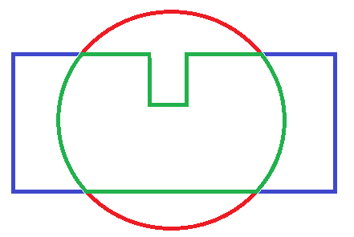

.. _common-polygon_fence:

[copywiki destination="copter,rover"]
==============================
Inclusion and Exclusion Fences
==============================

Overview
========

Copter and Rover includes support for polygon fences with up to 70 points and circular fences.  Either may be selected to be inclusion or exclusion type. The purpose of these fences are to attempt to stop your vehicle from flying into (exclusion), or out of (inclusion), the fences by initiating a failsafe action like RTL or, if flying in Loiter mode, the vehicle will normally stop before breaching the fence

This feature is an extension of the simpler :ref:`cylindrical fence <common-ac2_simple_geofence>` and can be combined with it.

Like the :ref:`cylindrical fence <common-ac2_simple_geofence>`, Copter will stop increasing altitude at :ref:`FENCE_ALT_MAX<FENCE_ALT_MAX>` in Loiter, PosHold, and AltHold modes. In other modes, it will execute the :ref:`FENCE_ACTION<FENCE_ACTION>` if the altitude limit is exceeded and active. 

See :ref:`cylindrical fence <common-ac2_simple_geofence>` for fence parameters, which also apply to these polygonal fences.

These fences are created and treated in a similar way to mission command lists and rally point lists and loaded into the autopilot.

..  youtube:: U3Z8bO3KbyM
    :width: 100%

Enabling Fences in Mission Planner
==================================

..  youtube:: SEm4nVfbg00
    :width: 100%

-  Connect your Autopilot to the Mission Planner
-  Go to the **CONFIG\| GeoFence** screen
-  Click "Enable" and set Type to "All" or another option that includes "Polygon". Circle refers to the HOME centered, :ref:`cylindrical fence <common-ac2_simple_geofence>`. Altitude only, limits maximum altitude (everywhere).

   .. image:: ../../../images/polygon_fence_enable.png
       :target: ../_images/polygon_fence_enable.png
       :width: 500px

-  Leave the Action as "RTL or Land". Although, you can select other failsafe actions.
-  Go to the **PLAN** screen, and select ``FENCE`` from the dropdown box in the upper right part of the map display.
-  For a circular fence, simply click on the map and a circular exclusion fence is added to the list. You can change its radius with the first parameter of the item. You can also change it from an exclusion fence to a circular inclusion fence, via the item's dropdown box.

   .. image:: ../../../images/exclusion-zone.png
       :target: ../_images/exclusion-zone.png
       :width: 500px

- For a polygonal fence, use the polygon tool on the left side of the map screen. Select "Draw a Polygon", and draw the boundary points with map clicks, then select if its an inclusion or exclusion fence type. It will be added to the fence point list.

   .. image:: ../../../images/polygon_add_point.png
       :target: ../_images/polygon_add_point.png
       :width: 500px

- Upload the fence(s) to the vehicle using "Write" button below the map. You can also read the fence list from the autopilot with the "Read" button.

.. note:: You can define many inclusion and exclusion fences. However,multiple inclusions fences, including the :ref:`cylindrical fences <common-ac2_simple_geofence>` must overlap, since the vehicle can operate only within the complete overlap area of all of the inclusion fences. Exclusion fences may be placed within or outside of inclusion fences.

.. note:: In order to upload or download these fences from Mission Planner the connected link must be using MAVLink2 protocol. Normally, since the USB conenction is used, this protocol is default. However, radio linked connections may use MAVLink1 by default and would need to be changed to MAVLink2 in order to upload and download across them.

.. tip:: You can have both the :ref:`cylindrical fences <common-ac2_simple_geofence>` and inclusion/exclusion fences and choose to use just the HOME centerd "tin-can" for a flight by selecting only the "Circle" or "Altitude and Circle" for :ref:`FENCE_TYPE<FENCE_TYPE>`. You can chose to enable the :ref:`cylindrical fences <common-ac2_simple_geofence>`, these inclusion/exclusion fences, and/or altitude limit, in any combination, with this parameter.

Combining with the Cylindrical Fence
====================================

A polygon fence can be used in combination with the :ref:`cylindrical fences <common-ac2_simple_geofence>` and the failsafe behaviour (i.e. stop at the fence or RTL) will trigger at whichever barrier the vehicle reaches first (i.e. the green line shown below)

Please see the :ref:`Cylindrical Fence <common-ac2_simple_geofence>` page for additional warnings and instructions including how to enable/disable the fence with the RC channel auxiliary switches.

